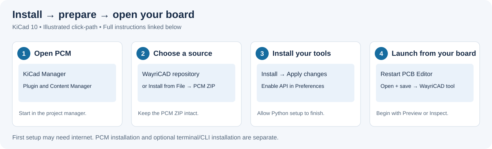
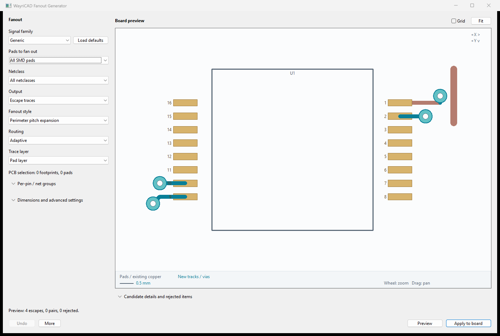
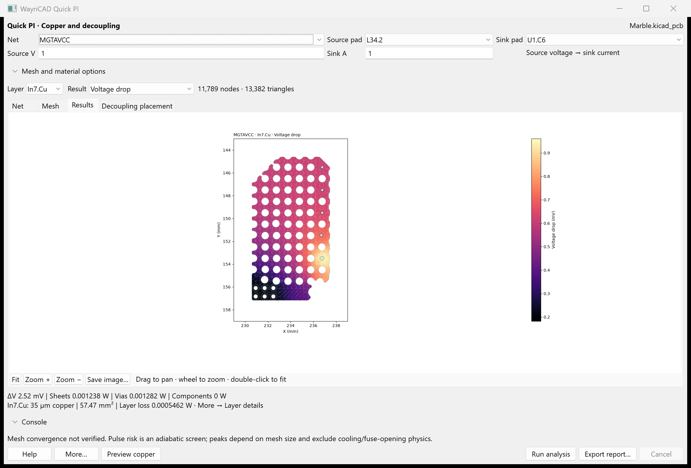
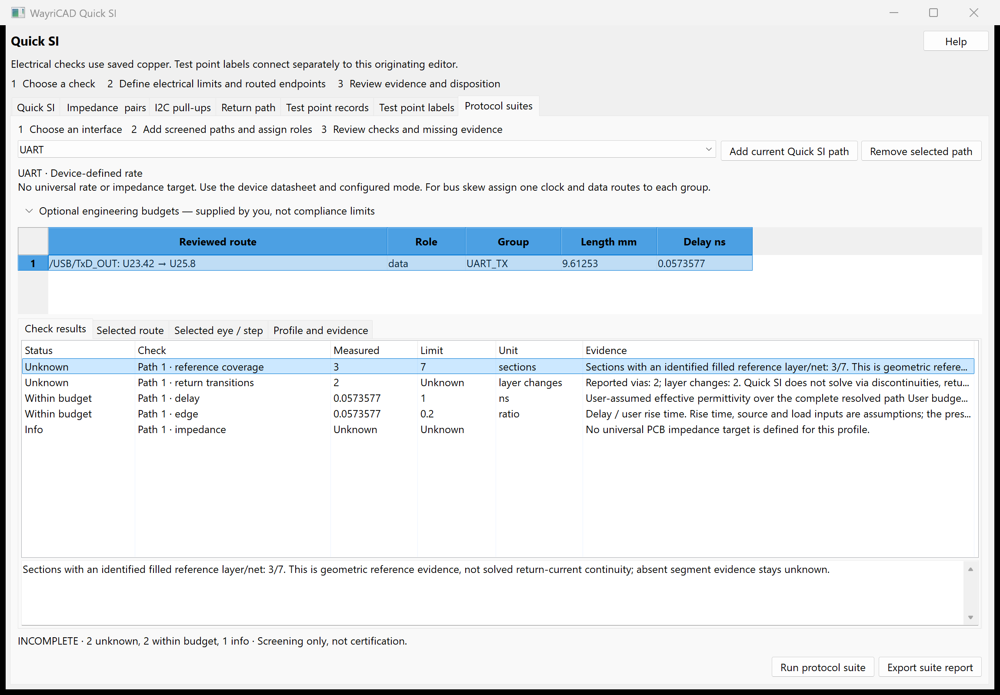
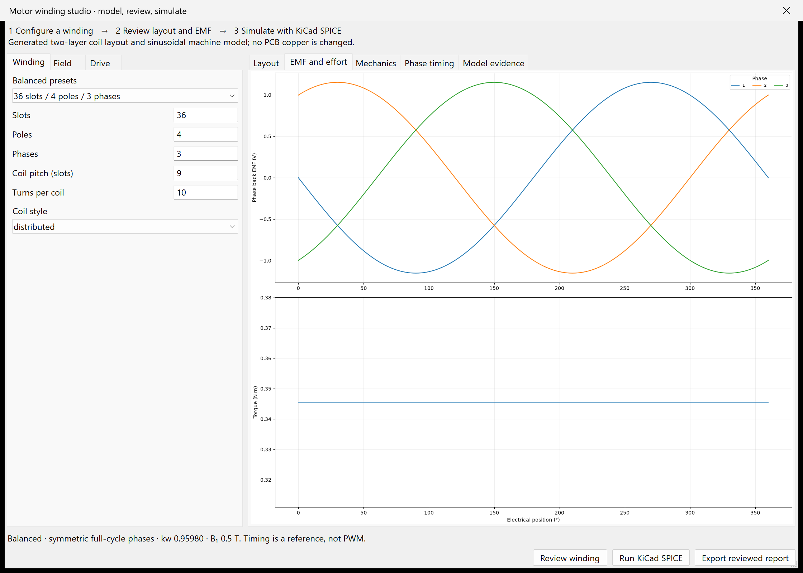
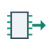
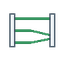

# WayriCAD — KiCad Plugins for PCB Design and Analysis

**WayriCAD** is an open-source suite of **16 KiCad plugins** for printed circuit board (PCB) design and analysis. It includes fanout routing, via stitching, trace impedance and RLC analysis, power integrity and signal integrity checks, bill of materials (BOM) editing, and portable project libraries. Each tool installs independently through KiCad's Plugin and Content Manager (PCM) and runs locally after setup.

Previously named **KiWay**, the project is now maintained as **WayriCAD** by [Wayri](https://github.com/wayri). The official source repository is [wayri/WayriCAD](https://github.com/wayri/WayriCAD). Start with the tool that solves your immediate task.

**Current suite: 3.2.0 · [GPL-3.0 license](LICENSE).**

**Use Releases for published packages. KiCad 10 is the validated target.** KiCad 11-only installations are not supported yet: several engines still need KiCad 10 native Python. See [compatibility and known limits](docs/COMPATIBILITY.md).

[Installation guide](docs/INSTALLATION.md) · [Illustrated user guide](docs/USER_GUIDE.md) · [Troubleshooting](docs/TROUBLESHOOTING.md) · [CLI guide](docs/CLI_USER_GUIDE.md) · [Releases](https://github.com/wayri/WayriCAD/releases)

[3.2 changes](docs/RELEASE_NOTES_3.2.0.md) · [Validation and limitations](docs/audits/RELEASE_3.2_VALIDATION.md)

## Install and open



**New to KiCad plugins?** Follow the [step-by-step GUI guide](docs/INSTALLATION.md), including ZIP installation, first launch and troubleshooting.

1. In KiCad Manager, open **Plugin and Content Manager**. Add the repository URL below, select **WayriCAD Plugin Repository**, and install the tools you need.
2. Alternatively, download an individual `WayriCAD-<tool>-<version>-PCM.zip` from Releases and use **Install from File**. Do not unpack the ZIP yourself.
3. In **Preferences → Plugins**, enable the API and configure Python. Let KiCad finish preparing each plugin environment, then restart the PCB Editor.
4. Open and save your board/project, then launch the tool from the PCB Editor. Toolbar launches use the originating project; standalone launches may need a file selection.

```text
https://raw.githubusercontent.com/wayri/WayriCAD/develop/pcm/repo.json
```

Initial dependency setup needs internet access or a prepared wheel cache. Once prepared, application pages, previews and project processing run locally. Some tools use a separate native KiCad runtime; [runtime setup](wayricad_runtime/RUNTIME_SETUP.md) explains overrides and offline installation.

## Plugin previews

Actual application captures; select a tool title for its guide. Example values are not predictions for your board.

<table>
<tr>
<td width="50%"><h3><a href="fanout_generator_plugin/ReadMe.md">Adaptive fanout</a></h3><a href="fanout_generator_plugin/help-adaptive.png"></a><p>Review pads, existing copper and proposed tracks/vias before applying.</p></td>
<td width="50%"><h3><a href="quick_pi_plugin/README.md">Quick PI</a></h3><a href="quick_pi_plugin/help-power-rail.png"></a><p>Marble MGTAVCC at a hypothetical 1 A; a selected rail path, not a whole-board load.</p></td>
</tr>
<tr>
<td width="50%"><h3><a href="signal_integrity_advisor_plugin/ReadMe.md">Quick SI</a></h3><a href="signal_integrity_advisor_plugin/help-protocols.png"></a><p>Protocol screening keeps missing models and reference coverage visible.</p></td>
<td width="50%"><h3><a href="trace_impedance_plugin/ReadMe.md">Trace RLC</a></h3><a href="trace_impedance_plugin/help-ac-geometry.png"></a><p>Inspect the connected copper path and per-section electrical coverage.</p></td>
</tr>
<tr>
<td width="50%"><h3><a href="bom_studio_plugin/README.md">BOM Studio</a></h3><a href="bom_studio_plugin/help-cost-mass.png"></a><p>Templates, bulk editing, conditional exports and explicit cost/mass coverage.</p></td>
<td width="50%"><h3><a href="planar_magnetics_plugin/ReadMe.md">Magnetics</a></h3><a href="planar_magnetics_plugin/help-motor-emf.png"></a><p>Motor EMF/force, winding layouts, coupled fields and KiCad SPICE; see model limits.</p></td>
</tr>
</table>

## All 16 plugins

Every name below opens that plugin’s README. The [full tool directory](docs/USER_GUIDE.md#tool-directory) explains inputs, outputs and write boundaries.

| Icon | Plugin and guide | Start here |
|---|---|---|
|  | [BOM Studio](bom_studio_plugin/README.md) | Saved schematic/project and desired fields |
|  | [Embed3D](embed_3d_plugin/README.md) | Project plus library/model search paths |
|  | [Quick PI](quick_pi_plugin/README.md) | Net, source/sink pads, voltage/current |
|  | [Trace RLC / Impedance](trace_impedance_plugin/ReadMe.md) | Connected path or zone terminals and stackup |
|  | [Quick SI](signal_integrity_advisor_plugin/ReadMe.md) | Signal path, stackup and driver/load assumptions |
|  | [Fanout Generator](fanout_generator_plugin/ReadMe.md) | Footprints/pads, netclass, pattern and layer |
|  | [Via Stitching](via_stitching_plugin/ReadMe.md) | Net, layer span, region and spacing |
|  | [Bulk Label Editor](bulk_label_editor_plugin/ReadMe.md) | Selected references, values or PCB text |
|  | [Pin Extractor](extract_pins_plugin/ReadMe.md) | Board/connector scope and fields |
|  | [Harness Workbench](harness_workbench_plugin/ReadMe.md) | Connector maps and explicit external wire links |
|  | [Copper Balancer](copper_balancer_plugin/README.md) | Saved board, region and density settings |
|  | [Mechanical Check](mechanical_check_plugin/README.md) | Saved board, component models and enclosure |
|  | [Heater Designer](heater_designer_plugin/ReadMe.md) | Region, geometry, material and thermal assumptions |
|  | [Planar Magnetics](planar_magnetics_plugin/ReadMe.md) | Coils, magnetic equivalents, motor windings and declared material/drive inputs |
|  | [Manufacturing Readiness](manufacturing_readiness_plugin/ReadMe.md) | Board, fabricator profile and release inputs |
|  | [Constraint Studio](protocol_constraint_composer_plugin/ReadMe.md) | Saved board, protocol assignments, net scope and desired rules |

## Focused workflows, shared tools

BOM Studio keeps templates, cell and bulk editing, grouping, and conditional exports in three primary views. Mechanical Check retains exact solids and adds a quick 2D envelope screen without FreeCAD. Copper Balancer reports rejected sites and per-tile density deficits. Quick PI includes decoupling placement, and Quick SI includes return-path and test-point workflows. These are distinct checks inside shared tools, not claims of full electrical or mechanical certification.

## Upgrade safely

Remove obsolete suite package entries to avoid duplicate actions. Embed3D combines the former Localizer and Portable Assets workflows and keeps the `embed-3d` package ID. Visual Diff and Design Variant Workbench are retired. PDN Decoupling is now a tab in Quick PI. Return-Path Auditor and Test Point Descriptor are tabs in Quick SI; their separate packages are retired. Native KiCad variants replace the standalone variant tool. The source installer backs up retired installations; it does not delete project data. Keep existing BOM workspaces and project backups.

For a source installation, build packages and run `python tools/install_suite.py` to preview the destination, then repeat with `--apply`. Use `--destination` for an explicit location. [Installation details](docs/TROUBLESHOOTING.md#installation-paths).

## Automation and development

Install the source interfaces with `python -m pip install -e .`. Use the [CLI guide](docs/CLI_USER_GUIDE.md) for reviewed plan/apply routing, native DRC verification, PI, RLC and library commands. Apply writes a new board copy; verification reports native DRC findings and preserves source hashes.

```text
python -m pip install -e ".[test]"
python tools/prepare_suite.py
python tools/generate_suite_icons.py
python -m unittest discover -s tests
python build_pcm.py --clean-feed --release-tag 3.2.0 --branch develop
python tools/validate_packages.py
```

Imported applications have separate test suites. Native tests require the relevant installed engines; skipped checks are not compatibility evidence. Read [compatibility](docs/COMPATIBILITY.md) and the [Marble smoke-test record](docs/audits/MARBLE_SUITE_SMOKE.md) for the distinction between checks, demonstrations and unverified operations. Historical release notes describe their original versions.

## Acknowledgements and AI disclosure

WayriCAD development has made substantial use of AI coding assistants and large language models (LLMs), including OpenAI Codex, for implementation, debugging, tests, documentation and research assistance. Project maintainers remain responsible for the code and release decisions. AI-generated code and explanations can contain errors; validation evidence and model limitations are documented separately.

We thank the KiCad community, upstream open-source projects, researchers and contributors whose work supports this suite. See [acknowledgements and the full AI-development disclosure](ACKNOWLEDGEMENTS.md).
