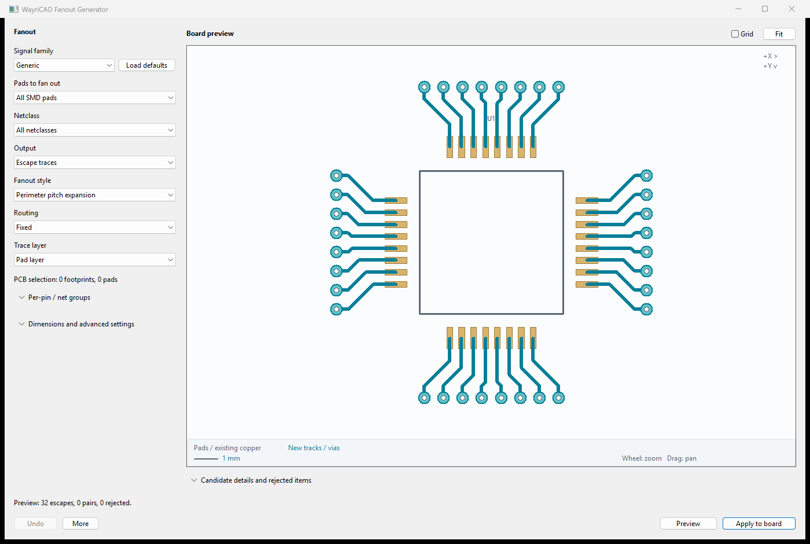
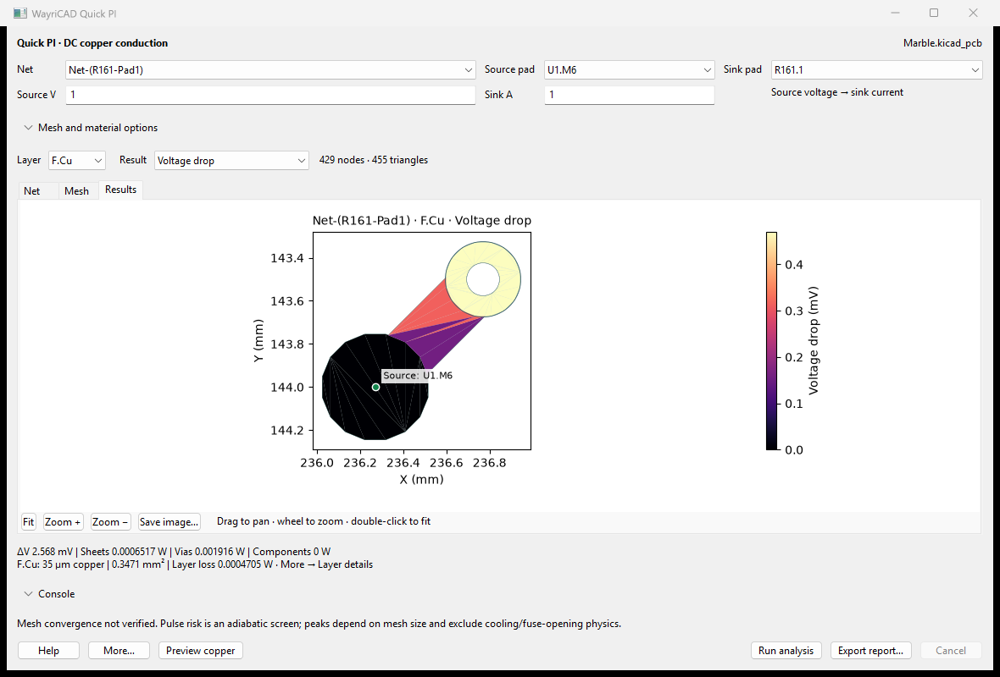

# WayriCAD 3.1.1

20 local KiCad tools for routing preparation, electrical checks, BOM work and portable projects. Start with the tool that solves your immediate task; each package installs independently.

**Testing release · KiCad 10 is the validated target.** KiCad 11-only installations are not supported yet: several engines still need KiCad 10 native Python. See [compatibility and known limits](docs/COMPATIBILITY.md).

[Illustrated user guide](docs/USER_GUIDE.md) · [Troubleshooting](docs/TROUBLESHOOTING.md) · [CLI guide](docs/CLI_USER_GUIDE.md) · [Releases](https://github.com/wayri/WayriCAD/releases)

## Install and open

1. In KiCad Manager, open **Plugin and Content Manager**. Add the repository URL below, select **WayriCAD Plugin Repository**, and install the tools you need.
2. Alternatively, download an individual `WayriCAD-<tool>-3.1.1-PCM.zip` from Releases and use **Install from File**. Do not unpack the ZIP yourself.
3. In **Preferences → Plugins**, enable the API and configure Python. Let KiCad finish preparing each plugin environment, then restart the PCB Editor.
4. Open and save your board/project, then launch the tool from the PCB Editor. Toolbar launches use the originating project; standalone launches may need a file selection.

```text
https://raw.githubusercontent.com/wayri/WayriCAD/develop/pcm/repo.json
```

Initial dependency setup needs internet access or a prepared wheel cache. Once prepared, application pages, previews and project processing run locally. Some tools use a separate native KiCad runtime; [runtime setup](wayricad_runtime/RUNTIME_SETUP.md) explains overrides and offline installation.

## See the workflows

### Review fanout before changing copper



Choose scope, style and layer, preview candidate tracks/vias, inspect rejections, then apply. Per-pin/net groups can override geometry within one review. Signal-family presets suggest geometry; they do not prove high-speed channel compliance. [Fanout guide](fanout_generator_plugin/ReadMe.md).

### Inspect power paths and losses



Select the net and source/sink pads, inspect extracted copper and mesh, then solve local DC conduction. This saved Marble example is a small selected net, not the complete power distribution network. [Quick PI guide](quick_pi_plugin/README.md) covers zones, vias, series components and numerical limits.

## Choose a tool

The [user guide's tool directory](docs/USER_GUIDE.md#tool-directory) links all 20 tools and explains their inputs, outputs and write boundaries. Common starting points:

| Task | Tool |
|---|---|
| Escape component pads; add ground stitching | [Fanout Generator](fanout_generator_plugin/ReadMe.md), [Via Stitching](via_stitching_plugin/ReadMe.md) |
| Measure connected copper; screen power and signal paths | [Trace RLC / Impedance](trace_impedance_plugin/ReadMe.md), [Quick PI](quick_pi_plugin/README.md), [Quick SI](signal_integrity_advisor_plugin/ReadMe.md) |
| Stage and review design rules | [Constraint Studio](protocol_constraint_composer_plugin/ReadMe.md), including protocol presets and native DRC handoff |
| Prepare purchasing/assembly tables | [BOM Studio](bom_studio_plugin/README.md) |
| Make project libraries and models portable | [Embed3D](embed_3d_plugin/README.md) |
| Export pins, connectivity and harness documentation | [Pin Extractor](extract_pins_plugin/ReadMe.md), [Harness Workbench](harness_workbench_plugin/ReadMe.md) |

## Upgrade safely

Remove obsolete suite package entries to avoid duplicate actions. Embed3D combines the former Localizer and Portable Assets workflows and keeps the `embed-3d` package ID. Visual Diff is retired. The source installer backs up retired installations; it does not delete project data. Keep existing BOM workspaces and project backups.

For a source installation, build packages and run `python tools/install_suite.py` to preview the destination, then repeat with `--apply`. Use `--destination` for an explicit location. [Installation details](docs/TROUBLESHOOTING.md#installation-paths).

## Automation and development

Install the source interfaces with `python -m pip install -e .`. Use the [CLI guide](docs/CLI_USER_GUIDE.md) for reviewed plan/apply routing, native DRC verification, PI, RLC and library commands. Apply writes a new board copy; verification reports native DRC findings and preserves source hashes.

```text
python -m pip install -e ".[test]"
python tools/prepare_suite.py
python tools/generate_suite_icons.py
python -m unittest discover -s tests
python build_pcm.py --clean-feed --release-tag 3.1.1 --branch develop
python tools/validate_packages.py
```

Imported applications have separate test suites. Native tests require the relevant installed engines; skipped checks are not compatibility evidence. Read [compatibility](docs/COMPATIBILITY.md) and the [Marble smoke-test record](docs/audits/MARBLE_SUITE_SMOKE.md) for the distinction between checks, demonstrations and unverified operations. Historical release notes describe their original versions.
