# WayriCAD — KiCad Plugins for PCB Design and Analysis

**WayriCAD** is an open-source suite of **19 KiCad plugins** for PCB design, analysis and project review. Each plugin installs independently through KiCad's Plugin and Content Manager (PCM) and runs locally after setup.

## Contents

| Topic | Where to go |
|---|---|
| Plugins and workflows | [All 19 plugins](#all-19-plugins) · [Choose a workflow](#choose-a-kicad-workflow) · [Illustrated user guide](docs/USER_GUIDE.md) |
| Installation | [Quick start](#install-and-open) · [Installation guide](docs/INSTALLATION.md) · [Troubleshooting](docs/TROUBLESHOOTING.md) |
| GUI previews | [Latest GUI snapshots](#latest-gui-snapshots) · [More plugin previews](#more-plugin-previews) |
| Releases and downloads | [Current suite release — 3.6.14](https://github.com/wayri/WayriCAD/releases/tag/v3.6.14) · [Latest release notes](docs/RELEASE_NOTES_3.6.14.md)<br>Independent testing packages: [Project Fusion 0.9.8 PCM](https://github.com/wayri/WayriCAD/releases/download/v3.6.10/WayriCAD-project-fusion-0.9.8-PCM.zip) · [Variant Manager 0.6.1 PCM](https://github.com/wayri/WayriCAD/releases/download/v3.6.10/WayriCAD-variant-manager-0.6.1-PCM.zip) |
| Requirements | **KiCad 10** is the validated target; KiCad 11-only installations are not supported yet. [Compatibility and known limits](docs/COMPATIBILITY.md) · [Runtime setup](wayricad_runtime/RUNTIME_SETUP.md) |
| Upgrading | [Upgrade safely](#upgrade-safely) |
| Automation and development | [Development](#automation-and-development) · [CLI guide](docs/CLI_USER_GUIDE.md) · [Jobsets and automatic reports](wayricad_runtime/JOBSETS.md) · [Contributing](CONTRIBUTING.md) |
| Project and licenses | [Maintainer: Wayri](https://github.com/wayri) · [Official source](https://github.com/wayri/WayriCAD) · [Acknowledgements and AI disclosure](#acknowledgements-and-ai-disclosure)<br>[GPL-3.0 license](LICENSE); Project Fusion and Variant Manager are MIT licensed. |

<a id="all-18-plugins"></a>

## All 19 plugins

All 19 packages install independently. Each row shows the current package version; feature brackets identify the WayriCAD suite release that added the feature or the listed improvement. Select a name for its guide, supported inputs and model limits. The [full tool directory](docs/USER_GUIDE.md#tool-directory) also explains write boundaries.

| Plugin, guide and version | Features | Purpose |
|---|---|---|
|  [Project Fusion](project_fusion_plugin/README.md)<br>Version 0.9.8 | Project/subsheet merging, visual layout placement and linked updates [3.6.4]; automatic project/sheet/layout-only discovery [3.6.8]; guided imports, variant destinations and saved-file CLI workflows [3.6.9]; recovery guidance, preserved repair choices and stale-review protection [3.6.10] | Combines schematics and routed PCB blocks into one saved KiCad project; reviewed apply requires closed target editors. |
|  [Variant Manager](variant_manager_plugin/README.md)<br>Version 0.6.1 | Saved/staged assembly previews; compare, bulk edit/delete, merge, swap, Default promotion and verified recovery [3.6.8]; preserved staged work, reload recovery and stale-apply protection [3.6.10] | Manages native KiCad assembly configurations in an independent desktop plugin; reviewed apply requires closed project editors. |
|  [BOM Studio](bom_studio_plugin/README.md)<br>Version 3.6.14 | Editable fields and templates; variants and CSV/XLSX/TSV exports; whole-board mass/cost totals, quantity and pack-price handling, MPN/value consolidation and analytics [3.6.12] | Organizes assembly data, purchasing totals and coverage; missing values and mixed currencies stay explicit. |
|  [Embed3D](embed_3d_plugin/README.md)<br>Version 3.6.14 | Local symbol and footprint libraries; 3D model copying/embedding; link repair; backups | Makes project libraries and 3D models portable by collecting dependencies locally. |
|  [Quick PI](quick_pi_plugin/README.md)<br>Version 3.6.14 | 2.5D DC voltage, current-density and copper-loss fields; diode series-path editing and return-path screening [3.5.0]; optional 3D copper-volume DC solve and result viewer [3.6.6]; prioritized voltage/current/loss plots [3.6.11]; multiple sinks, source-current budgets, sink-voltage limits, R/L/C load-step transients, electrothermal studies and continuous field gradients [3.6.12]; compact board workspace [3.6.13]; explicit [lead/solder/BGA contacts](docs/PACKAGE_CONDUCTION.md), separate contact Joule heat and source-bound PI-to-thermal contact-loss transfer [3.6.14] | Reviews voltage drop, current density, copper/contact losses and sink feasibility within the declared model. |
|  [QuickTherm](quick_therm_plugin/README.md)<br>Version 3.6.14 | Standalone package, thermal-field mapping, temperature limits and probe reports [3.6.0]; optional 3D steady board conduction [3.6.6]; plated slots and board-aware top/bottom reports [3.6.11]; whole-board field display, manual-input recovery and component power-step RC studies [3.6.12]; editable scanned inputs, interactive STEP component RC heating, copper-loss import and transient playback with air/vacuum boundaries [3.6.13]; explicit [lead/solder/BGA thermal paths](docs/PACKAGE_CONDUCTION.md), contact-loss transfer and fitted sidebar controls [3.6.14] | Reviews board heating and per-part temperatures with interactive 2D/3D views, playback and declared thermal assumptions. |
|  [Trace RLC / Impedance](trace_impedance_plugin/ReadMe.md)<br>Version 3.6.14 | Connected route measurements, RLC estimates and via/zone analysis; refreshed stackup with stale-result clearing [3.4.0]; corrected microstrip/stripline estimates and manual CPW/GCPW or coupled-stripline cross-sections [3.6.1]; synchronized routed-section measurement engine [3.6.11] | Measures routed copper and estimates its resistance, inductance, capacitance and impedance. |
|  [Quick SI](signal_integrity_advisor_plugin/ReadMe.md)<br>Version 3.6.14 | Reflections, termination candidates, skew and I2C checks; return-path/test-point review; corrected microstrip/stripline estimates and manual CPW/GCPW or coupled-stripline cross-sections [3.6.1]; automatic saved-stackup timing and routed-section plots [3.6.11] | Screens routed signal paths for timing, termination and reference-layer concerns. |
|  [Fanout Generator](fanout_generator_plugin/ReadMe.md)<br>Version 3.6.14 | Perimeter and BGA escapes; adaptive routing; differential-pair seeds; preview and grouped apply | Generates reviewed escape tracks and vias from SMD, BGA and LGA pads. |
| 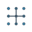 [Via Stitching](via_stitching_plugin/ReadMe.md)<br>Version 3.6.14 | Square/staggered grids; density profiles; net/layer filters; clearance checks; grouped apply | Places net-connected stitching vias in selected copper regions. |
|  [Bulk Label Editor](bulk_label_editor_plugin/ReadMe.md)<br>Version 3.6.14 | Wildcard and regex replacements; references, values, fields and PCB text; preview and apply | Renames repeated labels and component text in bulk. |
| 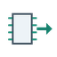 [Pin Extractor](extract_pins_plugin/ReadMe.md)<br>Version 3.6.14 | PCB cross-selection; pin/net tables, power trees and selection basket; safeguarded path tracing and CSV/Markdown exports; native SVG diagrams and interactive connector/pin HTML [3.4.0] | Turns board connectivity into interactive pinouts and signal-path documentation. |
| 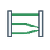 [Harness Workbench](harness_workbench_plugin/ReadMe.md)<br>Version 3.6.14 | Connector mapping; bundles and splices; wire gauges and loads; SVG/interactive maps; procurement BOM | Documents wiring between boards, connectors and peripherals. |
|  [Copper Balancer](copper_balancer_plugin/README.md)<br>Version 3.6.14 | Eight thieving patterns; per-layer density maps; clearance/keepout checks; saved-copy output | Adds reviewed isolated copper to balance local PCB copper density. |
|  [Mechanical Check](mechanical_check_plugin/README.md)<br>Version 3.6.14 | STEP model coverage, collision and clearance checks; interboard placement and per-finding cross-sections [3.6.4]; point/point, edge/edge, point/edge and body-centre 3D rulers, closest-approach hover distances, automatic part dimensions, top/bottom height-excess markers, proximity warnings and a larger board viewport [3.6.13] | Measures saved geometry and marks collisions, close approaches and height excesses; coverage gaps remain visible. |
|  [Heater Designer](heater_designer_plugin/ReadMe.md)<br>Version 3.6.14 | Copper, foil and custom alloys; serpentine, spiral, organic, circular and maze patterns; multilayer heaters; electrical/thermal preview | Creates heating patterns for declared material, resistance and temperature targets. |
|  [Planar Magnetics](planar_magnetics_plugin/ReadMe.md)<br>Version 3.6.14 | Multilayer winding generation; LCR and field estimates; motor/actuator models; ngspice simulations | Designs PCB windings and evaluates supported magnetic and electromechanical concepts. |
|  [Manufacturing Readiness](manufacturing_readiness_plugin/ReadMe.md)<br>Version 3.6.14 | Fabricator profiles; board geometry audits; native DRC/jobsets; release gates; hashed ZIP exports | Checks manufacturing constraints and packages reviewed fabrication outputs. |
|  [Constraint Studio](protocol_constraint_composer_plugin/ReadMe.md)<br>Version 3.6.14 | 34 visual DRC rule forms; clearance matrices, netclasses and reusable sets; protocol/per-layer routing profiles and reviewed offline Apply Review [3.4.0]; responsive editing, long findings lists and guarded application with request recovery [3.6.12] | Creates and reviews KiCad design constraints in a staged project workspace. |

## Install and open

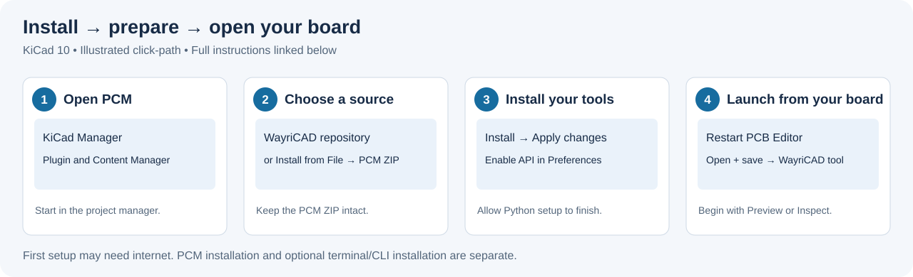

1. In KiCad Manager, open **Plugin and Content Manager**. Add the repository URL below, select **WayriCAD Plugin Repository**, and install the tools you need.
2. Alternatively, download an individual `WayriCAD-<tool>-<version>-PCM.zip` from Releases and use **Install from File**. Do not unpack the ZIP yourself.
3. For the IPC tools, in **Preferences → Plugins**, enable the API and configure Python. Let KiCad finish preparing each plugin environment, then restart the PCB Editor. **Fusion uses the native SWIG loader and does not require enabling the API:** install its PCM ZIP, apply, restart PCB Editor, and choose **Tools → External Plugins → Wayri Project Fusion**.
4. Open and save your board/project, then launch a WayriCAD action from **Tools → External Plugins** or the **PCB Editor's top toolbar**. Use **WayriCAD — All tools…** at the top of the External Plugins menu to search the full installed list when the flat KiCad menu does not fit on screen. The KiCad 10 packages include lightweight menu launchers alongside their IPC toolbar actions. Maximize the editor if the toolbar is crowded; use **Preferences → PCB Editor → Plugins** to show or hide individual buttons. Toolbar launches use the originating project; standalone launches may need a file selection. Startup feedback stays visible while a plugin prepares its runtime and clears when the plugin is ready [3.6.13].

```text
https://raw.githubusercontent.com/wayri/WayriCAD/develop/pcm/repo.json
```

Initial dependency setup needs internet access or a prepared wheel cache. Once prepared, application pages, previews and project processing run locally. Some tools use a separate native KiCad runtime; [runtime setup](wayricad_runtime/RUNTIME_SETUP.md) explains overrides and offline installation.

## Choose a KiCad workflow

- **Combine designs or reuse a circuit:** [Project Fusion](project_fusion_plugin/README.md) merges projects and selected schematic sheets with optional routed layout, variant selection, visual placement, dependency copying and reviewed linked updates.
- **Inspect PCB electrical behaviour:** [Quick PI](quick_pi_plugin/README.md), [Quick SI](signal_integrity_advisor_plugin/ReadMe.md) and [Trace RLC / Impedance](trace_impedance_plugin/ReadMe.md) report results with explicit model assumptions and coverage.
- **Review component temperatures:** [QuickTherm](quick_therm_plugin/README.md) models declared losses and thermal inputs with a board result overlay.
- **Prepare assembly and fabrication:** [BOM Studio](bom_studio_plugin/README.md), [Constraint Studio](protocol_constraint_composer_plugin/ReadMe.md) and [Manufacturing Readiness](manufacturing_readiness_plugin/ReadMe.md) provide field editing, rules and release checks.

## Plugin previews

Select a tool title for its guide, or a latest screenshot to open it at full resolution. Demonstration values are not predictions for your board.

### Latest GUI snapshots

These unmodified native captures use public or generated demonstration boards. The PI, thermal-input and mechanical workspace images were recaptured with opaque backgrounds so they remain readable in light and dark GitHub themes. [Recapture provenance](docs/audits/README_GALLERY.md) records the fixtures and checks. Select any image for its original resolution.

#### [3.6.14 — explicit contacts and fitted thermal controls](docs/PACKAGE_CONDUCTION.md)

<a href="docs/assets/package-conduction/quick-pi.png"></a>

<a href="docs/assets/package-conduction/quick-therm.png"></a>

These captures use a generated board and illustrative lead/solder properties. The 1 s thermal frame includes imported copper and contact losses. [Capture provenance](docs/assets/package-conduction/PROVENANCE.md) and [validation](docs/audits/PACKAGE_CONDUCTION.md). The other feature captures below were introduced in 3.6.13.

#### [Mechanical Check — 3D measurements and height checks](mechanical_check_plugin/README.md)

<a href="mechanical_check_plugin/help-workflow.png"></a>

Inspect STEP geometry, engineering rulers and height/proximity findings in a large board viewport. The fixture deliberately includes height violations and incomplete coverage. [Capture and validation notes](docs/audits/MECHANICAL_INSPECTION.md).

#### [Quick PI — copper and results workspace](quick_pi_plugin/README.md)

<a href="quick_pi_plugin/help-workspace.png"></a>

Compact setup and inspection panels leave more room for the board and continuous result overlay. The demonstrated field solves a uniform copper plate; the pictured PCB traces provide visual context. [Capture and analytical reference](docs/audits/QUICK_PI_WORKSPACE.md).

#### [QuickTherm — STEP models and transient heating](quick_therm_plugin/README.md)

<a href="quick_therm_plugin/examples/quicktherm-component-heating.png">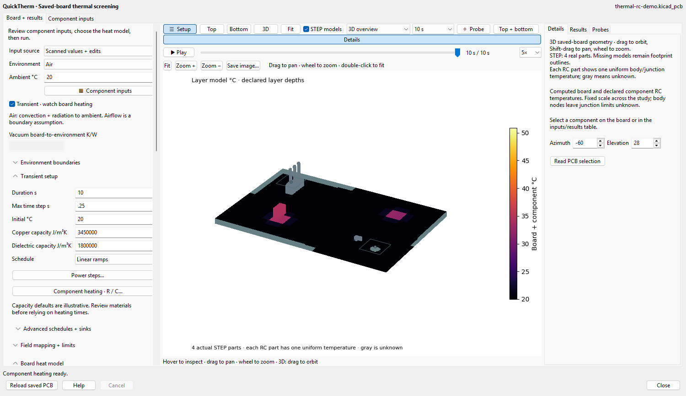</a>

Orbit real STEP geometry and scrub through calculated board and declared component RC temperatures. Each modeled part has one temperature; grey parts have unknown temperature. The example uses explicit demonstration thermal inputs. [Capture, thermal assumptions and validation](docs/audits/QUICKTHERM_COMPONENT_HEATING.md).

#### [QuickTherm — editable component inputs](quick_therm_plugin/README.md)

<a href="quick_therm_plugin/examples/quicktherm-input-workspace.png"></a>

Review scanned values, select the analysis scope and edit power, thermal resistances and limits in one table. [Input workspace capture notes](docs/audits/QUICKTHERM_WORKSPACE.md#screenshot-provenance).

### More plugin previews

Select a title for its guide, or a picture to open the original full-resolution capture. These older previews use generic project locations in place of machine-specific paths; surrounding UI and numerical results are preserved.

#### [Adaptive fanout](fanout_generator_plugin/ReadMe.md)

<a href="fanout_generator_plugin/help-adaptive.png">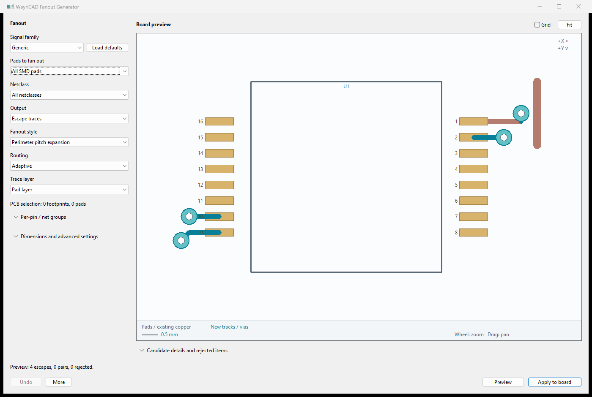</a>

Review pads, existing copper and proposed tracks/vias before applying.

#### [Quick SI](signal_integrity_advisor_plugin/ReadMe.md)

<a href="signal_integrity_advisor_plugin/help-protocols.png">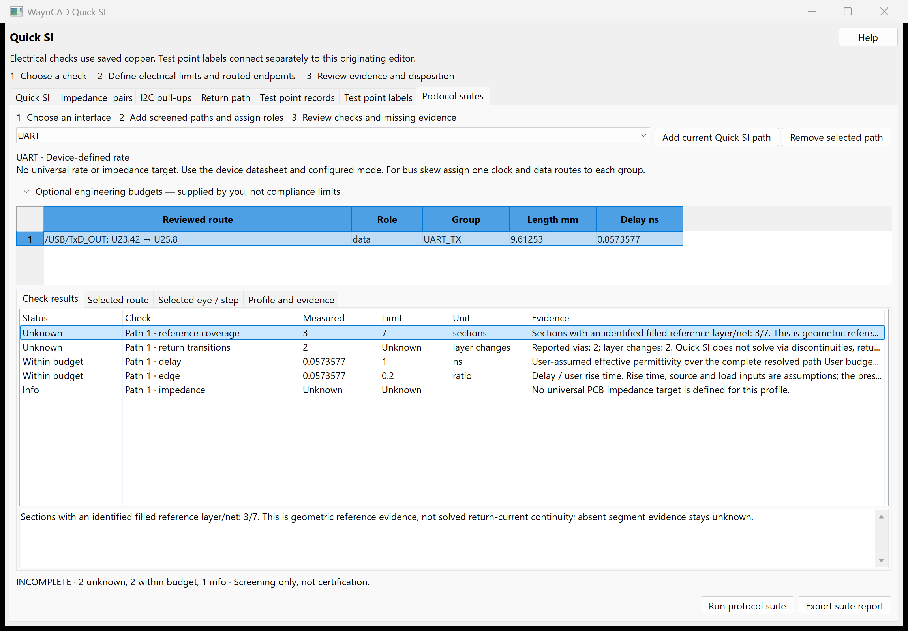</a>

Protocol screening keeps missing models and reference coverage visible.

#### [Trace RLC](trace_impedance_plugin/ReadMe.md)

<a href="trace_impedance_plugin/help-ac-geometry.png">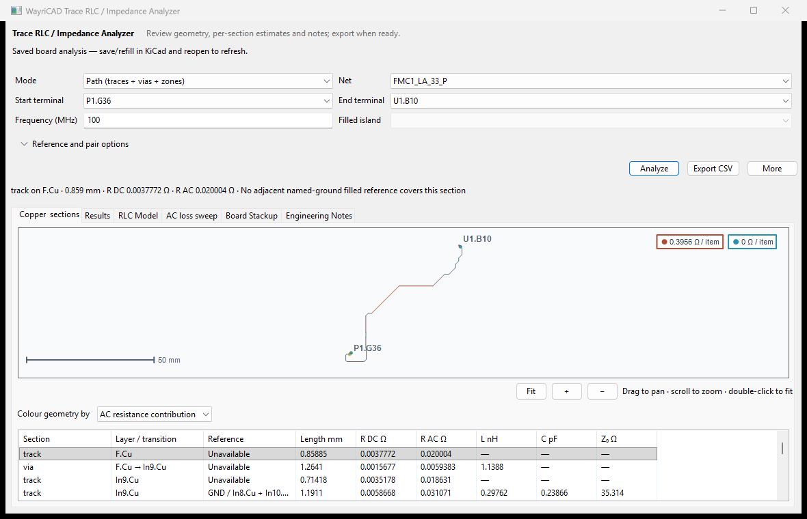</a>

Inspect the connected copper path and per-section electrical coverage.

#### [BOM Studio](bom_studio_plugin/README.md)

<a href="bom_studio_plugin/help-cost-mass.png">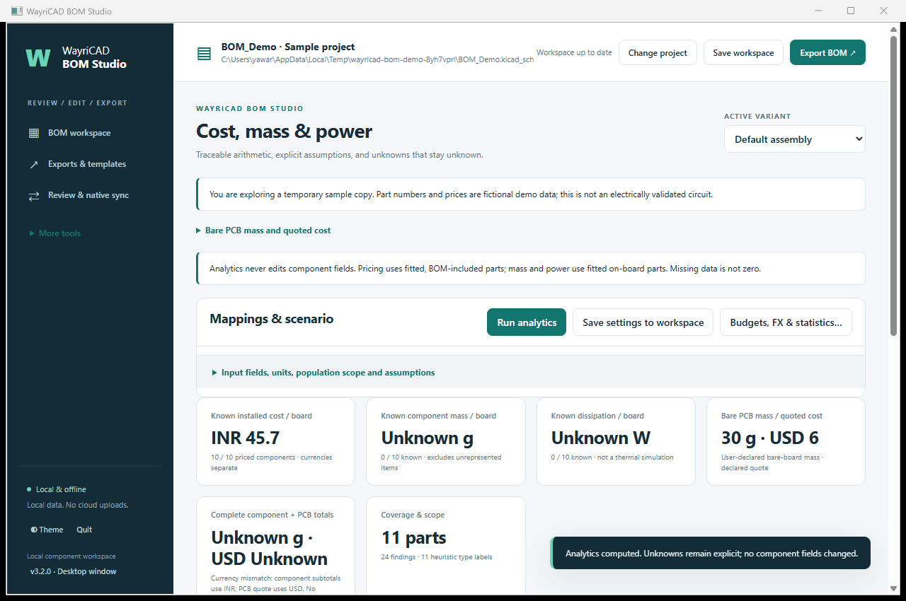</a>

Templates, bulk editing, conditional exports and explicit cost/mass coverage.

#### [Magnetics](planar_magnetics_plugin/ReadMe.md)

<a href="planar_magnetics_plugin/help-motor-emf.png">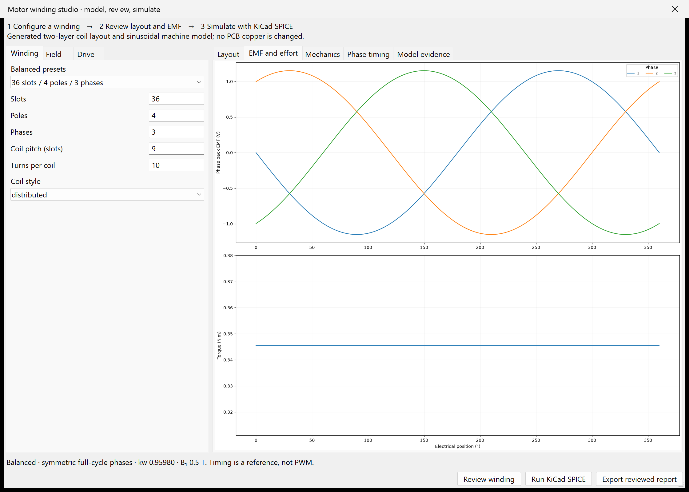</a>

Motor EMF/force, winding layouts, coupled fields and KiCad SPICE; see model limits.

#### [Constraint Studio — visual constraint manager](protocol_constraint_composer_plugin/ReadMe.md)

<a href="protocol_constraint_composer_plugin/help-workflow.png">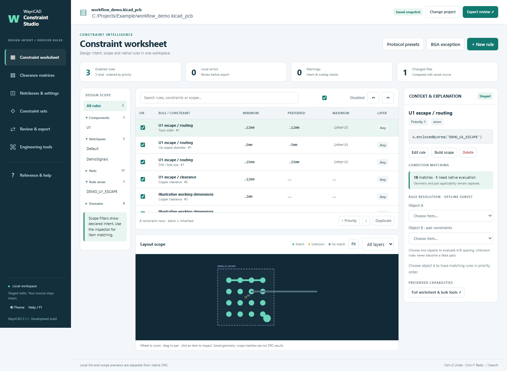</a>

Edit custom DRC rules visually, manage clearance matrices and reusable constraint sets, and stage per-layer routing profiles for reviewed export. Shipped interface rendered with a demonstration snapshot; scope colours are condition matches, not native DRC results.

#### [Variant Manager — assembly comparison](variant_manager_plugin/README.md)

<a href="variant_manager_plugin/help-workspace.png">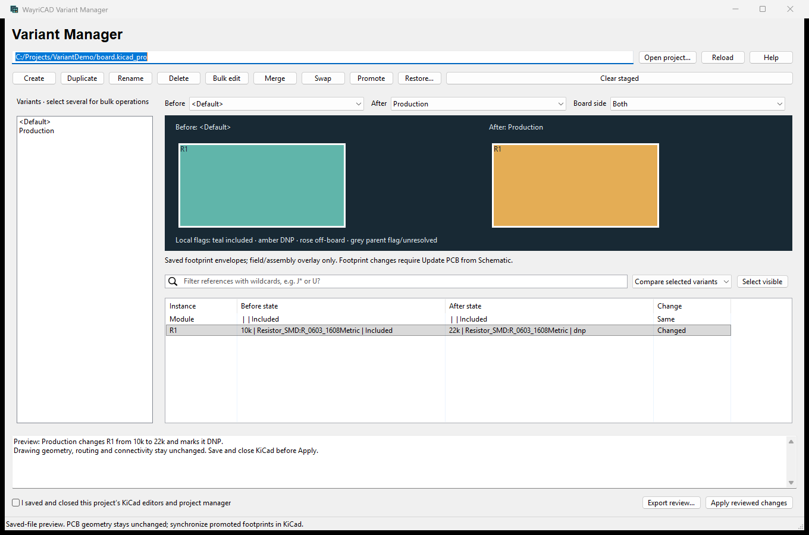</a>

Compare saved and staged assembly states, with bulk edit/delete, conflict-aware merge, swap, promotion and verified recovery.

## Focused workflows, shared tools

BOM Studio keeps templates, cell and bulk editing, grouping, and conditional exports in three primary views. Mechanical Check retains exact solids and adds a quick 2D envelope screen without FreeCAD. Copper Balancer reports rejected sites and per-tile density deficits. Quick PI includes decoupling placement; QuickTherm is separately installable; Quick SI includes return-path and test-point workflows. These are distinct checks inside the suite, not claims of full electrical or mechanical certification.

[Constraint Studio](protocol_constraint_composer_plugin/ReadMe.md) is the suite's visual constraint manager: custom DRC rule forms, clearance matrices, netclasses, reusable sets and per-layer routing profiles share a staged workspace. Review generated rules and file diffs before offline apply, then validate with KiCad's native DRC.

## Upgrade safely

Remove obsolete suite package entries to avoid duplicate actions. Embed3D combines the former Localizer and Portable Assets workflows and keeps the `embed-3d` package ID. Visual Diff and Design Variant Workbench are retired; their standalone source directories and those of consolidated tools are removed from repository history. PDN Decoupling is now a tab in Quick PI. Return-Path Auditor and Test Point Descriptor are tabs in Quick SI; their separate packages are retired. Native KiCad variants replace the standalone variant tool. The source installer backs up retired installations; it does not delete project data. Keep existing BOM workspaces and project backups.

For a source installation, build packages and run `python tools/install_suite.py` to preview the destination, then repeat with `--apply`. Use `--destination` for an explicit location. [Installation details](docs/TROUBLESHOOTING.md#installation-paths).

## Automation and development

Use `wayricad jobs` to create repeatable analysis/report sequences and insert them into KiCad jobsets. Native DRC/ERC, BOM, PI, SI and RLC presets collect a local HTML index, logs and JSON/hash evidence. [Setup and examples](wayricad_runtime/JOBSETS.md).

Install the source interfaces with `python -m pip install -e .`. Use the [CLI guide](docs/CLI_USER_GUIDE.md) · [Jobsets and automatic reports](wayricad_runtime/JOBSETS.md) for reviewed plan/apply routing, native DRC verification, PI, RLC and library commands. Apply writes a new board copy; verification reports native DRC findings and preserves source hashes.

For repository work, start with [AGENTS.md](AGENTS.md) and [CONTRIBUTING.md](CONTRIBUTING.md): architecture, validation, runtime checks and release safeguards.

```text
python -m pip install -e ".[test]"
python tools/prepare_suite.py
python tools/generate_suite_icons.py
python -m unittest discover -s tests
python build_pcm.py --output-dir .validation/candidate-pcm-3.6.14
python tools/validate_packages.py --archive-dir .validation/candidate-pcm-3.6.14
```

Imported applications have separate test suites. Native tests require the relevant installed engines; skipped checks are not compatibility evidence. Read [compatibility](docs/COMPATIBILITY.md) and the [Marble smoke-test record](docs/audits/MARBLE_SUITE_SMOKE.md) for the distinction between checks, demonstrations and unverified operations. Historical release notes describe their original versions.

## Acknowledgements and AI disclosure

WayriCAD development has made substantial use of AI coding assistants and large language models (LLMs) for implementation, debugging, tests, documentation and research assistance. Project maintainers remain responsible for the code and release decisions. AI-generated code and explanations can contain errors; validation evidence and model limitations are documented separately.

We thank the KiCad community, upstream open-source projects, researchers and contributors whose work supports this suite. See [acknowledgements and the full AI-development disclosure](ACKNOWLEDGEMENTS.md).
