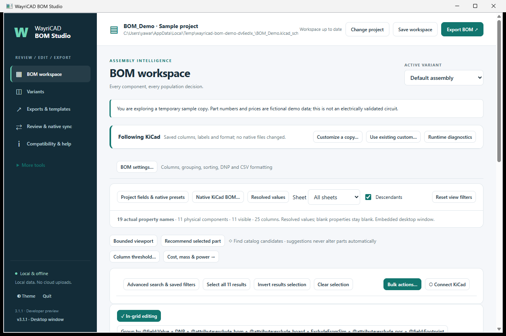
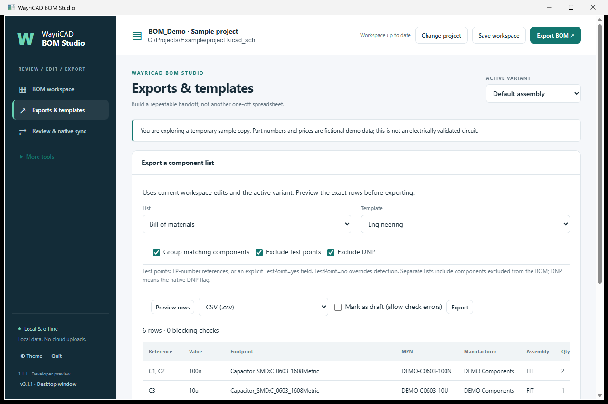
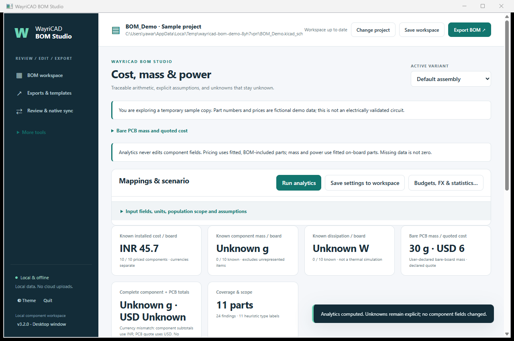
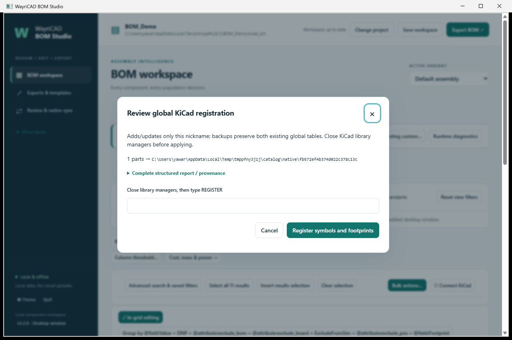

# WayriCAD BOM Studio


## Capabilities

- Edit component fields individually or in bulk, with grouping, reusable templates and a local desktop/browser interface.
- Export grouped or individual BOMs with DNP/test-point filters, plus separate DNP and test-point lists.
- Review staged changes before native source sync; save workspace settings and edits alongside the project.
- Analyze declared component cost, mass and power, bare-PCB estimates, component families and supported saved-board areas.
- Reuse local shared-parts catalogues and export recipient-specific assembler handoffs.

## Limitations

- Native KiCad exports read saved source; staged workspace edits require a workspace export or reviewed native sync.
- Costs, masses and operating power depend on supplied fields and assumptions; missing values and mixed currencies prevent complete combined totals.
- Area/power-density analytics are descriptive, not thermal simulation; unsupported PCB geometry remains unknown.
- Legacy source formats can restrict native writes. New recipient templates require review against the assembler’s requirements.
- The desktop UI needs a working WebView runtime or the local-browser fallback; native KiCad 11 acceptance remains unverified.

## Overview

Local BOM editing and exports for KiCad 10. The desktop window runs the bundled interface through wxPython WebView and a session-authenticated loopback server. UI assets are local; no CDN, account or cloud service is needed. Dependency installation may require internet access once.

## Install

In KiCad Manager, open Plugin and Content Manager → Install from File and select the **WayriCAD BOM Studio 3.1.1 PCM ZIP**. Keep the ZIP intact. Restart KiCad and launch BOM Studio from the plugin toolbar. IPC support must be enabled in KiCad preferences. The toolbar launcher selects a compatible installed KiCad Python runtime and provisions its lightweight dependencies in a private WayriCAD cache. It does not build wxPython inside KiCad's managed plugin environment. Windows needs WebView2; Linux needs the distribution's wxGTK/WebKit runtime. If the native browser cannot initialize, the same fully local interface opens in your installed browser with the reason displayed.

The UI is a separate local desktop window. Windows requires a working WebView2 runtime; Linux requires wxGTK WebKit support. If an embedded runtime is unavailable, the launcher opens the same authenticated local interface in your installed browser. Use the page’s Quit button to stop the local service. KiCad 11 compatibility is based on capability checks and an open-ended minimum version; live KiCad 11 acceptance has not been run.

## Current desktop workspace



The built-in sample contains 11 components and fictional part/pricing data. The screenshot shows the three primary views; it is not an electrically validated circuit.

## Everyday workflow

1. Launch from PCB Editor to use its saved project automatically. Standalone mode can open a `.kicad_pro` or root `.kicad_sch`, or explore the built-in sample.
2. Use **BOM settings** to arrange fields, labels, visibility, grouping, sorting, DNP filtering and CSV delimiters.
3. Work in three main views: **BOM workspace**, **Exports & templates**, and **Review & native sync**. Variants, help, catalogue, sourcing, checks and automation remain under **More tools**.
4. Save workspace changes to the adjacent `.wayricad-bom.json` sidecar. Undo restores settings as well as component edits.
5. Export using the saved KiCad native engine, or select a custom workspace template for staged edits. Native export reads saved KiCad source files; it does not automatically apply staged component edits. Review & native sync handles explicit backed-up source changes.

## Simple exports



Choose **Exports & templates**, a saved template, then **Bill of materials**, **Test points only**, or **DNP only**. The default BOM excludes test points and DNP components. Toggle either condition as required. **Group matching components** produces quantities and reference groups; turn it off for one component per row. Existing safety grouping separates differing packages and procurement data.

**Preview rows** shows the staged workspace data that the export uses. Choose CSV, XLSX, HTML or another supported format and Export. Errors still block release exports unless you explicitly mark the output as draft. Separate test-point and DNP lists include parts excluded from the normal BOM.

Test-point detection uses TP-number references (for example TP12) or the component field `TestPoint=yes`; `TestPoint=no` explicitly opts out. Use bulk field editing to classify nonstandard reference names. DNP lists use the native DNP flag. These are schematic component lists, not PCB test-pad coordinate reports.

Expand **Templates, native exports and advanced settings** to edit, duplicate, import or share full templates, and to use saved-source KiCad exports. Quick export conditions are session choices; saved templates and project files are unchanged by preview or export. Editing and bulk editing remain in BOM workspace. Native source changes still require reviewed sync.

## Cost and mass, including the bare PCB

### Custom mappings and component analytics

Use **Cost, mass & power → field mappings** to select your own KiCad fields for unit cost, currency, mass, operating dissipation and component type. For example, map `PurchasePrice`, `PartWeight` and `OperatingLoss`; values such as `100 mg` and `250 mW` retain their units. Resolved KiCad variables are supported, with raw/resolved source values recorded. **Export mapping template** and **Import mapping template** share these settings as JSON; Save settings, then Save workspace, persists them. These are analytics profiles, separate from BOM export-layout templates, and do not rename or overwrite native properties. Power rating is not operating dissipation.

After **Run analytics**, **Components & area** shows passive, active and other-component cost, mass and dissipation, plus separate R, L, C and combined RLC views. Component-type fields override reference-prefix guesses; unknown types stay unclassified. Diodes/LEDs are grouped with actives by convention. Histograms show component cost, mass, dissipation and available power/area distributions. Cost currencies remain separate; the existing **Cost & Pareto** view and summary provide total known BOM costs and build scenarios. RLC is an overlapping rollup, not another amount to add to the family totals.

Area analytics read the saved PCB beside the project (or the PCB path configured in Project health), matching reference, footprint identifier and UUID path when available. Footprint area uses the placement-side courtyard. The pad-contact proxy sums supported numbered copper lands on the placement side, subtracting supported drill openings. It is nominal copper area, not measured solder contact. Missing/mismatched footprints, open/curved courtyards, custom pads and potentially overlapping pad bounds remain unknown. Overlap bounds are conservative and can reject closely spaced disjoint pads. Unsaved PCB changes are not included.

Power/area uses **only components with both known power and known area**, with coverage shown beside results. These figures are descriptive densities, not temperature or cooling predictions. Expand geometry coverage to inspect source/hash and per-component reasons. **Download analytics → families** exports the breakdown; HTML reports include histograms and assumptions, and full JSON/XLSX exports include the new analysis. Saved project HTML/JSON reports include it too.

Open **Cost & mass…** beside BOM settings, or use **More tools → Cost, mass & power**. Map the component `UnitPrice`, `Currency` and `Mass` fields (custom field names are supported). Bulk-edit these fields in BOM workspace. Enter build quantity, pricing basis and mass units; explicit units such as `100 mg` override the default mass unit. Each physical component is counted once, even when represented by several schematic units.



The screenshot uses fictional sample prices and an illustrative PCB quote: 30 g, USD 4 per board plus USD 20 setup over 10 boards = USD 6 per board. Component mass is missing and component currency differs, so complete assembly totals correctly remain unknown.

Expand **Bare PCB mass and quoted cost** to enter either measured/declared PCB mass or all material-volume inputs: net laminate area in mm², dielectric thickness excluding copper in mm, dielectric density in g/cm³, summed copper thickness in mm, thickness-weighted copper coverage percent and copper density in g/cm³. This is an explicit material estimate, not an automatically extracted stackup. Cutouts, coatings, plating and solder need separate allowance; do not include a bare-PCB BOM component twice.

PCB cost uses an entered supplier quote: `unit cost + setup cost / quote quantity`. Enter setup cost as **0** when none. Blank quote quantity uses build quantity. The quote currency is mandatory; no current market price or quantity discount is guessed. Taxes, shipping and assembly labor are excluded unless explicitly included in your quote. Record supplier/date or material provenance in Source.

DNP parts are excluded from fitted cost and mass. Pricing also excludes BOM-excluded parts. Physical mass includes fitted on-board BOM-excluded parts only when its explicit scope checkbox is enabled. Build attrition applies to purchasing, not installed mass. Analytics query scope is independent of the BOM table’s temporary display filter. Missing values show coverage counts and known subtotals, never a complete zero. Complete component-plus-PCB totals require full relevant component coverage; cost totals also require one matching currency.

**Save settings to workspace**, then Save workspace, retains assumptions in the project sidecar. **Save reports in project** recomputes the current settings and writes `analysis.json`, `analysis.html`, `summary.csv` and `components.csv` into a unique folder under `reports/wayricad-bom/` beside the originating project. Repeated exports preserve earlier reports. Saved-source changes require reload; reports cannot overwrite design files. The existing Download analytics action retains XLSX and other formats.

## CLI

Older hierarchical projects can be upgraded through **Review & native sync > Upgrade project copy**. Select a new directory outside the source project. KiCad 10 upgrades every sheet; WayriCAD restores legacy annotation and power-net semantics, then compares native connectivity and component fields before publishing the copy. The original project stays unchanged. Unsupported or ambiguous hierarchies are rejected with a reason. Consistent multi-unit components spanning several sheets are grouped and edited together.

Run from this package directory with Python 3.10 or later:

```console
python cli.py gui --demo
python cli.py gui project.kicad_pro
python cli.py upgrade-copy legacy/project.kicad_pro --destination modern-project
python cli.py bom-format show project.kicad_pro
python cli.py bom-format configure project.kicad_pro --config settings.json
python cli.py export project.kicad_pro --format csv --acknowledge-saved-only --output bom.csv
python cli.py --help
```

`settings.json` contains `bom_settings` (including `fields_ordered`) and `bom_fmt_settings`. The **bom-format show** response exposes the current `preset` and `format` objects to use as these values. Configure updates the sidecar and preserves native files. `gui --ui none` starts the local headless service; `--ui browser` selects the local browser directly. CLI output refuses accidental overwrites.

Advanced tools include assembler and distributor exports, reusable custom templates, field inventories, variants, local parts catalogues, asset previews, checks and job sets. Supplier integrations are opt-in. STEP/IGES/BREP preview requires the optional packages listed in `requirements-preview.txt`; BOM editing and VRML/STL previews do not.

## Validation and licensing

Run `python -m unittest discover -s tests` from this directory. Contract tests do not establish native-editor equivalence or manufacturing qualification. Read the suite release validation report for actual host checks.

The imported BOM Studio implementation retains its original MIT license and copyright in [LICENSE](LICENSE). Suite bundles also include shared GPL-licensed runtime code with its own notice. The PCM package declares the combined distribution license. See [THIRD_PARTY_NOTICES.md](THIRD_PARTY_NOTICES.md) for bundled asset attribution. Version-specific documents under `docs/` describe historical feature development; this README is the current installation guide.

## Shared parts and plugin-only alternatives

Use **Shared parts library** in BOM workspace to capture project assets, remember a catalogue across projects, share templates and review global KiCad registration. The **Alt (plugin only)** selectors provide keyword/regex suggestions with specification differences. [Workflow, safety boundaries and manufacturing formats](SHARED_PARTS.md).

## Shared parts across projects

Open **Shared parts library** in BOM workspace to create or attach a persistent catalogue outside the project. Save the workspace first, then review and capture reusable parts and their native assets. Templates can be saved to the catalogue and imported into other projects without replacing conflicting local names.

The **Alt (plugin only)** column searches catalogue candidates and shows matching, differing and unknown specifications. Recording a candidate preserves the native part and exported BOM; it does not establish pin or electrical compatibility.

**Review global registration** previews symbol and footprint table changes before the explicit REGISTER action. Complete captured assets are required; snapshots retain linked 3D models, preserve unrelated library entries and back up existing tables. Review the KiCad version configuration directory and close library managers before applying. Catalogue changes after preview require another review.



*Disposable one-part catalogue preview in the native window; no global registration applied in this validation.*

OEM / assembly export also includes AISLER, PC Process and Krypton Solutions recipient handoffs. These editable generic mappings require review and are not verified vendor portal templates.
