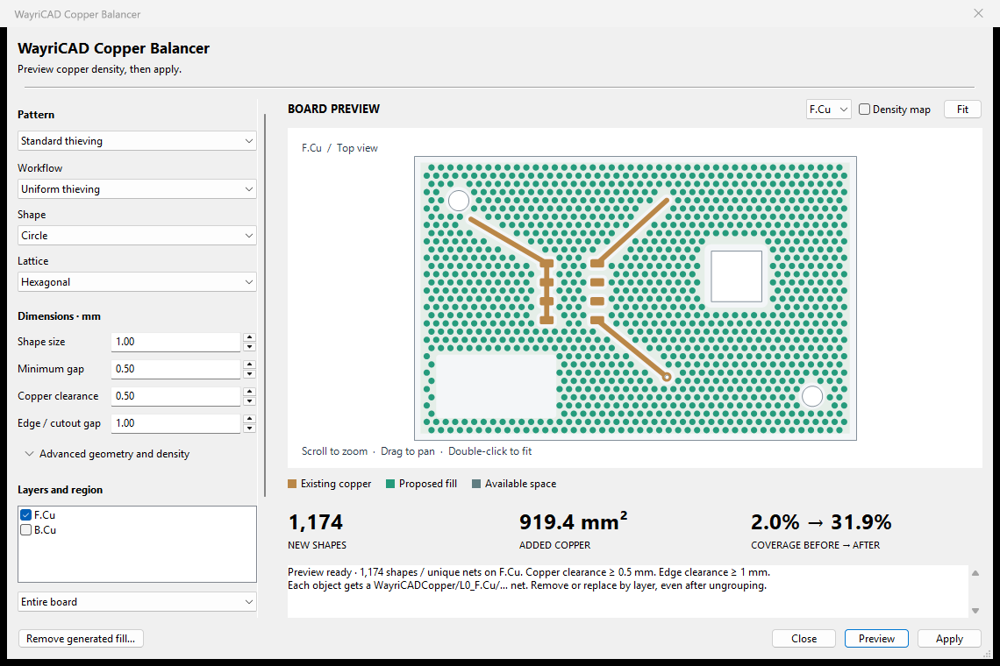
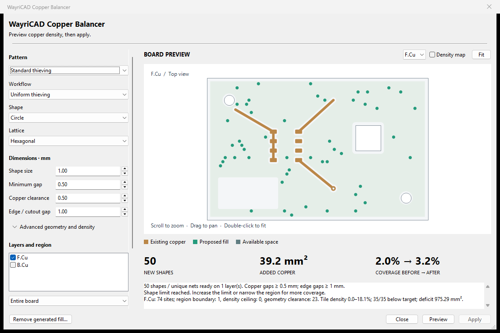

# WayriCAD Copper Balancer

Local copper thieving and density balancing, integrated from CopperBalancer 0.2.0. Uses KiCad 10 native integer polygon booleans; no geometry server or remote UI assets.



## Install and open

Install this tool's WayriCAD PCM ZIP using KiCad 10's Plugin and Content Manager **Install from File**. Open **WayriCAD Copper Balancer**, then choose a saved PCB. This package's IPC menu action launches a separate native KiCad 10 process; it does not change the open editor board. Unsaved editor changes are not included. KiCad 10 must remain installed. If automatic discovery fails, set `WAYRICAD_KICAD_PYTHON` to its Python executable.

The source package also exposes a native ActionPlugin for KiCad 10's legacy scripting host. That path edits the live board and relies on the host's action-plugin undo boundary; live editor undo has not been independently verified for this imported tool. The PCM saved-copy workflow is the default.

## Workflow

1. Save the source PCB, finish its closed Edge.Cuts outline and fill its zones.
2. Choose a preset, shape, workflow and enabled copper layers. Basic size/gap controls stay visible; advanced geometry and density controls expand when needed.
3. Preview actual board outlines, holes, existing copper and proposed fill on a neutral canvas. Scroll to zoom, drag to pan, double-click to fit. Switch layers and enable the density map to inspect per-tile coverage.
4. Choose **Save balanced copy** and a new output filename. Cancelling the picker leaves the preview untouched. Existing files cannot be replaced.
5. Open the copy in KiCad, refill zones and run DRC. Custom pair-specific DRC rules still require KiCad's checks.

Eight shapes (circle, square, diamond, hexagon, octagon, rounded square, organic blob, bar), square/hexagonal lattices, uniform thieving, local density balancing and edge bands are retained. Whole-board and manual-rectangle scope work on saved copies; selection bounds are available only in the native editor action. Each generated shape gets a unique floating net and no solder-mask opening. Replacement/removal acts only on selected layers and recognized generated ownership. Existing CopperBalancer nets/groups remain recognized so imported boards can be regenerated without duplicate fill; new ownership uses `WayriCADCopper`.

Previews are nonmutating. Settings and actual board geometry invalidate stale plans. Application restores objects, nets and group membership on failure. The output writer checks that the source file is unchanged and exclusively creates a new destination. Candidate/shape limits and cancellation keep generation bounded. Density targets are ceilings, not guaranteed final coverage or plating simulation.

## Density diagnostics



Synthetic fixture, limited to 50 proposed shapes; no board modification.

Each preview explains rejected sites by region boundary, per-tile density ceiling and geometry/clearance. The summary reports minimum/maximum tile coverage, tiles below target, the remaining target-area deficit, and tiles already above target before generation. The latter cannot be repaired by adding copper. CLI JSON exposes the same `diagnostics` object per layer. Geometry/clearance is one combined conservative rejection category, not a guessed obstacle diagnosis.

Settings reject booleans disguised as dimensions, nonfinite coordinates and noninteger shape limits/seeds. Impossible geometry-adapter areas fail the preview instead of producing misleading density. Tiny polygon-rounding deviations are clamped within a numerical tolerance. These diagnostics quantify copper coverage, not electroplating or thermal performance.

## Command line

The suite console command discovers KiCad's native interpreter automatically. `--help` needs no KiCad installation.

```text
wayricad-copper board.kicad_pcb --layer F.Cu --layer B.Cu
wayricad-copper board.kicad_pcb --settings settings.json --layer F.Cu --output board-balanced.kicad_pcb
```

The first command prints a JSON plan summary without writing a board. `--output` builds the same validated geometry and writes a new copy. Settings JSON accepts `shape`, `mode`, `lattice`, `size`, `gap`, `clearance`, `edge_clearance`, `rotation`, `target`, `tile_size`, `band_width`, `seed`, `max_shapes`, `replace` and optional `[x0,y0,x1,y1]` region. All distances are millimetres; e.g. `{"mode":"Local density balance","target":30,"size":1.2}`.

From a source checkout: `python copper_balancer_plugin/desktop_entrypoint.py board.kicad_pcb --layer F.Cu`. The native backend requires KiCad 10.x. **Live IPC copper editing and KiCad 11 native geometry are not claimed.** Other operating systems' interpreter discovery is best effort and unverified.

## Development

From this folder run `python -m unittest discover -s tests -v`; native tests skip without pcbnew. Repeat with KiCad 10's bundled Python for polygon/serialization tests. `tools/ui_smoke.py` opens and captures only a disposable fixture dialog. The upstream MIT license is preserved in `LICENSE`; the distributed suite runtime is GPL-3.0-only. See `PROVENANCE.md`.
