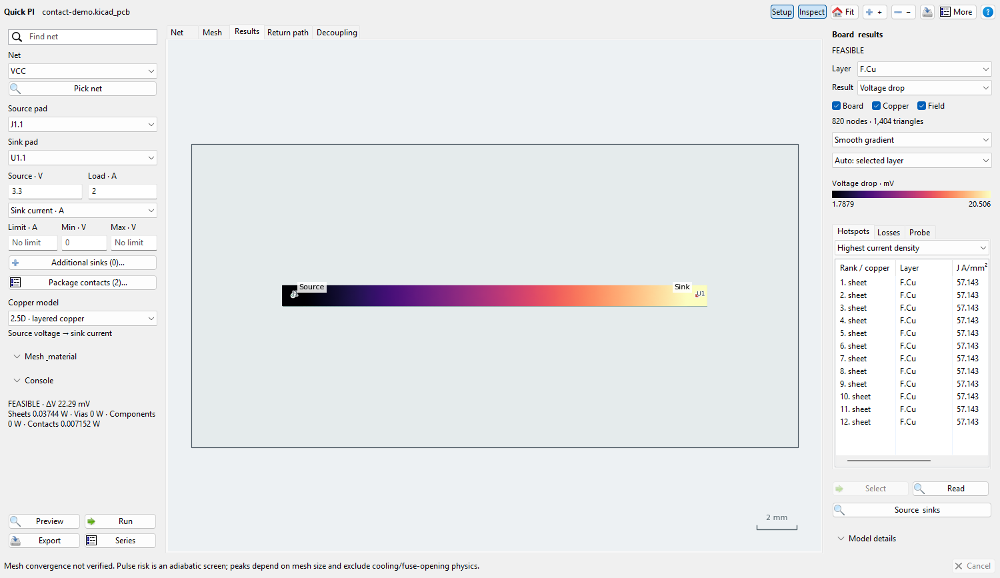
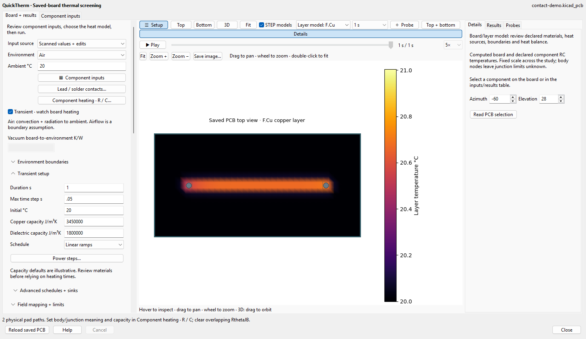

# Lead, solder and BGA conduction

This development feature adds explicit one-dimensional package contacts to
Quick PI's 2.5D constant-current DC network and QuickTherm's multilayer steady
and transient board graph. It is separate from the published 3.6.13 feature set.
The board mesh already contains pads and plated barrels; their conduction is
retained rather than replaced or counted again as a lead segment.

Native development snapshots use the generated acceptance board and illustrative
materials, not a customer PCB. [Capture provenance](assets/package-conduction/PROVENANCE.md)
records the source and privacy check.





## Inputs and use

In Quick PI, select **Package contacts…** beside the source/load setup. In
QuickTherm, select **Lead / solder contacts…** in the setup sidebar. Each row
supplies a stable Path ID, component reference, pad number, saved copper layer,
shape, dimensions and material properties. Layer names are resolved using the
loaded KiCad board; numeric IDs are version-dependent. Repeat a Path ID for
ordered lead/solder segments in series. Different paths are parallel contacts.
Source/evidence cells retain the provenance of reviewed material values.

Electrical ports are `source` and `sink:<selected sink pad UUID or label>`.
They represent explicitly common rail endpoints. The electrical service rejects
cross-net pads and conflicting ownership, and binds each contact to one saved
pad face. A package with several power balls shares current through its complete
board/contact network. Assigning independent prescribed currents to balls would
not establish that sharing. Legacy contact-free studies keep their existing
ideal terminal behavior.

Thermal paths share the explicitly declared body/junction node of their component.
Different electrical nets may conduct heat into that common node without becoming
electrically shorted. Enable the part in **Component heating · R / C…** and
review its temperature meaning. Aggregate RC R is 0 for these paths; clear an
overlapping RθJB. Optional extra per-path resistance describes a reviewed
internal/interface path. A complete datasheet RθJB already includes test-board
and package effects and cannot simply be added to resolved solder conduction.
Capacity may be 0 or omitted in steady studies; transient studies require an
explicit positive capacity. Known power is deposited once at the component node.

The native editor can clear all rows to remove physical paths. Input changes
invalidate results. A changed saved source invalidates contact configuration in
the native workspace; service results remain bound to the saved board hash.

## Equations and units

For a constant-section segment with length `L` in mm and area `A` in mm²:

`F = ∫ dz/A(z) = 1000 L/A` in 1/m

`Re = ρ F` in Ω; `Rθ = F/k` in K/W.

Resistivity `ρ` is Ω·m and conductivity `k` is W/(m·K). No material defaults
are supplied. Cylinders use `A = π(d/2)²`; rectangular leads use width ×
thickness. Dimensions are bounded to `[1e-9, 1e6]` mm for finite calculations.

The spherical-ball option is a symmetric truncated sphere with diameter `d`,
height `h < d` and radius `r = d/2`, all in mm:

`F = 2000 atanh(h/d)/(πr)` in 1/m.

Its two finite contact necks have area `π(r² − h²/4)`. Full spheres would have
zero-area end contacts and divergent axial resistance, so they are rejected.
This option describes reviewed geometry; it does not reconstruct solder wetting,
voids or BGA necks from pad diameter. A ball may instead be represented by an
explicit effective cylinder when its effective section has suitable evidence.

Series segment resistances add. PI attaches a finite contact branch between
an equipotential saved pad face and a separate package electrode. It solves
package current sharing and reports signed current, endpoint voltages and I²R
for each path/segment. Source budgets and sink voltage limits use package
endpoints, including contact drop. The selected physical face never merges the
other layers of a through-hole pad and bypasses its barrel.

QuickTherm distributes a path's conductance to intersected pad-support cells
by saved copper area: `Gi = wi/Rθ`, with `Σwi = 1`. This conservative subcell
stencil samples the finite-volume board field; it does not impose an ideal
isothermal pad in the thermal mesh. Signed heat can enter a package through
one hot pad and leave through another cooler pad. Missing faces, duplicate
ownership, oversized final neck area, unsupported boundary contacts and
unresolved annuli reject the solve. Local peaks still need grid refinement;
contact coverage gates use the least-resolved pad of each component.

## Joint I²R heat transfer

**Import PI copper losses…** retains computed contact losses separately from
planar/barrel copper watts. It requires the exact saved board, a feasible PI
operating point, consistent current/resistance/power and matching thermal contact
identities, UUIDs, faces, geometry and overlapping material declarations.
Unknown contact current cannot become zero heat. Delivered load power is not
automatically component dissipation.

For each constant-property segment, `Qj = I² Re,j`. Joint thermal storage is
excluded, so massless internal segment nodes can be eliminated conservatively.
In thermal-resistance coordinates, its equivalent heat allocation to the board
endpoint is:

`Qboard,j = Qj (Rbefore,j + Rθ,j/2)/Rθ,total`.

The package receives the remainder. A single segment splits half to each end;
series segments with differing materials need not split equally. Reports show
heat from the package and heat into the board separately; their difference is
the computed joint heat. No heat is duplicated in component power or copper.
Extra lumped resistances have unknown heat location and reject this transfer;
use explicit reviewed material segments for an imported joint heat study.

Imported heat remains a fixed operating point unless explicitly scheduled using
`contact:<Path ID>` source IDs. Playback does not re-solve contact current or
temperature-dependent resistivity. The separate Quick PI electrothermal feedback
model rejects physical contacts until those paths have a qualified feedback
contract. Full 3D PI, series-domain, resistive-load, sweep and independent rail
transient workflows similarly reject unsupported contacts instead of omitting
their physics.

## JSON example

The values below are illustrative, not recommended solder properties. Replace
them with reviewed geometry/material evidence. This defines one package-to-pad
path; a second distinct ID/pad adds a parallel path.

```json
{
  "id": "U1-A1", "reference": "U1", "pad_number": "A1", "layer_id": 0,
  "port": "sink:U1.A1",
  "segments": [
    {"shape": "rectangular", "length_mm": 1, "width_mm": 0.3,
     "thickness_mm": 0.1, "rho_ohm_m": 2e-8, "k_w_mk": 200,
     "material": "reviewed lead material", "evidence": "replace with source"},
    {"shape": "spherical_ball", "length_mm": 0.2, "diameter_mm": 0.3,
     "rho_ohm_m": 1.3e-7, "k_w_mk": 50,
     "material": "reviewed solder alloy", "evidence": "replace with source"}
  ]
}
```

Quick PI accepts a list through `--package-conduction contacts.json`. QuickTherm
accepts the list as `thermal_network_settings.package_conduction`; its `port`
is unused electrically. Include `component_storage.U1` with declared
`temperature_kind`, `resistance_k_per_w: 0` and capacity for transient analysis.
Geometry, thermal properties and joint heat ledgers are exported in JSON; HTML
shows solved contact heat flow and the reviewed input definitions.

## Limits and reference context

PI treats the declared pad face as an equipotential electrode and keeps plated
barrel resistance finite. QuickTherm distributes path conductance over the
actual saved pad area using mesh-cell overlap weights. Neither attachment
resolves neck-to-pad spreading or the detailed contact footprint inside a pad.
The last segment's neck must fit within the saved copper area, including holes.

These are explicit axial conduction paths, not meshed solder/package solids.
Internal die/leadframe gradients, constriction/spreading, wetting defects, joint
thermal capacity, temperature-dependent material feedback and mechanical fatigue
are not solved. Enter a reviewed effective path or use a separately qualified
solid model where those effects matter. STEP appearance supplies no hidden
electrical connectivity or thermal material evidence.

Primary reference context: COMSOL's [Joule-heated busbar model](https://doc.comsol.com/6.3/doc/com.comsol.help.models.llac.busbar_llac/busbar_llac.html)
describes electrical/energy conservation and material-dependent heating. Ansys
Icepak's [approximated package features](https://ansyshelp.ansys.com/public/Views/Secured/corp/v242/en/ice_ug/ice_ug_sec_mdlpkg_approx_feat.html)
describes substrate and ball details omitted by package approximations. These
references describe their solvers; they do not validate WayriCAD's implementation.
Analytical, conservation and native acceptance evidence is recorded in
[the contact conduction audit](audits/PACKAGE_CONDUCTION.md).
