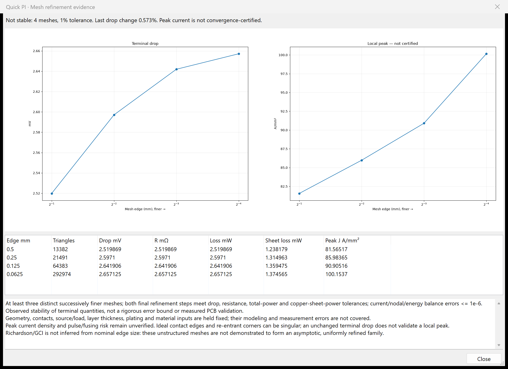

# Quick PI numerical reference benchmarks

These are reproducible **numerical verification**, not measured board validation. They compare production DC solver results to independently derived analytical answers, with production VTK contour meshing. A successful run does not certify arbitrary PCB geometries, peak current, transient behavior or thermal limits.

Run from the repository or installed package with its prepared scientific Python runtime:

```console
python -m quick_pi_plugin.cli --verify --output pi-reference-results.json
# Or inside the prepared scientific runtime:
python -m quick_pi_plugin.verification --output pi-reference-results.json
```

From a source checkout (tests are not installed in the wheel), run `python -m unittest quick_pi_plugin.tests.test_verification` separately. Without `--output`, JSON goes to stdout. The output filename must end in `.json`; missing parent folders are created. Execution and output errors produce JSON on stdout without a traceback. Exit codes: 0 passes, 1 fails numerical criteria, 2 cannot execute. `run_benchmarks()` returns the same JSON-safe evidence. Requirements are the Quick PI runtime dependencies: NumPy, SciPy, Matplotlib and VTK; KiCad and a board are not required. No board is modified.

## Known answers and boundary conditions

Copper resistivity is explicitly 1.724e-8 ohm metre at 20 C, thickness 35 micrometres. This is an input assumption, not a fitted value. Terminals are ideal equipotential electrodes. All cases compare R, voltage drop and Joule loss; energy and current balance must be within 1e-6 relative error.

| Case | Independent reference | Acceptance |
|---|---|---|
| Uniform 10 x 1 mm strip, 2 A | R = rho L/(w t); drop = IR; J = I/(w t); loss = I²R | 1e-7 relative for R/drop/loss and vector J error |
| Parallel 10 mm strips, widths 1 and 2 mm, 3 A | R = rho L/((w1+w2)t); currents 1 and 2 A | 1e-7 relative including each layer current |
| Two strips and one series via, 2 A | 2 Rstrip + rho lv/[pi p(d+p)] | 1e-7 relative; also via current and loss |
| Elmer published beam subproblem | L=1 m, width=0.2 m, depth=1 m, sigma=5 S/m: R=1 ohm | 1e-7 relative |
| Elmer beam plus external 2-ohm resistor | 3 V / (1+2 ohm) = 1 A; beam 1 V; resistor 2 V; total loss 3 W | 1e-7 relative; sink ground within 1e-7 V |
| Radial annulus, inner radius 1 mm, outer 4 mm, 1 A | R=rho ln(b/a)/(2 pi t); J(r)=I/(2 pi r t) | R/drop/loss <=2% / 0.6% / 0.2%; area-weighted vector J L2 <=10% / 5% / 2.5% across the three levels; both errors decrease at every refinement |

Via length is 1.6 mm, drill diameter 0.3 mm, plating 0.025 mm. Its contacts deliberately join whole strip end faces. This verifies the lumped barrel and its coupling to layers; it does **not** verify contact spreading, pad crowding or a 3D via field.

The annulus has finite, smooth radial current density, avoiding reentrant-corner singularities. Complete inner/outer boundaries are terminals. Successive meshes use 24/48/96 segments per circle and requested maximum edges 0.8/0.4/0.2 mm. The reference vector is evaluated at triangle centroids and compared with area weighting. Geometry and discretization are refined together; outer contour sagitta is included in JSON. Each mesh has an 80,000-cell budget. A trial 128-segment/0.15-mm contour exceeded that budget in the production mesher; it is not silently counted as a result.

The metre-scale beam uses a uniformly scaled production rectangle mesh to avoid excessive millimetre contour subdivision. The conductor subproblem and full circuit operating point are reproduced: a 2-ohm external resistor joins a standalone source node to the beam right face. At a 3 V source and imposed 1 A sink on the left face, the computed sink is ground, beam right face is 1 V, resistor drop is 2 V and loss is 3 W. This verifies the same published operating point using a current-sink boundary, rather than independently solving for load current from two prescribed voltages. We have **not run Elmer**, nor claimed a cross-engine comparison.

## Recorded run

Native KiCad scientific runtime, 2026-09-20: eight cases passed in approximately 2 seconds. Linear strip, parallel, via and beam resistance errors were below 4e-13 relative.

| Annulus segments / requested edge | Triangles | R error | Vector J L2 error |
|---|---:|---:|---:|
| 24 / 0.8 mm | 768 | 1.6064% | 7.6555% |
| 48 / 0.4 mm | 4,080 | 0.4121% | 3.7879% |
| 96 / 0.2 mm | 23,712 | 0.1023% | 1.8647% |

Analytical annulus R is 0.1086787928 milliohm. Finest computed R is 0.1085676675 milliohm. These are absolute known-answer errors; the approximately fourfold reduction in R error is evidence for this smooth case, not a blanket convergence certificate. Tests additionally require finest R error below 0.2% and vector J below 2.5%.

## Sources and limits

Uniform and coaxial resistor derivations follow charge conservation and Ohm's law in [MIT Electromagnetic Field Theory, Chapter 3, conduction / Figure 3-16](https://ocw.mit.edu/courses/res-6-002-electromagnetic-field-theory-a-problem-solving-approach-spring-2008/2cccce322d387cccbc78c3ed65843f49_MITRES_6_002S08_chp03_text.pdf). An annular sheet uses the coaxial-cylinder expression with axial length equal to sheet thickness. Integrating rho dr/(2 pi r t) gives its exact resistance.

The independent published numerical fixture is [Elmer ConstantUnknownPotStatCurrent at pinned commit b461e4b](https://github.com/ElmerCSC/elmerfem/tree/b461e4be77d0ca13bada61f04819fccb20a524ab/fem/tests/ConstantUnknownPotStatCurrent). Its `case.sif`, `beam.grd` and test configuration specify the conductor and circuit. Other potential cross-engine fixtures are [StatCurrentVec](https://github.com/ElmerCSC/elmerfem/tree/b461e4be77d0ca13bada61f04819fccb20a524ab/fem/tests/StatCurrentVec) and [StatCurrentVecResMatrix](https://github.com/ElmerCSC/elmerfem/tree/b461e4be77d0ca13bada61f04819fccb20a524ab/fem/tests/StatCurrentVecResMatrix). Their published regression norms (1.46010733 and 50.8829854 respectively) are **not resistances**, and have not been used as resistance references. The former's reentrant corner is unsuitable for certifying a finite peak current density.

[NASA's verification overview](https://www.grc.nasa.gov/www/wind/valid/tutorial/overview.html) distinguishes mathematical/code verification from physical validation. [NASA's spatial-convergence guidance](https://www.grc.nasa.gov/www/wind/valid/tutorial/spatconv.html) describes asymptotic behavior and grid-convergence indices, including effective refinement measures for unstructured meshes. This suite has not established the required asymptotic conditions for arbitrary boards and does not report GCI or Richardson uncertainty. Board mesh stability, conservation and these analytic checks are complementary evidence; none substitutes for measured validation or independent full-geometry comparison.


## Check your board

In Quick PI, choose the net and source/sink, then **More → Check mesh convergence**. Start with a practical coarse mesh; choose 3–5 levels and a tolerance (default 1%). Every level halves the requested edge while keeping board geometry, contacts, load, thickness and materials fixed. The plot and table show terminal drop and peak sheet current separately. Results retain the finest successful mesh; a budget or geometry failure yields **INCOMPLETE**, never a pass.

```console
wayricad-pi board.kicad_pcb --net MGTAVCC --source L34.2 --sink U1.C6 --converge-levels 4 --convergence-tolerance-percent 1 --output study.json --html study.html
```

Both final refinement steps must meet the tolerance for drop, resistance, total power **and copper-sheet power**. Checking sheet power prevents a dominant lumped component/via resistance from hiding copper discretization error. Current, nodal residual and energy balances must also pass; the actual node and triangle counts must increase. Exit code 3 means the study is incomplete or fails stability; 2 means execution failed. A stable result is observed mesh stability, not a physical accuracy certificate. Peak current and fusing risk are never certified by this terminal criterion.



The [Marble rail record](audits/QUICK_PI_3.2_VALIDATION.md) contains a deliberately non-passing 1% study. Continuous integration runs the known-answer benchmark suite independently of KiCad and uploads its JSON evidence.
