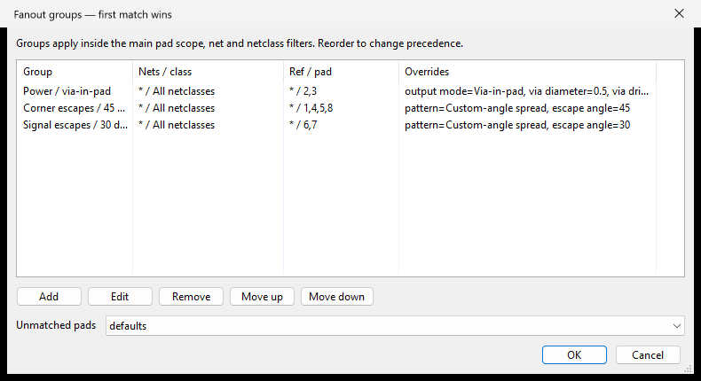
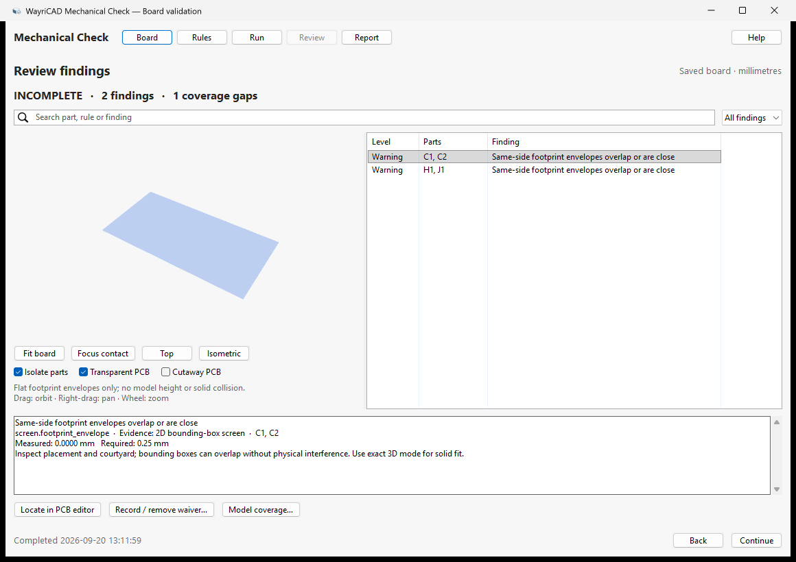

# WayriCAD user guide

[Install](INSTALLATION.md) · [Choose a tool](#tool-directory) · [Routing](#routing-review) · [Electrical analysis](#electrical-analysis) · [BOM and libraries](#bom-and-project-libraries) · [Troubleshooting](TROUBLESHOOTING.md) · [CLI](CLI_USER_GUIDE.md)

This guide describes the 16-tool 3.2.0 development suite; published releases may contain the earlier inventory. Screenshots are captures of the applications using example or Marble projects; their values are examples, not predictions for your board. Individual tool guides explain additional controls.

## Install and first launch

[Step-by-step installation guide](INSTALLATION.md) · [Visual installation map](images/install-workflow.svg)

1. Open **KiCad Manager → Plugin and Content Manager** and add:

   ```text
   https://raw.githubusercontent.com/wayri/WayriCAD/develop/pcm/repo.json
   ```

2. Select **WayriCAD Plugin Repository** and install your chosen tools. For an offline package file, download a PCM ZIP from [Releases](https://github.com/wayri/WayriCAD/releases) and choose **Install from File**. A ZIP contains one independent plugin.
3. Enable the API in **Preferences → Plugins** and configure the Python interpreter. Allow dependency preparation to finish. Installing a ZIP does not eliminate the first-run dependency requirement.
4. Restart the PCB Editor, open and save the project, and launch a WayriCAD action. The action passes the originating editor's project context. File-based processing reads saved files; save recent edits first. Standalone CLI/desktop launches need an explicit project when no editor context exists.
5. Start with **Preview**, **Inspect**, or the tool's read-only analysis. Review diagnostics before using a write/apply operation.

Help is also shipped inside each package as `help.html`, with local images. Use the tool's Help action where available, or open that file from the installed package folder. These pages do not need a documentation website or CDN. CLI help is available through each command's `--help`.

**Runtime boundary:** KiCad 10 is the primary target. Some geometry and saved-file engines need KiCad 10 native Python even though the toolbar action uses IPC. KiCad 11-only operation remains unsupported. Exact mechanical solids additionally need FreeCAD. Read [runtime setup](../wayricad_runtime/RUNTIME_SETUP.md) and [compatibility](COMPATIBILITY.md) before deploying to another workstation.

## Tool directory

Select the linked name for detailed instructions. “Review” below means that the output still needs engineering assessment; it is not a manufacturing or electrical sign-off.

| Icon | Tool and detailed guide | Start with | Result and write boundary |
|---|---|---|---|
|  | [BOM Studio](../bom_studio_plugin/README.md) | Saved schematic/project and desired fields | Review staged component data, export purchasing/assembly BOMs; native writes require a reviewed operation |
|  | [Embed3D](../embed_3d_plugin/README.md) | Project plus library/model search paths | Preview then copy/relink symbols, footprints and models with backups |
|  | [Quick PI](../quick_pi_plugin/README.md) | Net, source/sink pads, voltage/current | Read-only layered DC mesh, fields, losses and risk screening; integrated decoupling placement review; export reports |
|  | [Trace RLC / Impedance](../trace_impedance_plugin/ReadMe.md) | Connected path or zone terminals and stackup | Read-only trace/via/zone/plane estimates; unknown assumptions stay explicit |
|  | [Quick SI](../signal_integrity_advisor_plugin/ReadMe.md) | Signal path, stackup and driver/load assumptions | Delay/reflection/eye screening, return-path review and test-point lists; explicit reviewed test-point silkscreen writes; not a full channel solver |
|  | [Fanout Generator](../fanout_generator_plugin/ReadMe.md) | Footprints/pads, netclass, pattern and layer | Preview candidate escapes/vias, then explicitly apply copper |
|  | [Via Stitching](../via_stitching_plugin/ReadMe.md) | Net, layer span, region and spacing | Preview accepted/rejected vias, then explicitly apply |
|  | [Bulk Label Editor](../bulk_label_editor_plugin/ReadMe.md) | Selected references, values or PCB text | Review and apply edits with undo/redo |
|  | [Pin Extractor](../extract_pins_plugin/ReadMe.md) | Board/connector scope and fields | Extract pin tables, connectivity diagrams and document exports |
|  | [Harness Workbench](../harness_workbench_plugin/ReadMe.md) | Connector maps and explicit external wire links | Validate and export harness documentation; board connectivity alone cannot infer external wiring |
|  | [Copper Balancer](../copper_balancer_plugin/README.md) | Saved board, region and density settings | Preview copper thieving, density deficits and rejection counts; save an explicit board copy |
|  | [Mechanical Check](../mechanical_check_plugin/README.md) | Saved board, component models and enclosure | Quick 2D footprint-envelope screen without FreeCAD; exact-solid checks use FreeCAD; unknown 3D coverage never passes |
|  | [Heater Designer](../heater_designer_plugin/ReadMe.md) | Region, geometry, material and thermal assumptions | Heater geometry and estimates; review before placement/application |
|  | [Planar Magnetics](../planar_magnetics_plugin/ReadMe.md) | Coil geometry and material/drive assumptions | Coil/actuator geometry and estimates; generated copper needs review |
|  | [Manufacturing Readiness](../manufacturing_readiness_plugin/ReadMe.md) | Board, fabricator profile and release inputs | Check reports and explicit DRC/jobset/release operations |
|  | [Constraint Studio](../protocol_constraint_composer_plugin/ReadMe.md) | Saved board, protocol assignments, net scope and desired rules | Stage rules/project settings, review diffs, export a separate bundle and validate with native DRC; offline apply requires closed editors and source-hash checks |

## Routing review

Choose a small component scope first. Set the output mode (escape traces or via-in-pad), layer and geometry. **Preview** displays pads, existing copper and proposed copper together. Inspect rejected candidates before **Apply to board**. Changing geometry invalidates the previous review.


**Routing → Adaptive** preserves existing routes, continues unambiguous open stubs and searches nearby simple escapes using the selected radius and step. It refuses ambiguous topology rather than modifying existing copper. Fixed routing remains available.

Per-pin/net groups let one footprint use different styles, widths, angles, layers or via-in-pad settings. Rules are ordered: the first match wins inside the global scope. Review unmatched/skipped counts rather than assuming every pad was processed.



Via Stitching follows the same preview-first flow with grid pattern, net, layer span, spacing, outline and exclusions. Conservative checks may reject usable locations. Run native KiCad DRC after applying; a clear preview is not a substitute for DRC. The [routing CLI](CLI_USER_GUIDE.md) provides JSON/SVG plans, writes a new board on apply, and can compare native DRC reports before and after.

## Electrical analysis

In Quick PI, select the actual power net and source/sink pads. Set source voltage and sink current. Preview extracted copper, inspect layer coverage, then run the mesh solve. Check the **Net**, **Mesh** and **Results** views before interpreting voltage drop, current density or loss.


These captures use a selected Marble path; they are not a measurement of the whole board's power network. Zones, vias and trace/zone hybrids depend on actual filled connectivity and selected terminals. Refine the mesh and compare convergence. Reported source V/I differs from copper drop/I. Pulse/fusing risk is a screening estimate, not a fuse-opening or cooling simulation.

The mini console accepts pad references such as `U8.2` and series branches such as `L1.1 5mH+30m L1.2`. See [Quick PI command examples](../quick_pi_plugin/README.md) for complete commands, engineering units and DC/inductance limits.

Use Quick PI’s **Decoupling placement** tab to review capacitor distances and pad/rail topology. Its heuristics complement the DC solver; they do not simulate transient PDN impedance.

For connected RLC extraction, use explicit start/end pads or zone/plane terminals and verify stackup/reference assumptions. A result marked unknown or partial must remain so until the missing inputs or connectivity are resolved.

Quick SI also offers an optional **Eye / step** preview: a uniform lossless-line
PRBS7 model using explicit bit rate, driver swing and resistive endpoints.
It can illustrate ringing and sampled eye closure, but does not simulate IBIS
drivers, coupled crosstalk or protocol compliance. See the
[model assumptions and CLI examples](../signal_integrity_advisor_plugin/ReadMe.md#illustrative-eye-and-step-response).


Quick SI’s **Return path** tab retains transition/reference checks. Its **Test points** workflow exports test-point information and supports previewed net-name values and a silkscreen table. Review the selected set and proposed labels before writing; do not silently rename every footprint. Existing connector pin documentation remains in Pin Extractor.

## Mechanical and manufacturing review

For a quick placement screen, choose **Quick 2D footprint screen** on Mechanical Check’s Board page. Review same-side bounding-box warnings in its native canvas; the report remains INCOMPLETE because model height, enclosure and exact interference were not checked. Use Exact 3D mode with FreeCAD for those operations.



Copper Balancer’s preview explains region, density-ceiling and geometry rejections. Inspect the density range and remaining deficit before saving a new PCB copy; an already dense tile cannot be fixed by adding copper. Manufacturing Readiness compares board metrics to your actual fabricator profile. Neither tool replaces final native DRC and fabrication review.


## BOM and project libraries

BOM Studio's primary workflow is **open the originating project → edit fields → preview a component list → export**. The three primary views are BOM workspace, Exports & templates, and Review & native sync. Select BOM, test points only or DNP only, then a template and grouped or individual rows. Exclude test points/DNP independently for BOM exports. Cell and bulk editing remain available; advanced tools are folded away. Native KiCad BOM settings can be inherited; advanced catalogue, variant and automation tools are optional. Save a workspace to retain the staged review. Exporting a BOM and applying native schematic edits are different operations.


Embed3D consolidates library localization and model portability. Its default library folder is `local/` inside the project, and the destination is editable. Resolve missing dependencies, review proposed copies/relinks, save and close project editors, then apply with backups. Missing external models are not generated automatically.


The current window shows the project-local folder, reviewed relinks and backup workflow.

## When something does not work

- **No packages in PCM:** use the raw `repo.json` URL, select the repository and clear filters. [Repository diagnostics](TROUBLESHOOTING.md#repository-added-but-packages-are-missing).
- **Installed but no window:** inspect the plugin environment/dependency error, then recreate the environment after fixing it. [Launch diagnostics](TROUBLESHOOTING.md#installed-package-has-no-action-or-clicking-it-fails).
- **Wrong or unavailable project:** save the board, launch from its PCB Editor, and check the source path. Multiple Windows KiCad 10.0.5 editors may need [separate temporary namespaces](TROUBLESHOOTING.md#windows-two-open-editors-and-an-unreachable-second-instance).
- **Partial analysis:** inspect missing stackup, terminals, filled zones, models or connectivity. Do not turn a partial result into a pass by suppressing the warning.

For a report, include the tool/version, OS, KiCad version, operation and redacted error text. Do not share IPC tokens. The [Marble smoke record](audits/MARBLE_SUITE_SMOKE.md) documents bounded checks and their remaining limitations.
