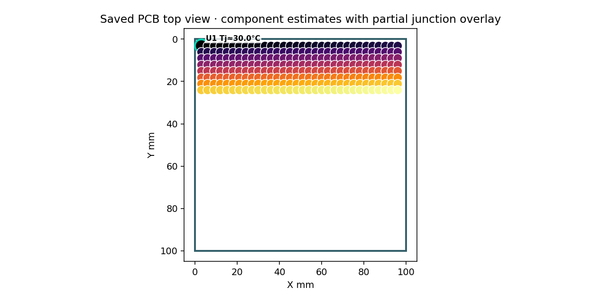

# QuickTherm selected and hover labels

Validated on Windows with KiCad 10.0.6, its Python 3.11.5 runtime, wxPython 4.2.2 and Matplotlib. Portable tests used Python 3.14.2.

Board maps previously labelled every component included in the thermal study. Native main, paired top/bottom and 3D views now retain only the selected component's label and reuse one temporary hover label. Leaving the component or canvas clears the temporary label. Pixel-based marker picking follows zoom and 3D rotation; planar maps also accept the saved footprint bounds. Hovering preserves selection, field artists and camera limits. Unknown junction values remain explicit.

The interactive HTML report uses the same selected/hover behavior, including keyboard focus inspection. Its all-reference-label option has been removed. Scientific temperature charts and explicitly pinned probes retain their own labels.

## Checks performed

- `python -m pytest quick_therm_plugin/tests tests/test_ipc_plugins.py -q`: 152 passed, 20 skipped, 100 subtests passed. The portable environment's skipped checks are not passes.
- KiCad Python focused renderer and actual native-window tests: 5 passed. Main and paired canvas motion/leave callbacks showed one selected label plus at most one hover label, and retained the saved PCB hash.
- Dense 1,024-component renderer checks covered repeated hovering, blank space, leaving, a selected component, bottom-side unknown values, a modeled junction value, zoom and 3D rotation. Text artist counts stayed bounded.
- Browser review of a generated 1,024-top-component report plus one unknown bottom component: no component labels initially; one after selection; one additional temporary label through the shared pointer/focus handler; clear on leaving or changing side; equivalent 3D behavior. No browser errors were observed. Keyboard focus exercised the report's shared pointer/focus handler; native tests exercised pointer motion directly.
- Built the independent QuickTherm 3.6.13 PCM candidate. All 19 candidate archives passed schema, runtime, action, asset and Python-syntax validation. A previous 3.6.12 disposable ZIP was moved out of the candidate folder before inventory validation.
- Fresh native process loading only the extracted QuickTherm ZIP passed native hover/leave, persistent selection, help asset and saved-PCB hash checks.
- `python tools/validate_docs.py --source-only` passed for current user documentation and local illustrations. `git diff --check` passed.

The image is a plot captured from the actual native QuickTherm window using a synthetic 100 × 100 mm outline and 256 invented components and junction estimates. It demonstrates label behavior only; the temperatures are not measurements or solver validation. It contains no personal paths, private board data or addresses, and required no redaction.

This candidate has not been installed, published or promoted to the public PCM feed. The numerical models and their limitations are unchanged.
