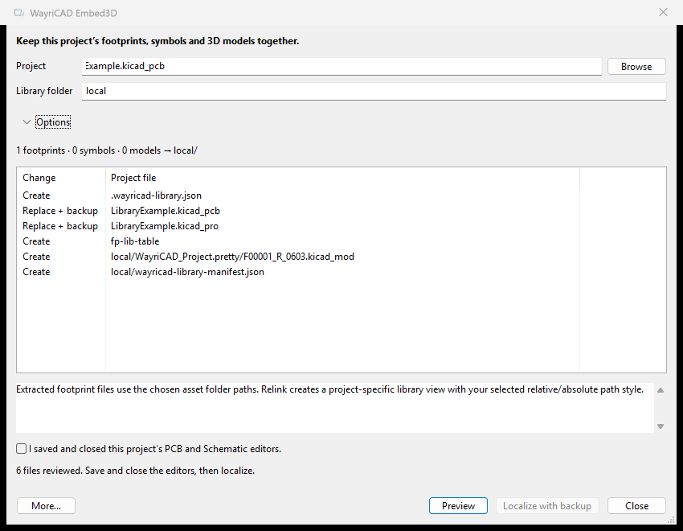

# WayriCAD Embed3D


One native window combines Embed3D, Localizer and Portable Assets. Keep symbols, footprints and 3D models together in **`local/`**, or choose another relative project folder. The existing `embed-3d` package identifier is retained for upgrades.

Install `WayriCAD-embed-3d-3.1.1-PCM.zip` using KiCad PCM **Install from File**. Enable the API in Preferences → Plugins. Local normalization and validation require KiCad 10 native Python; `WAYRICAD_KICAD_PYTHON` can select it. IPC is the forward integration path; KiCad 11 native acceptance remains unverified.

Choose a saved project, PCB or root schematic and preview exact files and links. Save and close the project editors, then localize with a backup. Reopen the project afterward. Settings remember your folder, additional model roots and explicit `NAME=FOLDER` path variables.

Output contains a `.pretty` footprint library, `symbols/WayriCAD_Project.kicad_sym`, `models/`, and a content manifest. Project tables use `${KIPRJMOD}` links. Placed schematic footprint assignments, symbol IDs/cache keys, PCB footprint IDs and model addresses are updated together. Native footprint normalization and model-transform checks preserve placement. Schematic-only designs also collect assigned footprints.

Writes are staged and natively validated before publication. Replaced files are backed up under `.wayricad-backups/`; stale sources, conflicting unmanaged assets and modified managed libraries are protected. Failed publication rolls back. Repeated extraction keeps stable asset filenames.

**More → Upgrade a project copy** converts older schematic hierarchies using the local KiCad CLI, preserving legacy reference/unit/page records and power-net semantics and comparing native connectivity. **Advanced asset tools** retains selective embed/unbundle/relink and footprint-file operations. The optional native **Advanced Live Assets** menu action retains tools requiring the actual PCB Editor context.



```text
wayricad-library localize-project board.kicad_pcb
wayricad-library localize-project board.kicad_pcb --library-folder libraries/local --apply
wayricad-library localize-project board.kicad_pcb --model-root D:/models --var CERN=D:/models --allow-partial --apply
wayricad-library restore-local PROJECT/.wayricad-backups/BACKUP --apply
```

Without `--apply`, localization is a dry run. Exit 3 indicates explicitly retained unresolved assets. Restore verifies backup hashes and protects subsequent user edits. `python -m embed_3d_plugin --help` lists the retained embedding/extraction commands.

Unavailable external files cannot be recreated from a filename. [CERN's public library](https://gitlab.com/ohwr/cern-kicad-libs) excludes its 3D collection; supply the original model folder for complete localization of designs using those references.

From the repository root, run `python -m unittest discover -s embed_3d_plugin/tests` for regression tests. Native tests are opt-in and are not covered by a passing pure-Python test count. Original license notices remain in LICENSE. Older documents under docs describe the imported releases and are historical.
