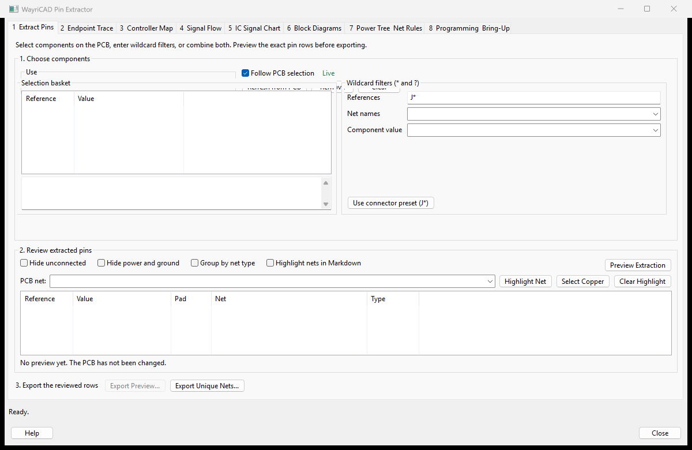

# WayriCAD Extract Pins Plugin


## Capabilities

- Extracts component, pin, and net data with reference, value, and connector-type filters.
- Exports reviewed data to CSV, Markdown, JSON, and self-contained SVG diagrams.
- Traces signal flow, endpoint paths, controller-to-connector maps, and IC signal charts.
- Builds power trees and programming/bring-up packages with editable classification rules.
- Links pin documents across projects and produces tracker tables and harness-style diagrams.
- Provides GUI and command-line workflows for board analysis and automation.

## Limitations

- PCB nets do not inherently encode signal direction, so endpoint traces do not claim an unverified source.
- Controller maps cross components only through exact approved pin pairs; capacitors are excluded from safe defaults.
- Active-device paths require explicit rules and enablement, remain conditional, and do not infer device state or electrical direction.
- Full native hierarchical sheet coverage comes from a KiCad XML netlist; PCB-only coverage depends on saved fields.
- Generated tables and diagrams do not replace ERC, DRC, or engineering review of ambiguous cross-board links.

## Overview

A comprehensive KiCAD plugin for extracting component/pin data and analyzing signal flow. Features both GUI and CLI interfaces.




Interface overview before selecting footprints. Choose components, refresh the
preview, review pin/net rows, then export. An empty preview does not mean the board
has no pins. The installed [offline guide](help.html) covers the selection,
connector mapping, diagrams and bring-up workflows.

## Features

### Data Extraction
- Extract pin and net information from any component
- Filter by reference pattern (`J*`, `U*`, etc.), value, or connector type
- Export to clean **CSV**, **Markdown**, or **JSON** formats
- Support for custom `connector-type` properties
- Preserve native hierarchical schematic sheet paths from KiCad XML netlists
- Define sheet display aliases with path and component-reference wildcards
- Import pin documents from other projects and build cross-board signal trackers
- Auto-link exact or normalized labels and apply custom wildcard/regex rules
- Export cross-project tracker CSV/Markdown and harness-style SVG diagrams

### Signal Flow Analysis
- Generate consolidated source-to-destination signal flow tables
- Trace connections between connectors, ICs, and passives
- Find all signal paths between any two components
- Identify intermediate components in signal chains
- Show source and destination pin lists, net class, protocol, path, and link count
- Double-click a route to highlight its net in PCB Editor

### Wildcard Label Endpoint Trace
- Match label/net families such as `*TM`, `*_TD`, or `DEMO_CTRL_*`
- Resolve exact or wildcard endpoint sets such as `U1,U2`, `J1,U1`, or `U*`
- Trace across user-approved resistor/filter/jumper references and `NetTie_Path` parts
- Report endpoint pins, pin functions, terminal nets, ordered intermediate components, and complete paths
- Export software and harness endpoint maps to CSV or Markdown

### Safeguarded Controller-to-Connector Map
- Select controller/IC and connector scopes by exact reference, wildcard, or live PCB selection
- Trace across net-name changes while retaining source pin/function, every net, every inline component pin transition, and final connector pin
- Cross only exact approved pin pairs such as `R* | 1-2 | passive`
- Keep capacitors out of the safe defaults because a shunt capacitor is not a series path
- Support MOSFET `D-S`, BJT `C-E`, jumper-state, and other IC `IN-OUT` paths through explicit rules
- Require **Enable conditional active paths** before active-device rules are used
- Mark active-device routes `Conditional` and alternate routes `Ambiguous`; device state and electrical direction are not inferred
- Bound traversal with maximum component-hop and route-count controls
- Double-click a reviewed row to highlight its source net; export the exact preview to CSV or Markdown

### IC Signal Charts
- Create complete pin-to-destination mapping for ICs
- Optionally include or exclude power/ground nets
- Group and sort power nets separately from signals
- Preview the IC connectivity as an embedded visual flow diagram
- Perfect for documentation and debugging

### Block Diagrams (NEW!)
- Generate SVG block diagrams - fully self-contained, no external dependencies
- Show every component once in a harness-style component/net topology
- Use distinct signal, supply, power, and ground bus colors with pin labels
- Switch between system map, signal topology, and directed power flow
- Zoom with the mouse wheel, drag to pan, fit/restore the image, and click nets to highlight them in KiCad

### Power Net Classification
- Automatic detection of power/ground nets (VCC, VDD, GND, VSS, voltage rails, etc.)
- Sort and group power nets separately from signal nets
- User-defined power, supply, ground, and forced-signal wildcard patterns
- Shared classification rules across extraction, signal flow, IC charts, and diagrams
- Auto-extracted converter/filter power tree with editable rules and issue checks
- Power-tree SVG and CSV export, including inferred direction and confidence

### Programming and Bring-Up Package
- Detect SWD, JTAG, UART, reset, boot-strap, target-reference voltage, power, and ground pins
- Scope discovery to connector/controller reference wildcards such as `J*,U*`
- Preview reference, pin, net, function, direction, and required engineering review notes
- Export a bring-up Markdown document with a first-power checklist
- Export firmware-friendly C macros for reviewed net and physical pin mappings

### CLI Support (NEW!)
- Full command-line interface for automation
- Batch processing of multiple boards
- Integration with build systems and CI/CD
- All GUI features available from command line

---

## Installation

1. Download `WayriCAD-extract-pins-3.1.1-PCM.zip` from the published WayriCAD release, or build it with the repository's `build_pcm.py`.
2. In KiCad Manager, open **Plugin and Content Manager → Install from File** and select the ZIP.
3. Enable the API in **Preferences → Plugins**, configure Python, and restart KiCad.

The ZIP includes the shared runtime. For a source installation, use the repository's `tools/install_suite.py` after building the packages; copying this source folder alone omits its runtime.

Once the release is published, the repository feed is `https://raw.githubusercontent.com/wayri/WayriCAD/develop/pcm/repo.json`.

---

## Usage

### GUI Mode
1. Open your PCB in the PCB Editor
2. *(Optional)* Select components on the PCB
3. Launch **WayriCAD Pin Extractor**. The additional **WayriCAD Interboard & Harness** menu action opens the project connectivity and ICD workbench.
4. Use **Extract Pins** to follow PCB selection, filter components, preview rows, and export
5. Use **Controller Map** for an auditable IC-to-connector table across approved series and active-device pin pairs
6. Use **Signal Flow** and **IC Signal Chart** to review same-net table and visual connectivity
7. Use **Power Tree & Net Rules** to define classification wildcards and build the checked rail tree

Controller-map rules use one crossing per line:

```text
R* | 1-2 | passive | two-terminal series resistor
Q12 | D-S | active | MOSFET state must be verified
Q20 | C-E | active | BJT bias must be verified
U7 | IN-OUT | active | explicitly reviewed pass-through IC
```

Pin tokens match either physical pad numbers or schematic pin functions. Active
rules are ignored until conditional paths are enabled. Do not use a broad `U*`
rule unless every matched IC and pin pair has been reviewed.

Double-click an extracted pin, signal-flow route, or IC-chart row to highlight its
net in PCB Editor. **Select Copper** selects matching tracks, vias, and zones for
native KiCad operations. The **Help** button opens the bundled guide inside a
native KiCad window and provides an external-browser fallback.

### CLI Mode (Installed Plugin)

### Hierarchical Sheet Definitions

The **Sheet Definitions** tab shows sheets detected from each XML netlist's
`sheetpath` metadata. Optional rules use this format:

```text
Display Name | /native/sheet/path/* | reference wildcard
```

Rules are evaluated from top to bottom and both filters must match. Examples:

```text
Channel 1 Power | /Power/Channel1/* | *
Control MCU | * | U1
Connector Sheets | /Interfaces/* | J*
```

The resolved sheet name and native path are included in TM/TC, test-point,
connector, peripheral, and component exports.

### Cross-Project Pin Linking

Use the **Cross-Link** tab to import WayriCAD CSV or Markdown pin documents from
multiple projects. The current PCB can be added directly. Exact and normalized
label matching are available by default; power rails are opt-in.

Custom rules use:

```text
Rule Name | wildcard | DEMO_CTRL_* | DEMO_SENSOR_*
Harness || regex || ^SRC_(?P<signal>.+)$ || ^DST_(?P<signal>.+)$
```

Wildcard `*` and `?` captures, or regex capture groups, must resolve to the
same text. Use the `||` delimiter when a regex contains `|` alternation. The
tracker records project, board, sheet, component, pin, label, match method,
rule, confidence, and ambiguity status. Export it to CSV/Markdown or generate
a multi-project harness SVG.

```bash
# Basic extraction - all J* connectors to CSV
python -m extract_pins_plugin extract --refs "J*" --format csv board.kicad_pcb
```

### CLI Mode (Standalone / Without Installation)
You can run the plugin directly from the downloaded folder without installing it into KiCad, as long as you use KiCad's bundled Python.

**Windows:**
```cmd
"C:\Program Files\KiCad\9.0\bin\python.exe" -m extract_pins_plugin extract --refs "J*" "C:\path\to\your\board.kicad_pcb"
```

**Linux/Mac:**
If you have the `pcbnew` python module available in your system python:
```bash
export PYTHONPATH=$PYTHONPATH:/usr/share/kicad/scripting/plugins
python3 -m extract_pins_plugin extract --refs "J*" board.kicad_pcb
```

---

## CLI Commands Reference

### `extract` - Extract component/pin data
```
--refs          Reference patterns (wildcards: *, ?)
--connector-types  Filter by connector-type property
--value-filter  Filter by component value
--net-filter    Filter by net name (comma-separated patterns)
--ignore-unconnected  Skip 'unconnected' pins
--ignore-free   Skip pins with no net
--ignore-power  Skip power/ground nets
--sort-by-net-type  Sort signals before power
--format        csv, md, json (default: csv)
```

### `signal-flow` - Source/destination table
```
--source        Source components (wildcards supported)
--dest          Destination components (wildcards supported)
--intermediates Include intermediate components
--format        csv, md, json, svg
```

### `ic-chart` - IC signal chart
```
--ic            IC reference (wildcards for batch)
--include-power Include power nets
--power-nets    Custom power net patterns
--format        csv, md, json, svg
```

### `diagram` - SVG block diagrams
```
--refs          Component references (wildcards supported)
```

### `unique-nets` - Extract unique net names
```
--sort-by-type  Group signals first, then power, then ground
```

### `find-path` - Find signal paths
```
--start         Starting component
--end           Ending component
--max-hops      Maximum hops (default: 10)
```

### `list` - List board components
```
--refs          Filter by reference pattern
```

---

## Wildcard Patterns

All reference and filter arguments support wildcards:

| Pattern | Matches |
|---------|---------|
| `J*` | J1, J2, J10, JCONN1 |
| `U?` | U1, U2, but not U10 |
| `J*,U*` | All J and U components |
| `SPI_*` | SPI_MOSI, SPI_CLK, etc. |
| `*GND*` | Any net containing GND |

---

## Output Formats

### CSV
Clean, one-row-per-pin format ideal for spreadsheet analysis.

### Markdown
Human-readable tables with optional net highlighting.

### JSON
Structured data for programmatic processing.

### SVG
Self-contained vector diagrams with:
- Color-coded net types (signal/power/ground)
- Component blocks with pin details
- Connection paths with labels
- Legend and summary

---

## License

GPL-3.0 - See [LICENSE](https://github.com/wayri/WayriCAD/blob/develop/LICENSE) for details.

## Author

**Wayri (Yawar)**
- GitHub: [@wayri](https://github.com/wayri)
