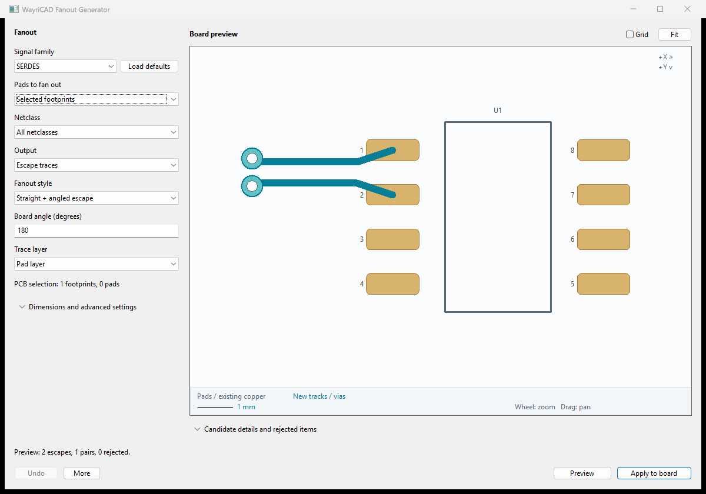

# WayriCAD Fanout Generator

A fully local routing tool for PCB Editor. No hosted UI or remote preview assets are required.

## Workflow

1. Configure geometry and pad scope or target net.
2. Click **Preview**. The canvas and result table show accepted candidates and rejection reasons. Preview creates no PCB copper.
3. Inspect the result, then **Apply to board**. A named WayriCAD group contains the committed geometry. Run KiCad DRC before saving or manufacturing.

The optional **More → Review placement again** command rechecks the board snapshot and prepares the same geometry; it is not required before Apply. **More → Clear preview** discards unattached candidates. Settings changes invalidate the preview. Board changes require a new preview. Plugin Undo/Redo preserves a recoverable group; reopen the tool to find its existing named groups.

## Controls and checks

Choose selected SMD pads, selected footprints, reference wildcards, or all SMD pads. Through-hole pads and pads without a net are excluded. Choose **Output → Via-in-pad** to place vias directly in selected pads, or **Escape traces** with radial, eight-direction dogbone, diagonal quadrant, perimeter, corner, or BGA/LGA diagonal style. Configure track width, escape length, angle, X/Y offsets, via diameter/drill, and copper clearance. **Netclass** filters pads using live board classes plus saved project explicit assignments and wildcard patterns. **Trace layer** lists actual enabled copper layers. Choosing a different layer creates a source via at the pad, then routes on that layer; this keeps the trace connected. Through vias span F.Cu to B.Cu.

The planner checks existing other-net pad/track envelopes, zones and routing keepouts, board edges/cutouts, and collisions between generated copper. Checks are conservative, so valid arrangements can be rejected. This is a fanout seed generator; it does not autoroute an entire BGA or guarantee manufacturing clearance.

## Advanced styles and high-speed selection

Choose **45-degree spread**, **Custom-angle spread**, **Straight + angled escape** or **Staggered rows**. The primary angle field supports footprint-aware spread, a board-absolute heading, or a footprint-relative heading. Advanced controls expose straight-launch length, stagger distance, net-name wildcards, pair gap, breakout skew and saved netclass dimensions.

Signal families include **DDR, GDDR, SERDES, PCIe, PCI, PXI, PXIe and LVDS**. Choosing a family leaves manual settings intact; **Load defaults** explicitly loads its suggested geometry and naming filter. Inspect the matched nets before applying. DDR/GDDR bus signals use independent escapes; narrow the filter to a clock/strobe pair before selecting paired mode. Profiles contain no assumed impedance or stackup-derived width.

**Auto differential pairs** reviews named mates together, routes a shared parallel section, reports actual escape lengths and rejects both members when a path, spacing or skew check fails. Every path segment appears in the canvas and exported SVG. See the bundled [advanced guide](advanced-fanout.md), [high-speed settings example](high-speed-settings.json) and [custom-angle example](custom-angle-settings.json). Example dimensions are illustrative and must be adapted to your board constraints.



## Local preview

Primary choices remain visible; detailed dimensions and rejection tables are collapsed until needed. The clean, neutral canvas shows footprint outlines and references, real native pad polygons/rotation, existing copper, and generated geometry. A visible legend, millimetre scale, and coordinate orientation support review; the grid is optional and off by default. The resizable canvas supports wheel zoom at the cursor, drag to pan, double-click to fit, and via picking for coordinates. Pads, existing tracks/vias, zone outlines, and board edges provide context. Candidate copper and drill sizes use board units. Arc tracks currently appear as conservative bounding envelopes; native pads use their effective polygons; the IPC fallback uses supported padstack shapes. The canvas is a review aid, not a replacement for PCB Editor or DRC.

## Command line

Use KiCad 10's bundled Python so `pcbnew` is available. List JSON option names and actual project choices with `python -m wayricad_runtime.cli fanout settings --board source.kicad_pcb` (or `stitching settings`). Settings are a JSON object, for example:

```json
{"scope":"Reference wildcard","ref":"U1","pattern":"Dogbone outward","length":1.2,"width":0.2,"via_diameter":0.6,"via_drill":0.3,"clearance":0.2}
```

```text
python -m wayricad_runtime.cli fanout plan --board source.kicad_pcb --settings settings.json --output plan.json --svg preview.svg
python -m wayricad_runtime.cli fanout apply --board source.kicad_pcb --plan plan.json --output routed.kicad_pcb
```

Plan is read-only and produces reviewable JSON plus an optional standalone local SVG. Apply recomputes and checks the reviewed geometry and board fingerprint, then writes a **new** `.kicad_pcb` file. It refuses source overwrites, existing destinations, empty plans, and stale or altered candidate geometry. The source remains unchanged.

## Compatibility

Native in-memory board tests, file round-trips, and hidden wx frame smoke checks run against KiCad 10. The suite also packages an IPC entry point for forward compatibility; supported geometry depends on the live IPC API. Unsupported capabilities fail explicitly. Live KiCad 11 behavior must be validated against its released runtime.
