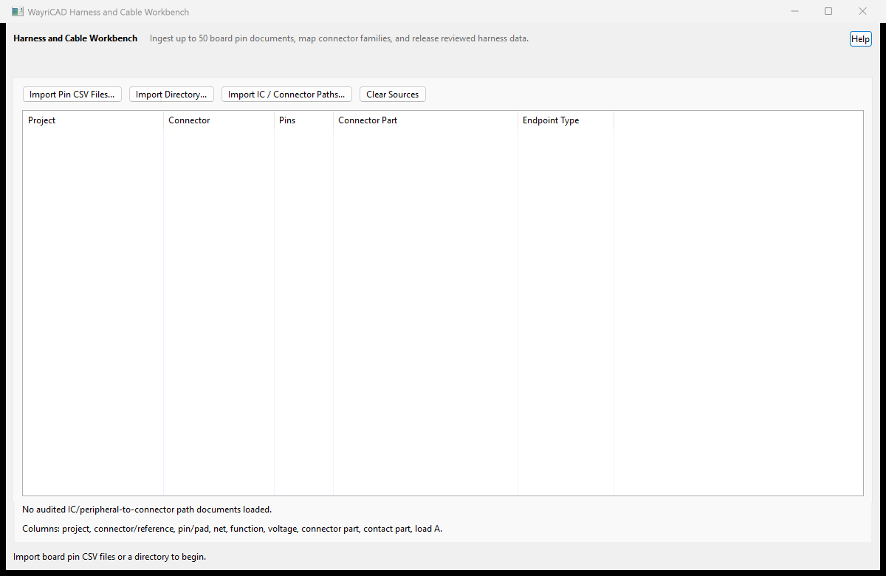

# WayriCAD Harness and Cable Workbench

## Capabilities

- Builds a harness definition from up to 50 board pin exports and harness-only loads.
- Matches connectors by index, offset, explicit rules, or spreadsheet-style pin maps.
- Captures wire gauges, colors, lengths, shields, bundles, splices, and procurement data.
- Produces sortable wire, pin, net, system-path, and procurement tables.
- Exports CSV, SVG, and self-contained interactive HTML reports with a pan/zoom draft.
- Joins reviewed IC/peripheral paths with harness wires across board projects.

## Limitations

- The workbench reads project data and does not modify PCBs.
- Controller-map records join only when project, connector reference, and connector pin match exactly.
- Active-device crossings require explicit Pin Extractor rules and remain conditional pending review.
- Automatic correspondence does not establish polarity, mating orientation, electrical compatibility, ampacity, derating, or regulatory compliance.
- Connector ratings, insulation, creepage, shielding, bend radius, assembly, and test coverage require independent verification.

## Overview

Builds a system-level harness definition from as many as 50 board pin exports.
It supports indexed net matching and connector correspondence where pin 1 maps
to pin 1, pin 2 to pin 2, and so on. Offset and explicit pin maps cover
connectors whose numbering differs. The Pin Mapping Editor adds a spreadsheet-
style workflow for arbitrary mappings, including pin 1 to pin 17, alphanumeric
pins, intentionally fanned-out sources, and harness metadata per wire.

The workbench produces sortable wire, pin, net, system-path, and procurement
tables; a native pan/zoom system draft; and CSV/SVG/interactive HTML outputs. Harness-only loads can be
entered without adding artificial components to a schematic. Selected wires
can be assigned gauges, colors, lengths, shields, bundles, and splices.

## Native interface

Native connector and harness workspace before importing connectivity. This empty view is an interface overview, not a completed cable design.

The installed package includes [offline help](help.html) with its workflow and limitations.

## IC and peripheral paths

The workbench can join an internal controller or peripheral path on one board,
a reviewed harness wire, and an internal path on another board. Export
**Controller Map CSV** from WayriCAD Pin Extractor for each board, then import
those files with **Import IC / Connector Paths**. The CSV file stem, or its
`Project` column when present, must match the project name in the board pin
document.

The resulting route is explicit and ordered, for example:

~~~text
DEMO_CTRL:U1.21 USART3_TX -> R12.1 -> R12.2 -> J1.3
  -- W00003 / DATA-A -->
DEMO_SENSOR:J2.8 -> R7.2 -> R7.1 -> U3.5 UART_RX
~~~

Reference wildcards select source and destination endpoint families. Passive
series parts remain in the path and in the exported table. MOSFET, BJT, jumper,
and other active-device crossings are accepted only when the Pin Extractor map
contains an explicit pin-pair rule; their conditional status and notes are
propagated into the harness report.

The self-contained HTML report works offline. It provides wheel zoom, canvas
pan, draggable nodes, clickable path details, bundle/status/search filters,
sortable system and construction tables, validation findings, and a harness
BoM. It uses one connector node per board connector and distinct endpoint nodes
to avoid presenting the same connector as both a source and destination block.

Connector rule examples:

~~~text
DEMO_CTRL:J1 -> DEMO_IO:J2
DEMO_IO:J4 -> LOADS:P1 [offset=1]
DEMO_A:J3 -> DEMO_B:J7 [map=1:3,2:4]
~~~

For larger mappings, seed a source/destination connector pair in the Pin
Mapping Editor, then edit destination pins before building. Mapping CSV files
use these columns:

~~~csv
source_project,source_connector,source_pin,destination_project,destination_connector,destination_pin,wire_id,gauge_awg,color,bundle,splice,length_m,shield,notes
DEMO_CTRL,J1,1,DEMO_IO,J7,8,W00001,24,Blue,DATA,,1.250,,UART transmit
DEMO_CTRL,J1,2,DEMO_IO,J7,12,W00002,24,White,DATA,,1.250,,UART receive
~~~

The same workflow is available headlessly through `wayricad run` and
`harness.build`; `path_documents`, `source_refs`, `destination_refs`, and
`include_html` expose the complete system-path report. See
`docs/CLI_USER_GUIDE.md`.

Automatic matching establishes correspondence, not electrical or mechanical
compatibility. Independently verify polarity, mating view, pin gender, wire
ampacity and derating, insulation, creepage, shielding, bend radius, connector
ratings, assembly process, applicable standards, and test coverage.

Native operational validation inventories the real Marble board (371 connector pins) without inventing external mates. A clearly separate two-board fixture exercises saved-board reload, reviewed pin-map CSV roundtrip, bundles/splices, procurement BOM and CSV/SVG/offline HTML exports. Reproduce with `python tools/validate_marble_operations.py --kinds harness` from the suite root.
