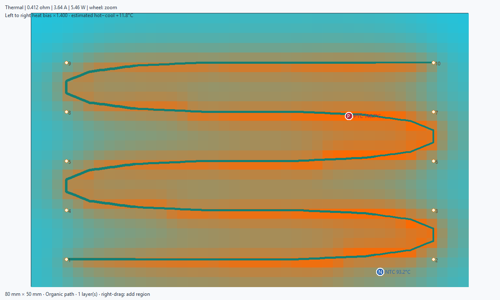

# WayriCAD PCB / Foil Heater Designer

## Capabilities

- Designs series-connected serpentine, zoned-raster, and concentric-spiral copper heaters.
- Designs organic series paths from ordered control points entered as percentages or placed by clicking the preview.
- Adjusts regional trace resistance to bias local Joule heating.
- Provides directional width bias and a model-based search for a requested hot-to-cool temperature difference.
- Continues multilayer heater paths through transition vias.
- Previews geometry and runs a steady-state 2D conduction/convection thermal model.
- Marks PTC hotspot/safety and NTC representative-control locations on the thermal preview and exports their coordinates.
- Draws heating regions on the preview with a right drag, then shows their
  boundaries and resulting width-coded copper before applying anything.
- Reviews existing copper, zones, and keepouts before applying a recoverable named group.
- Supports persistent heater-group undo after reopening the plugin.

## Limitations

- The thermal model is reduced-order and steady-state; it does not establish thermal performance or safety acceptance.
- Sensor markers are heuristic sampling positions, not placed footprints or proof of optimal control response.
- Organic-path spacing screening does not replace KiCad DRC or fabrication review.
- It does not solve enclosure airflow, radiation, anisotropic laminate, adhesive interfaces, attached masses, or closed-loop control dynamics.
- Generated terminals must be connected afterward, and KiCad DRC remains the final geometry check.
- Fabrication requires coupled-solver and physical-prototype validation of temperature, current density, materials, airflow, and control stability.

## Overview

Design series-connected serpentine, zoned-raster, or concentric-spiral copper
heaters. Regional resistance factors narrow or widen the trace to bias local
Joule heating, while multilayer mode continues the path through transition
vias. The generated geometry can be inspected in the window, simulated, reviewed for placement, and applied to the PCB only after review.

Heating regions are visible on the Geometry tab. Enter one region per line as
`name,X%,Y%,radius%,resistance factor`, or right-drag on the preview to add a
region with an initial factor of 1.5. Edit the generated row to fine-tune its
position, size, and heating bias, then select **Preview** again. The region
outlines, copper widths, and board dimensions are shown in the preview.

For an organic route, choose **Organic path** and enter at least three ordered
`X%,Y%` control points. The generator rounds corners, samples one continuous
series path, checks board-edge and nonlocal copper spacing, and reverses
alternate layers so transition vias join consecutive paths. **Draw path on
preview** clears the preset path and lets you click to add points. Draft points
appear immediately; **Preview** shows the width-coded copper.

Choose a heat-bias direction and ratio from 0.5 to 4. A ratio above 1 narrows
copper toward the nominated hot end; a ratio below 1 narrows copper toward the
opposite end. Fixed-voltage current and total power also change. On **Thermal**,
optionally enter a positive target hot-to-cool
difference and select **Simulate / tune**. The tool samples candidate ratios,
refines a crossing when present, then reports the achieved model difference or
warns when the target is not reached. This is model feedback, not temperature
regulation.

The thermal preview marks a PTC candidate near the hottest accessible grid
cell and an NTC candidate near the model's average temperature, separated from
the PTC where possible. The copper keepaway applies to each marker's center;
it does not account for a particular footprint, pad, solder or neighboring
part. The results and JSON export include PCB coordinates based on the chosen
origin. Place actual sensors manually, check isolation and KiCad DRC, and
validate control and over-temperature behavior on a prototype.

This is an offscreen rendering of a synthetic 80 × 50 mm example at 1.5 V,
not a board measurement or qualified sensor placement.

The thermal preview is a reduced-order steady-state 2D conduction/convection
model. Validate maximum temperature, copper current density, laminate limits,
adhesive behavior, airflow, attached masses, and control stability using an
appropriate coupled solver and physical prototype before fabrication.

Window previews do not create board geometry. Apply writes the reviewed geometry as a recoverable group. Committed heaters
use persistent named groups, and the latest WayriCAD heater commit can be undone
after reopening the plugin.

Placement review now checks existing copper, zones and keepouts before creating a group, including copper on the selected net that would short around the designed conductor. Pad, text and zone bounding boxes are reserved conservatively. Choose a clear area and connect the generated terminals afterwards; KiCad DRC remains the final geometry check. Redo repeats the placement check.

Native operational validation uses `python tools/validate_marble_operations.py` from the suite root. It exercises review, apply, undo/redo, preserved net assignment, native saved-board reload and full DRC on explicit isolated test coupons in copies of Marble. These coupons are validation fixtures, not proposed Marble modifications.

## Native interface

Generated serpentine preview from the documentation fixture. Geometry preview alone does not establish thermal performance or placement acceptance.

The installed package includes [offline help](help.html) with its workflow and limitations.
