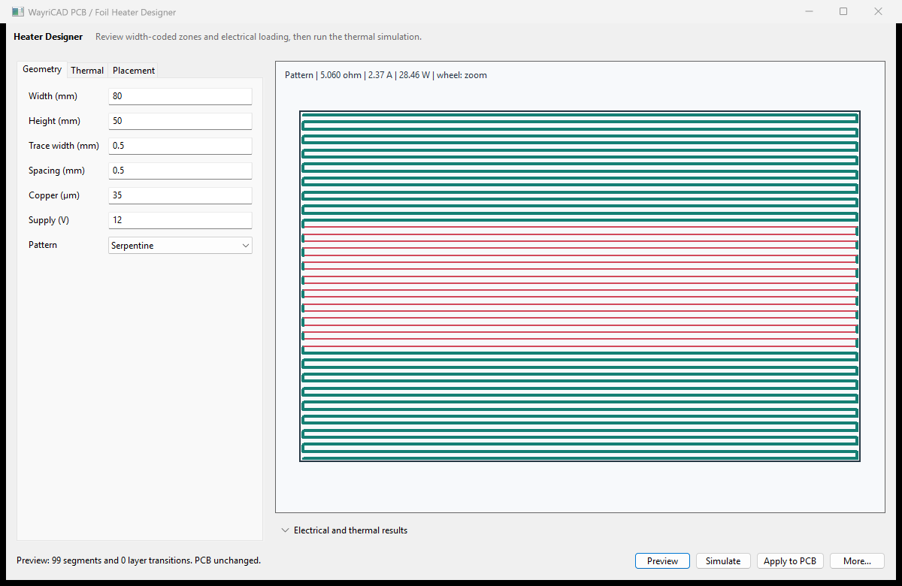

# WayriCAD PCB / Foil Heater Designer

Design series-connected serpentine, zoned-raster, or concentric-spiral copper
heaters. Regional resistance factors narrow or widen the trace to bias local
Joule heating, while multilayer mode continues the path through transition
vias. The generated geometry can be inspected in the window, simulated, reviewed for placement, and applied to the PCB only after review.

The thermal preview is a reduced-order steady-state 2D conduction/convection
model. Validate maximum temperature, copper current density, laminate limits,
adhesive behavior, airflow, attached masses, and control stability using an
appropriate coupled solver and physical prototype before fabrication.

Window previews do not create board geometry. Apply writes the reviewed geometry as a recoverable group. Committed heaters
use persistent named groups, and the latest WayriCAD heater commit can be undone
after reopening the plugin.

Placement review now checks existing copper, zones and keepouts before creating a group, including copper on the selected net that would short around the designed conductor. Pad, text and zone bounding boxes are reserved conservatively. Choose a clear area and connect the generated terminals afterwards; KiCad DRC remains the final geometry check. Redo repeats the placement check.

Native operational validation uses `python tools/validate_marble_operations.py` from the suite root. It exercises review, apply, undo/redo, preserved net assignment, native saved-board reload and full DRC on explicit isolated test coupons in copies of Marble. These coupons are validation fixtures, not proposed Marble modifications.

## Native interface

Generated serpentine preview from the documentation fixture. Geometry preview alone does not establish thermal performance or placement acceptance.

The installed package includes [offline help](help.html) with its workflow and limitations.
