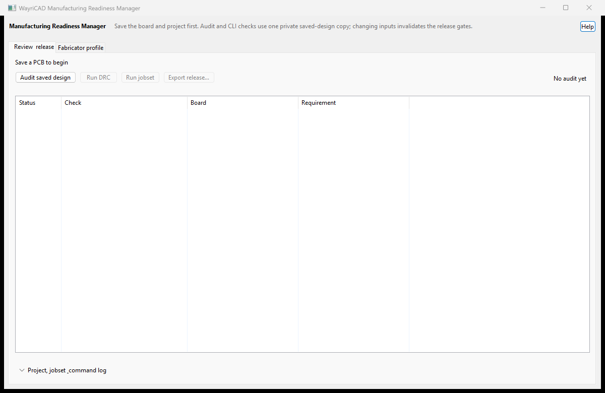

# WayriCAD Manufacturing Readiness Manager

Audit a saved PCB against a fabricator profile, run local KiCad checks, and package the exact verified files with a SHA-256 manifest. The UI stays responsive while DRC and jobsets run.

1. Save the PCB and its matching project in KiCad. Select its own project directory and, optionally, a jobset saved inside that directory.
2. Set the fabricator limits and choose **Audit Saved Design**. WayriCAD verifies that the editor matches the saved PCB, then captures a private copy of the project inputs.
3. Run **JSON DRC**, then the selected **Jobset**. Both commands operate on the captured copy. Only outputs generated inside that copy enter the release; jobsets that use absolute external output paths must be adjusted if those outputs belong in the archive.
4. Choose **Build Release ZIP**. Any board, project, profile, jobset or verified artifact change blocks the old evidence. Repeat the audit and checks after changes. Rerunning DRC also invalidates the previous jobset result.

Archive members use stable names, ordering and timestamps. The manifest hashes the same bytes that are written to the archive; an interrupted or rejected build preserves an existing destination ZIP.

The audit reads saved track widths, ordinary via sizes/drills, full board thickness, copper-layer count and the project minimum-clearance rule. Via aspect ratio conservatively uses the full thickness. Non-uniform via padstacks are refused. Clearance is a rule check; KiCad DRC provides the geometry check. These are focused routed-track/via checks, not a complete fabrication-process audit. Footprint PTH/NPTH drills and slots are now included; plated-pad annular rings include conservative drill-offset allowances. Custom plated shapes and non-uniform padstacks require native per-layer review. Missing routed tracks or plated holes are explicitly N/A, rather than an infinite passing measurement.

All parsing, UI, CLI execution and release files stay local. The CLI is located beside the runtime, on PATH, or in standard KiCad 10/11 Windows installations. Closing the window terminates the active CLI process.

Native saved/live serialization and the DRC command/report contract were exercised on KiCad 10.0.5 with a synthetic saved PCB. Its intentional DRC violation returned exit code 5 and was not treated as passing. Live IPC transport and KiCad 11 remain unverified; see [compatibility](../docs/COMPATIBILITY.md).

Native operation validation now also covers Marble: its full DRC returned 464 findings and correctly blocked release. A separate clean outlined fixture passed DRC, generated three Gerbers through a native jobset, and produced a hashed release ZIP. Exit-code-5 reports retain their finding counts and types in verification evidence and the local command log. Run `python tools/validate_marble_operations.py --kinds manufacturing` from the suite root to reproduce without modifying the source project.

## Native interface

Native release-gate workspace before an audit. Empty findings do not mean the board passed DRC or fabrication checks.

The installed package includes [offline help](help.html) with its workflow and limitations.
