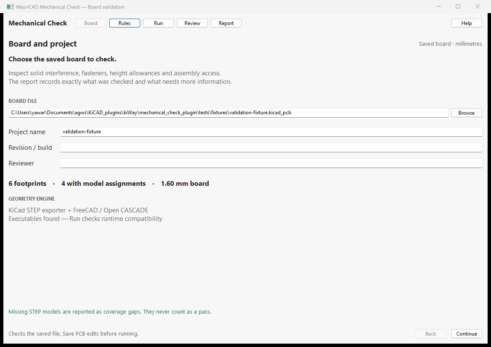

# WayriCAD Mechanical Check

Local, read-only board mechanical validation with actual STEP conflict surfaces and offline reports.

Install the independently built WayriCAD Mechanical Check ZIP with KiCad 10 Plugin and Content Manager. The IPC action opens a native window through installed KiCad 10 Python. Save PCB edits first: launch context identifies the saved file and does not capture unsaved changes. If context is unavailable, choose a board manually.

The compact Board → Rules → Run → Review → Report navigation retains clearances, hardware, enclosure/zone rules, search, severity filters, 3D inspection, reasoned waivers, and HTML/JSON/CSV exports. Advanced geometry settings stay behind one button. The canvas uses a neutral background with actual solid geometry and conflict volumes.

## Native interface



Saved-board setup using a small validation fixture. Model coverage and exact-solid findings are assessed after Run.

The installed package includes [offline help](help.html) with its workflow and limitations.

## Runtime

- Python 3.10+ CLI; the IPC environment uses `kicad-python>=0.8,<0.9`.
- KiCad 10 Python with `pcbnew`, `wxPython` and `PyOpenGL` for extraction/native UI, plus `kicad-cli` STEP export.
- FreeCAD Python with `FreeCAD`, `Part` and `Import` for Open CASCADE solid checks.

`python launch.py --doctor` prints executable discovery. Set `WAYRICAD_MECHANICAL_KICAD_CLI`, `WAYRICAD_MECHANICAL_KICAD_PYTHON`, or `WAYRICAD_MECHANICAL_FREECAD_PYTHON` to override paths. The Windows auto-discovery intentionally selects KiCad 10 because the extraction worker uses SWIG. KiCad 11 live integration and extraction are unverified; installation metadata does not claim runtime certification.

## CLI

```powershell
python launch.py --init-rules rules.json
python launch.py board.kicad_pcb --rules rules.json --output reports
& 'C:/Program Files/KiCad/10.0/bin/python.exe' launch.py --gui
```

Exit codes: 0 passed/waived, 1 runtime/configuration failure, 2 review required, 3 incomplete coverage. Every completed run can produce a unique timestamped report folder; HTML contains its own viewer assets, without CDN/network access.

## Checks and limits

Exact solid intersection/distance, component-to-enclosure and PCB fit, top/bottom heights, regional heights and rectangular keepouts are included. Hardware/copper-pad proximity, screw/washer/tool/nozzle access and independent XY/Z allowances are conservative envelopes, visibly reported as such. Model gaps and unconfirmed mounting intent prevent a pass even if findings are waived. See [local help](help.html) for coordinates and workflow. Static fit checks do not replace electrical DRC or validate manufacturing processes.

## Source and validation

Integrated from the user-provided `3d-interference-check` project (3Dvalid 0.1.0), with original MIT [license](LICENSE) preserved. [Provenance](PROVENANCE.md) records the import. No Marble checkout, source screenshots, third-party model libraries, generated reports or build artifacts are included. The small synthetic test board references external KiCad libraries.

Run `python -m unittest discover -s mechanical_check_plugin/tests -v` from the suite root. Pure checks run without CAD; native pipeline tests require KiCad, FreeCAD and the installed model library. Runtime verification details are reported by the suite validation record.
