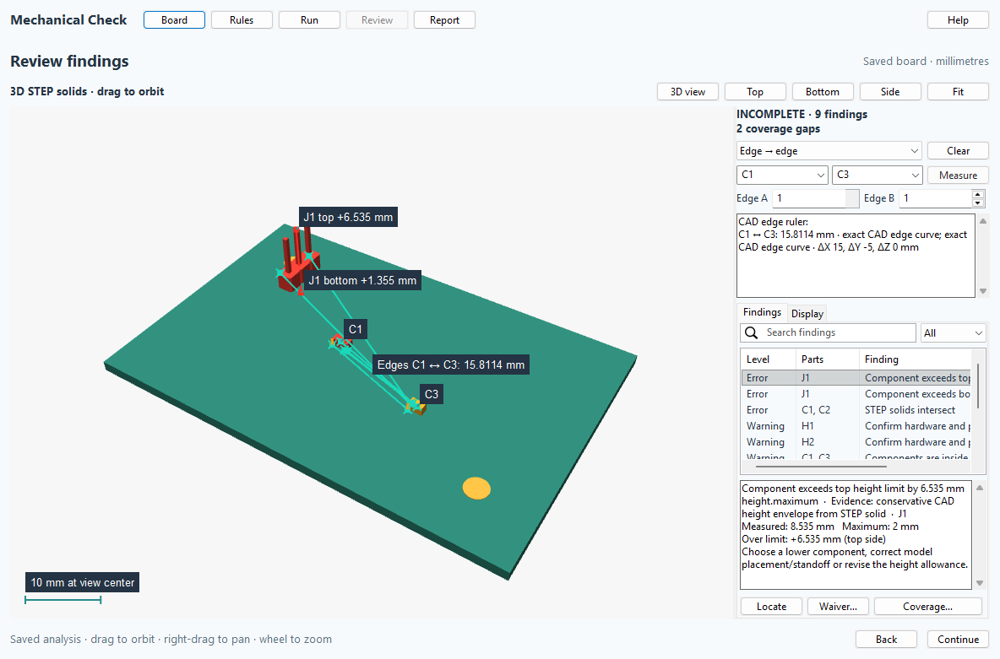
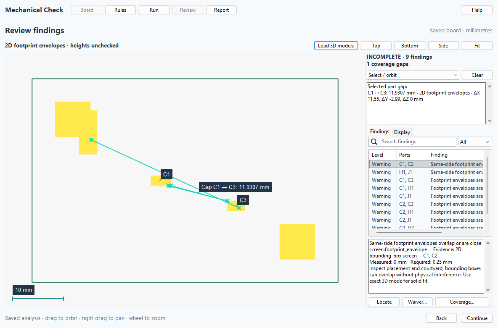

# WayriCAD Mechanical Check


## Capabilities

- Run a quick saved-board 2D footprint-envelope overlap and XY-clearance screen without FreeCAD.
- Use optional FreeCAD exact-solid intersection/distance checks with STEP models and enclosure geometry.
- Import a second saved PCB into the current board’s STEP coordinate frame, position it with X/Y/Z offset and Z rotation, and check exact interboard collisions or close approaches.
- Inspect each interboard finding in the 3D cutaway and exact X/Y/Z or custom-direction 2D section curves; the HTML/JSON report retains these sections.
- Review height/keepout rules, hardware and access envelopes, severity filters and reasoned waivers.
- Configure a circular PnP nozzle tip and wider head with a live dimensioned side view; review conservative tip/head access warnings in the offline report.
- Inspect local geometry/conflict surfaces and export HTML, JSON or CSV through the GUI or CLI.
- Measure any two modelled parts with exact surface witnesses, or use a point ruler between two picked surface locations. Hover shows the nearest measured part and its closest-approach line.
- Keep the whole board in view, switch between top/bottom/side/isometric views, and use reference labels, an orthographic scale, grid and persistent rulers.

## Limitations

- Quick 2D mode is always incomplete for mechanical sign-off: it omits height, enclosure and exact solids, and can flag harmless bounding-box overlaps.
- Exact 3D checks require FreeCAD and usable models; model gaps and unconfirmed mounting intent prevent a complete pass.
- Hardware and assembly-access checks use conservative envelopes; static fit does not validate manufacturing processes or electrical DRC.
- Analysis uses the saved board, not unsaved edits. Native KiCad 11 extraction remains unverified.

## Overview

Local, read-only board mechanical validation with actual STEP conflict surfaces and offline reports.

Install the independently built WayriCAD Mechanical Check ZIP with KiCad 10 Plugin and Content Manager. The IPC action opens a native window through installed KiCad 10 Python. Save PCB edits first: launch context identifies the saved file and does not capture unsaved changes. If context is unavailable, choose a board manually.

The compact Board → Rules → Run → Review → Report navigation retains clearances, hardware, enclosure/zone rules, search, severity filters, 3D inspection, reasoned waivers, and HTML/JSON/CSV exports. Advanced geometry settings stay behind one button. The canvas uses a neutral background with actual solid geometry and conflict volumes.

On Rules, enter the PnP **tip radius**, **head radius**, **head setback** above the pickup plane, and **access travel** in millimetres. The side-view diagram updates as values change. The head radius must be at least the tip radius, and setback cannot exceed travel. Exact 3D runs screen same-side obstacles against each circular section and identify which one triggered a warning. The HTML report shows the configured profile and a schematic obstacle for a selected nozzle warning; use the 3D viewer for actual locations. This is an access envelope, not a machine-path or certified nozzle simulation.

## Interboard collision workflow

1. Save both KiCad boards. Open **Mechanical Check** from the current board and choose **Exact 3D solids**.
2. On **Board**, choose the **Comparison board**. Enter its X/Y/Z translation in millimetres relative to the current board’s KiCad STEP export origin and its rotation about the CAD Z axis. This placement is an assembly assumption; the plugin does not infer connector mating or mounting-hole alignment.
3. On **Rules**, set the minimum 3D clearance. Optionally enter a nonzero custom section-plane normal such as `1,1,0`. Run the check. It exports each board independently, then applies the configured transform to the comparison board’s STEP solids.
4. In **Review**, select an `interboard.collision` or `interboard.clearance` finding. The comparison board is blue/orange and its references begin `Other:`. Enable **Cutaway PCB**, choose X, Y, Z or Custom and adjust the section offset to scan through the contact. **2D section…** shows exact STEP intersection curves through the finding for that direction.
5. Export the HTML/JSON/CSV report. The HTML includes the selected finding’s exact 2D section curves and a cutaway control; JSON retains placement and section geometry without the comparison board’s local path. Re-run after changing either board or the placement.

The two source board files are read only and independently hashed. Missing STEP models or a missing board substrate are coverage gaps, never a pass. Only static placed solids are checked: mating alignment, motion during assembly, cables, flexible sections and manufacturing tolerances need separate review. The custom direction is set before Run so its exact section curves are generated by FreeCAD; the 3D cutaway offset can be adjusted afterward. Quick 2D mode does not accept a comparison board.

For CLI use, create a rules JSON file with `"comparison_board": {"path": "C:/Projects/Example/other.kicad_pcb", "translation_mm": [0, 0, 8], "rotation_deg": 0}` and `"section_normal": [1, 1, 0]`, then run the usual `python launch.py current.kicad_pcb --rules rules.json --output reports` command. Relative comparison paths resolve from the current board’s directory.

## Native interface



Saved-board setup using a small validation fixture. Model coverage and exact-solid findings are assessed after Run.

The installed package includes [offline help](help.html) with its workflow and limitations.

## Quick in-editor screening

Choose **Quick 2D footprint screen (no FreeCAD)** on the Board page, then Run. The saved originating board is screened for same-side footprint bounding-box overlap and XY clearance. DNP filtering, searchable findings, native geometry preview and HTML/JSON/CSV reports work in this mode. No STEP models are resolved or copied.



This conservative screen can report harmless bounding-box overlap, particularly for rotated parts. It is **always INCOMPLETE for mechanical sign-off**: height, enclosure, exact solid interference, hardware and assembly access are unchecked. Opposite-side components are not compared. Choose **Exact 3D solids** for the existing detailed FreeCAD workflow; that mode remains the default. CLI rules use `"mode": "quick2d"` or `"mode": "exact3d"`.

The pictured synthetic fixture uses a 20 mm proximity warning threshold to demonstrate the markers: nine warnings across six footprint envelopes, including seven optional proximity findings. No STEP export or FreeCAD analysis runs in this mode, and the source hash remains unchanged.

## Runtime

- Python 3.10+ CLI; the IPC environment uses `kicad-python>=0.8,<0.9`.
- KiCad 10 Python with `pcbnew`, `wxPython` and `PyOpenGL` for extraction/native UI, plus `kicad-cli` STEP export.
- **Exact 3D mode only:** FreeCAD Python with `FreeCAD`, `Part` and `Import` for Open CASCADE solid checks.

`python launch.py --doctor` prints executable discovery. Set `WAYRICAD_MECHANICAL_KICAD_CLI`, `WAYRICAD_MECHANICAL_KICAD_PYTHON`, or `WAYRICAD_MECHANICAL_FREECAD_PYTHON` to override paths. The Windows auto-discovery intentionally selects KiCad 10 because the extraction worker uses SWIG. KiCad 11 live integration and extraction are unverified; installation metadata does not claim runtime certification.

## CLI

```powershell
python launch.py --init-rules rules.json
python launch.py board.kicad_pcb --rules rules.json --output reports
& 'C:/Program Files/KiCad/10.0/bin/python.exe' launch.py --gui
```

Exit codes: 0 passed/waived, 1 runtime/configuration failure, 2 review required, 3 incomplete coverage. Every completed run can produce a unique timestamped report folder; HTML contains its own viewer assets, without CDN/network access.

## Checks and limits

Exact solid intersection/distance, component-to-enclosure and PCB fit, top/bottom heights, regional heights and rectangular keepouts are included. Hardware/copper-pad proximity, screw/washer/tool/nozzle access and independent XY/Z allowances are conservative envelopes, visibly reported as such. Model gaps and unconfirmed mounting intent prevent a pass even if findings are waived. See [local help](help.html) for coordinates and workflow. Static fit checks do not replace electrical DRC or validate manufacturing processes.

## Source and validation

Integrated from the user-provided `3d-interference-check` project (3Dvalid 0.1.0), with original MIT [license](LICENSE) preserved. [Provenance](PROVENANCE.md) records the import. No Marble checkout, source screenshots, third-party model libraries, generated reports or build artifacts are included. The small synthetic test board references external KiCad libraries.

Run `python -m unittest discover -s mechanical_check_plugin/tests -v` from the suite root. Pure checks run without CAD; native pipeline tests require KiCad, FreeCAD and the installed model library. Runtime verification details are reported by the suite validation record.


### Inspect 3D geometry

The Review workspace gives the board most of the window, with measurements and findings in a resizable sidebar. The toolbar identifies the loaded geometry. **Load 3D models** runs the exact STEP analysis from a Quick 2D result; after that, **3D view** restores the orbitable solid assembly. If FreeCAD is missing, the action opens Board setup with an explanation. Changing camera views never turns 2D envelopes into component solids.

Drag to orbit, right-drag to pan and use the wheel to zoom. Hover over visible solid triangles for the component reference and XYZ position; click to select, or Ctrl-click to pin a surface probe. Section clipping and isolated-part visibility apply to picking. Offline HTML includes a clearable probe list. These coordinate probes do not alter either board or create new collision findings.

Native labels show the active ruler, hovered closest approach and selected/hovered parts. Saved ruler lines remain visible; label placement respects the viewport and scale bar, and omits crowded labels. Grid and PCB transparency start off. Display contains advanced view controls and **Save view…**, which exports the rendered view directly to an opaque PNG. Help images can be clicked to inspect their original pixels in a scrollable window.

Click a part in **Select / orbit** to open its dimension card: CAD X/Y/Z extents and ranges, solid volume, geometric volume centroid and edge count when available. Extents are axis aligned in the saved assembly coordinates; they are not a local oriented bounding box or manufacturing dimensions. Missing metrics remain unavailable.

The measurement selector includes **Point → point**, **Edge → edge**, **Point → edge**, **Body center → center** and **Minimum part gap**. In exact 3D, hover highlights selectable CAD edges; click two edges, or choose references and their one-based Edge A/B numbers in the sidebar. Two different edges of the same body are supported. For point-to-edge, click the first surface point, then click an edge or enter Part B / Edge B. For body centers, click two bodies or choose their references. Curved-edge distances use the CAD kernel and show the shortest witness line. Body centers are geometric volume centroids using uniform volume weighting, without density or mass properties. Minimum part gap remains a separate whole-surface query.

Picked surface points come from the display tessellation; their approximation is stated in the readout. Sampled CAD curves support highlighting/picking only, while exact edge indices resolve against immutable BREP copies. Display sampling is bounded; edges without display samples remain listed by number for manual queries. Older reports without feature inspection require a new native Run. Portable reports preserve and display saved feature rulers, but cannot create arbitrary new exact edge measurements without the native CAD cache.

### Measure clearance and inspect nearby parts

After **Run**, choose **Minimum part gap** and click two different parts, or type their references in **Part A / Part B** and choose **Measure**. Exact 3D mode computes the shortest surface distance using the already transformed solid geometry; it does not re-export either PCB. The ruler joins the two closest witness points, and the readout includes distance, evidence and ΔX/ΔY/ΔZ in millimetres. A zero gap means touching or overlapping geometry; positive intersection volume is reported separately when available. Missing models or failed geometry queries remain unavailable.

Choose **Point → point** to click any two visible surface locations, including two points on one part. This measures the straight-line distance between the picked tessellated points; it is not a minimum part clearance. Green rulers persist until **Clear**, while the orange hover ruler shows the nearest eligible part found by the analysis. Hover information describes the saved analysis snapshot. Live part queries reject changed boards, models or enclosure files and request a new Run.

**Fit** restores the full assembly; **Focus contact** in Display centers a finding. **Top**, **Bottom** and **Side** use orthographic projection with a millimetre scale; **3D view** restores perspective, whose scale is marked “at view center.” Selected/hovered reference labels can be toggled in Display. **Isolate selected parts** is optional. Rulers appear through surfaces so their witness positions remain visible; use cutaway or a section view to inspect the geometry around them.

Quick 2D shows the saved Edge.Cuts outline, including cutouts and sampled curves, as unfilled contour lines. It measures same-side axis-aligned footprint envelopes, not actual part surfaces. Invalid or missing outlines are reported as unavailable instead of inventing a rectangle. Exact 3D retains its STEP substrate and solid models.

Exported HTML/JSON preserves measured pairs and point rulers. The offline viewer can display saved pair distances and create new point rulers; an arbitrary uncached part pair requires a new native run. “Nearest known measured pair” in an older report is distinct from a proven nearest part. Imported reports do not retain the private live geometry cache.

### Global height limits and proximity warnings

On **Rules → Global board limits**, set **Max top height** and **Max bottom height** in millimetres. Heights are measured outward from the corresponding PCB face: top `max(0, zmax − board thickness)`, bottom `max(0, −zmin)`. Every primary component solid is checked on both sides, including through-hole tails and other opposite-side protrusions. Different sides have separate findings. The limits include model placement/standoff; a zero height limit permits no protrusion. Missing models remain unchecked coverage, and Quick 2D cannot establish height.

Violating parts appear red with an excess label such as `J1 top +0.8 mm`. Select the finding or hover/click the part to inspect the height, maximum and excess. Height markers show the CAD envelope beyond the threshold; curved geometry can have conservative bounds, and these markers are not closest-surface witnesses. Labels avoid overlap and are bounded on dense boards; every violation remains in the findings table, and selected/hovered parts get label priority. Display can hide **Violation / proximity markers**. Waived findings retain their recorded measurements but do not mark parts as active violations.

**Proximity warning** sets an optional soft gap threshold; `0` disables it. Exact 3D warns for component-to-component surface gaps below that threshold while preserving collision and hard-clearance findings. Quick 2D uses same-side footprint-envelope gaps and explicitly retains its conservative evidence. Warning parts appear amber; select a proximity finding for its measured witness line or hover for the gap and warning threshold. Comparison-board and enclosure checks keep their existing clearance rules. Settings and exports preserve the threshold as `proximity_warning_mm`.

### Performance and validation

The collision broad phase adapts its sweep axis to the assembly. Nearest-part search uses a bounds tree and cached surface distances; full collision screening still examines every potentially colliding pair. Native and offline picking use triangle indices, and viewers reuse GPU buffers. These optimizations preserve exact geometry checks rather than substituting bounding-box gaps for solid distances.

An 80-solid FreeCAD fixture produced the same nearest distances as an all-pairs reference, using 64 exact queries instead of 3,160 on the spaced arrangement. This is a nearest-search benchmark, not a whole-board runtime guarantee; dense collision analysis and expensive imported geometry can still take longer. See [inspection validation](../docs/audits/MECHANICAL_INSPECTION.md) for analytical, native and package checks.
