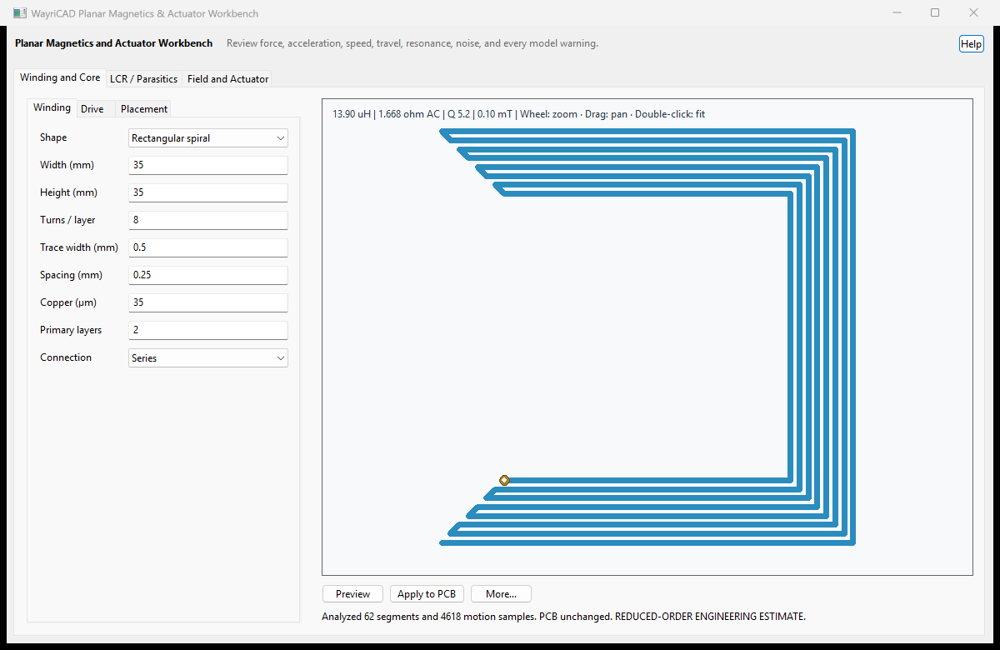
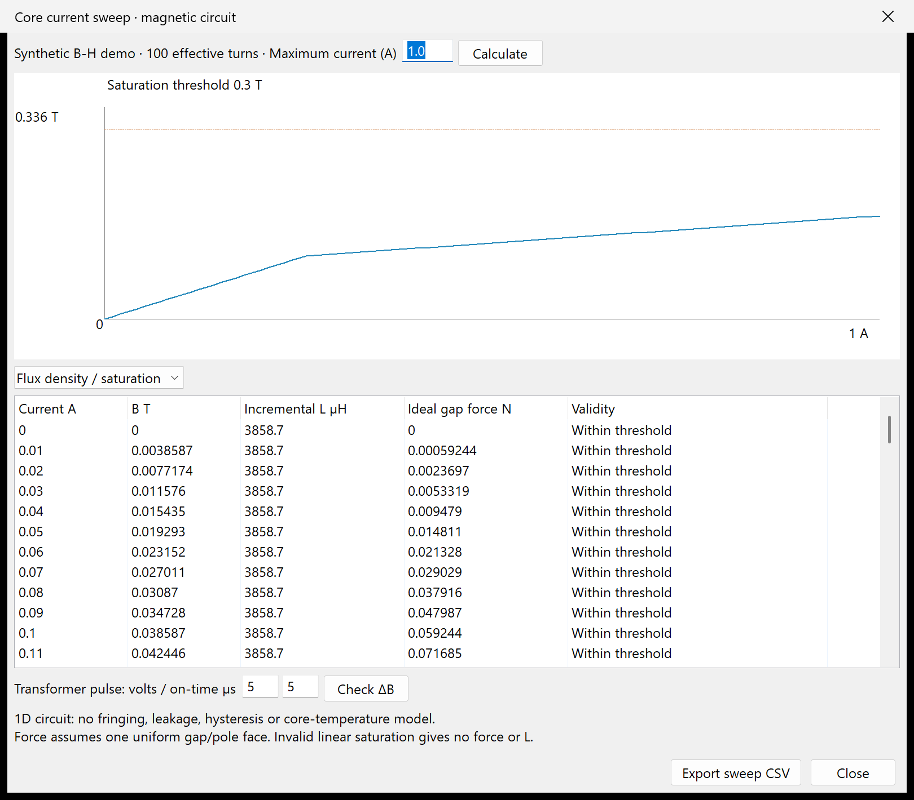
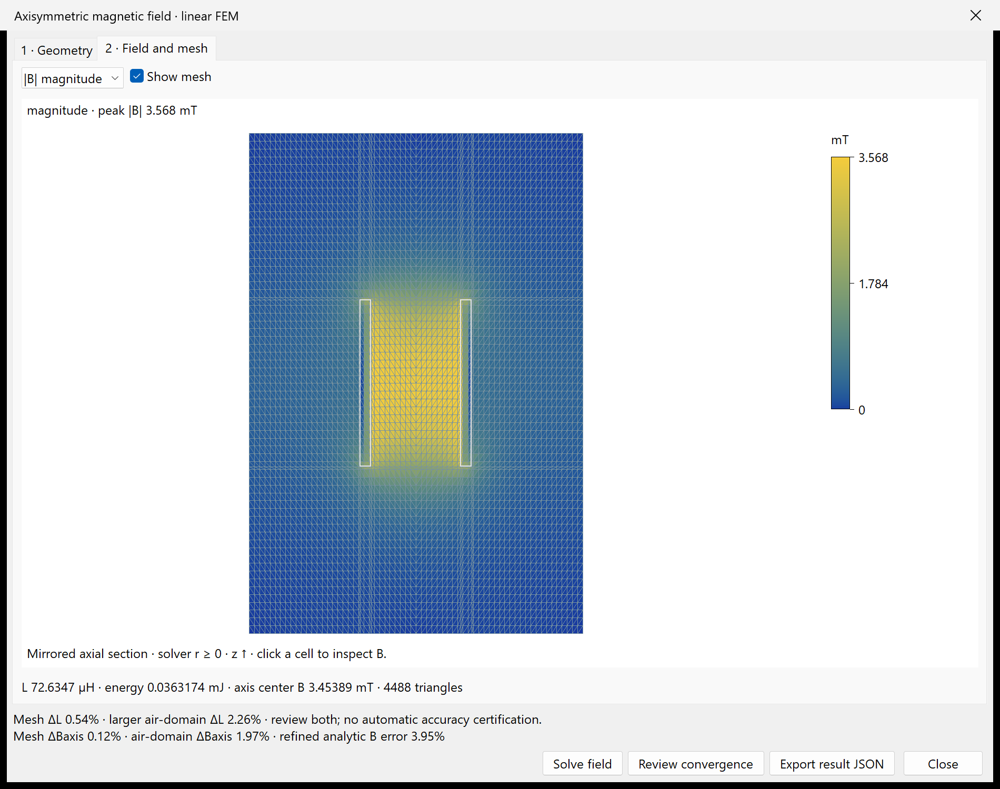

# WayriCAD Planar Magnetics & Actuator Workbench 3.1.1

Generate rectangular or circular planar windings across as many as 16 copper
layers with series transitions, stitched vias, separate primary/secondary PCB
nets, independently layered secondary turns, and an extensible JSON magnetic-core catalog. The workbench
estimates DC/AC resistance, inductance, capacitance, self resonance, Q, copper
and core loss, saturation, coupling, field, force, and magnetic-torquer torque.

The coupled motion solver integrates coil current and a one-degree-of-freedom
mechanical model. Inputs include moving mass or rotary inertia, restoring
stiffness, damping or mechanical Q, initial magnetic gap, hard travel limits,
external load, static friction, waveform, drive frequency, simulation duration,
time step, and temperature. Results include force or torque, transduction
constant, force gradient, acceleration, speed, displacement, resonance,
settling, thermal force-noise density, and Brownian displacement.

Actuator modes cover voice coils, linear solenoids, PCB coil motors, and PCB
magnetic torquers. Macro and nanoscale screening presets are provided. The
nanoscale preset is not a fabrication signoff model: it omits rarefied-gas and
squeeze-film damping, adhesion, stiction physics, Casimir and van der Waals
forces, process stress and geometry variation, nonlinear material properties,
multimode coupling, readout back-action, and quantum effects. Use
process-calibrated electromagnetic/structural/fluid/thermal FEA and measured
device parameters before fabricating MEMS or NEMS hardware.

Preview stays in the window and does not change the PCB. Apply checks that the board and settings still match the review. Accepted windings
are stored in persistent named groups, allowing the latest WayriCAD commit to be
undone after reopening the workbench.

Placement review now checks existing copper, zones and keepouts before creating a group, including copper on the selected net that would short around the designed conductor. Pad, text and zone bounding boxes are reserved conservatively. Choose a clear area and connect the generated terminals afterwards; KiCad DRC remains the final geometry check. Redo repeats the placement check.

**Analyze** reviews winding geometry and electrical estimates. **Run Coupled Motion Simulation** separately runs the bounded dynamics solver, so mechanical duration/step limits cannot block ordinary winding placement.

Native operational validation uses `python tools/validate_marble_operations.py` from the suite root. It exercises review, apply, undo/redo, preserved net assignment, native saved-board reload and full DRC on explicit isolated test coupons in copies of Marble. These coupons are validation fixtures, not proposed Marble modifications.

## Native interface

Generated coil preview from the documentation fixture. Reduced engineering estimates require the stated geometry and material assumptions.

The installed package includes [offline help](help.html) with its workflow and limitations.

## Custom cores, saturation and STEP inspection

**Core tools** adds dimensional core editing, measured B-H tables, current/saturation, incremental-inductance and ideal-gap-force plots, transformer volt-second checks, and CSV export. Optional FreeCAD STEP inspection shows solid geometry, dimensions and volume while requiring explicit magnetic dimensions/material inputs. See [equations, workflow, installation and limits](MAGNETICS_MODELS.md).

These are magnetic-circuit calculations and a STEP surface preview; full-field transformer/actuator FEA remains unimplemented.

**Axisymmetric field** adds a real linear FEM subset for dimensioned annular
windings and optional bore cores. Inspect native |B|/Br/Bz maps, mesh cells,
energy-derived inductance and three-case mesh/air-domain convergence. This does
not import arbitrary STEP into a field solve or replace nonlinear transformer FEA.

