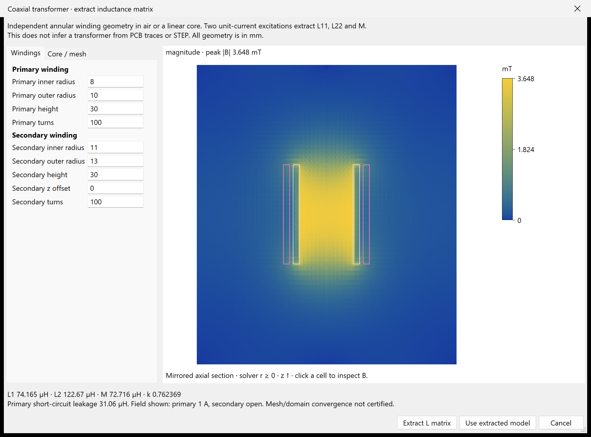
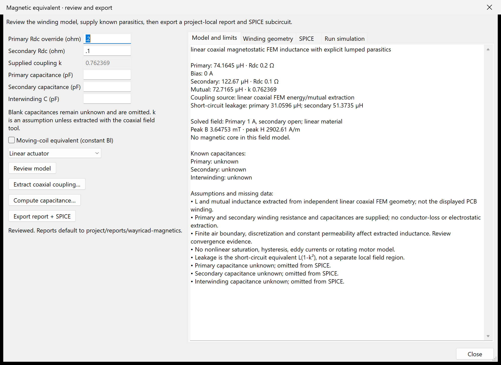
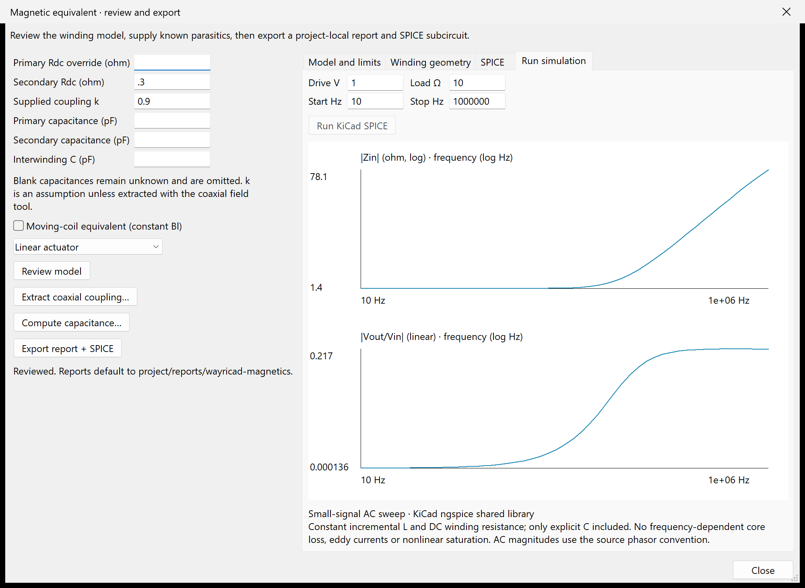
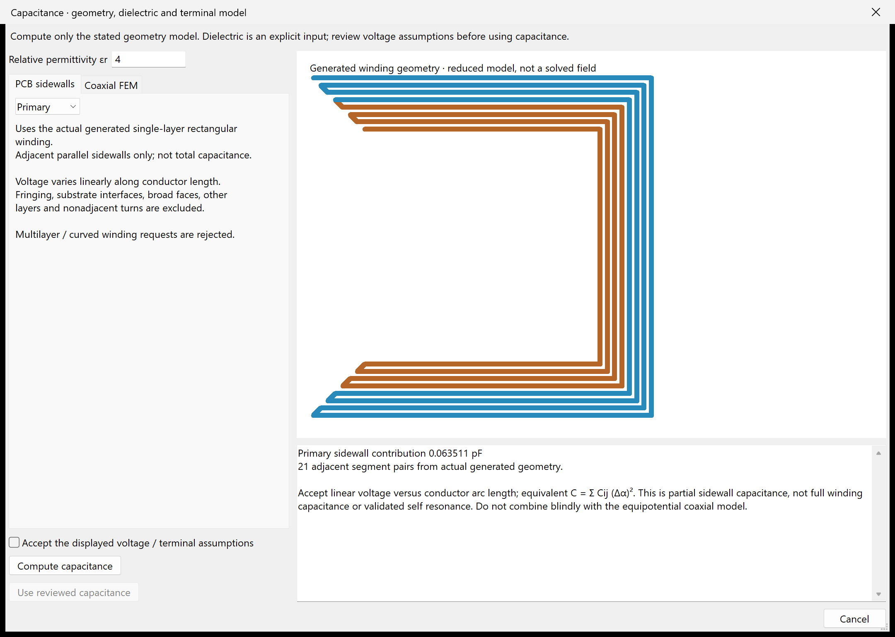
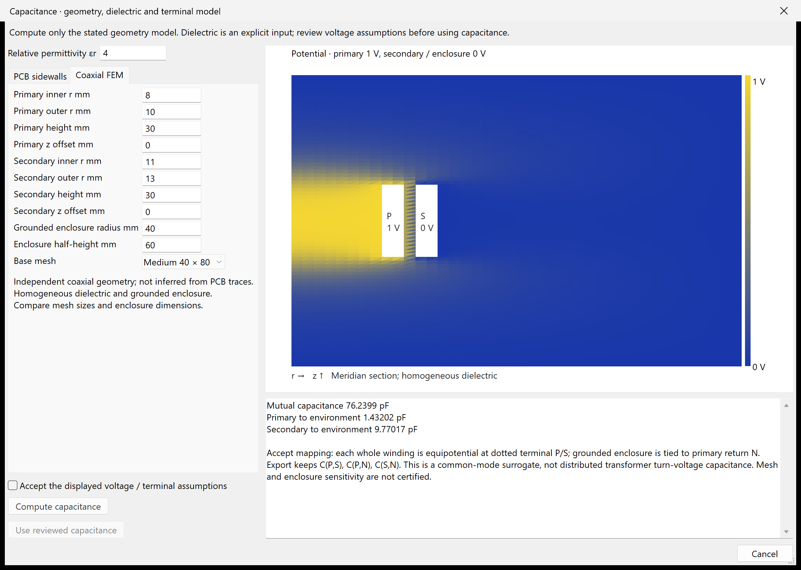
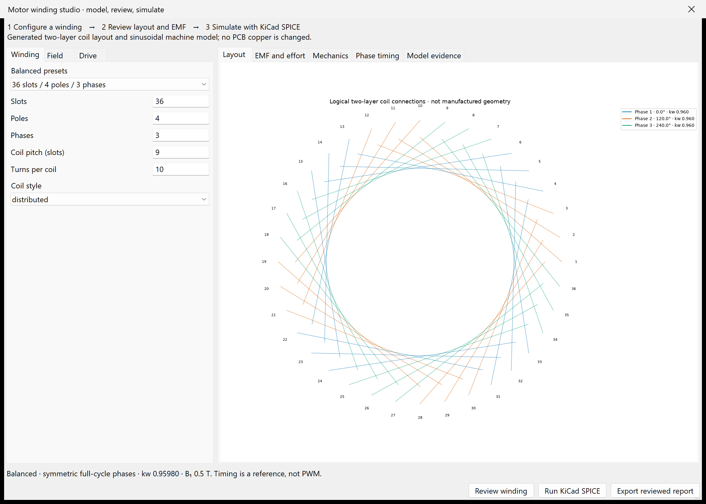
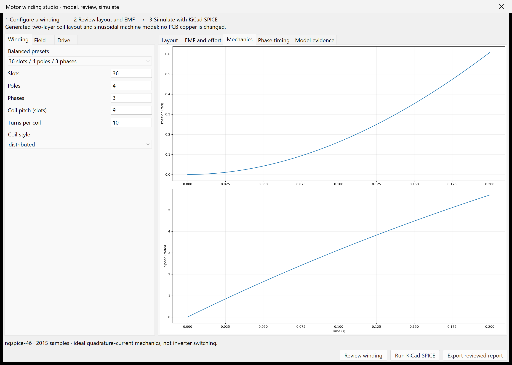

# WayriCAD Planar Magnetics & Actuator Workbench

## Capabilities

- Generate rectangular/circular planar windings with multilayer transitions, primary/secondary nets and reviewed, recoverable PCB placement.
- Estimate winding electrical properties and reduced actuator motion; inspect dimensioned cores, B-H sweeps, reluctance, saturation and ideal-gap force.
- Solve explicit linear axisymmetric winding fields, mutual coupling and leakage; inspect mesh, B/H and convergence evidence.
- Compute explicit-dielectric coaxial capacitance matrices and partial single-layer PCB sidewall capacitance.
- Synthesize logical concentrated/distributed/chorded motor windings with balanced 2–12-phase presets, EMF, ideal-current torque/force and phase-event references.
- Run supported equivalent-circuit AC/DC and motor-mechanics transient simulations using KiCad ngspice; export project-local HTML, JSON, SPICE, CSV and plots.

## Limitations

- Field FEM covers explicit linear axisymmetric geometry; arbitrary STEP field meshing, nonlinear full-field and frequency-dependent eddy/core-loss extraction are not implemented.
- Capacitance models have explicit voltage, dielectric and geometry assumptions; PCB sidewall estimates are partial, not total winding capacitance or SRF validation.
- Motor layouts are logical connections, not manufactured stator or routed PCB geometry. Phase events are not inverter gate commands.
- The motor winding workbench’s ideal-current transient omits winding-voltage dynamics, current control, cogging, saliency, saturation and end effects.
- Reduced force/motion models and MEMS/NEMS presets need material, boundary and prototype validation; native DRC is still required for generated copper.

## Overview

Generate rectangular or circular planar windings across as many as 16 copper
layers with series transitions, stitched vias, separate primary/secondary PCB
nets, independently layered secondary turns, and an extensible JSON magnetic-core catalog. The workbench
estimates DC/AC resistance, inductance, capacitance, self resonance, Q, copper
and core loss, saturation, coupling, field, force, and magnetic-torquer torque.

The coupled motion solver integrates coil current and a one-degree-of-freedom
mechanical model. Inputs include moving mass or rotary inertia, restoring
stiffness, damping or mechanical Q, initial magnetic gap, hard travel limits,
external load, static friction, waveform, drive frequency, simulation duration,
time step, and temperature. Results include force or torque, transduction
constant, force gradient, acceleration, speed, displacement, resonance,
settling, thermal force-noise density, and Brownian displacement.

Actuator modes cover voice coils, linear solenoids, PCB coil motors, and PCB
magnetic torquers. Macro and nanoscale screening presets are provided. The
nanoscale preset is not a fabrication signoff model: it omits rarefied-gas and
squeeze-film damping, adhesion, stiction physics, Casimir and van der Waals
forces, process stress and geometry variation, nonlinear material properties,
multimode coupling, readout back-action, and quantum effects. Use
process-calibrated electromagnetic/structural/fluid/thermal FEA and measured
device parameters before fabricating MEMS or NEMS hardware.

Preview stays in the window and does not change the PCB. Apply checks that the board and settings still match the review. Accepted windings
are stored in persistent named groups, allowing the latest WayriCAD commit to be
undone after reopening the workbench.

Placement review now checks existing copper, zones and keepouts before creating a group, including copper on the selected net that would short around the designed conductor. Pad, text and zone bounding boxes are reserved conservatively. Choose a clear area and connect the generated terminals afterwards; KiCad DRC remains the final geometry check. Redo repeats the placement check.

**Analyze** reviews winding geometry and electrical estimates. **Run Coupled Motion Simulation** separately runs the bounded dynamics solver, so mechanical duration/step limits cannot block ordinary winding placement.

Native operational validation uses `python tools/validate_marble_operations.py` from the suite root. It exercises review, apply, undo/redo, preserved net assignment, native saved-board reload and full DRC on explicit isolated test coupons in copies of Marble. These coupons are validation fixtures, not proposed Marble modifications.

## Native interface

Generated coil preview from the documentation fixture. Reduced engineering estimates require the stated geometry and material assumptions.

The installed package includes [offline help](help.html) with its workflow and limitations.

## Custom cores, saturation and STEP inspection

**Core tools** adds dimensional core editing, measured B-H tables, current/saturation, incremental-inductance and ideal-gap-force plots, transformer volt-second checks, and CSV export. Optional FreeCAD STEP inspection shows solid geometry, dimensions and volume while requiring explicit magnetic dimensions/material inputs. See [equations, workflow, installation and limits](MAGNETICS_MODELS.md).

These are magnetic-circuit calculations and a STEP surface preview; full-field transformer/actuator FEA remains unimplemented.

**Axisymmetric field** adds a real linear FEM subset for dimensioned annular
windings and optional bore cores. Inspect native |B|/Br/Bz maps, mesh cells,
energy-derived inductance and three-case mesh/air-domain convergence. This does
not import arbitrary STEP into a field solve or replace nonlinear transformer FEA.

## Extract coupling and export equivalent circuits

After **Preview**, use **More → Equivalent model & report**. The review shows Rdc, incremental L, B/H, supplied magnetic path length, and core/gap reluctance for the magnetic-circuit model. Enter known capacitances in pF; blanks remain unknown and are omitted. Transformer export requires secondary Rdc. Supplied k is explicitly an assumption; short-circuit leakage is L(1−k²), not a fabricated geometric extraction.

Choose **Extract coaxial coupling** for a genuine linear FEM extraction. Define two non-overlapping annular windings; core and mesh controls are on their own tab. Independent unit-current excitations on a shared mesh compute L11, L22 and mutual M, then k and both short-circuit leakage inductances. The native field includes both winding outlines, a quantitative B legend and cell B/H probing. The displayed field is primary 1 A, secondary open. This independent geometry is not inferred from the planar PCB winding; enter its primary and secondary Rdc explicitly.

The inductance matrix must be reciprocal and positive definite; |k| must be below one. The [independent mutual-inductance reference](../docs/MAGNETICS_VERIFICATION.md) checks against Neumann/elliptic-loop integration. Matrix checks and that reference do not certify a chosen model's air-boundary or mesh convergence. Compare refined meshes and larger air domains; no nonlinear core, frequency-dependent leakage, electrostatic capacitance or conductor loss is extracted by this field subset.

**Export report + SPICE** creates a unique folder under `PROJECT/reports/wayricad-magnetics/`, containing `model.html`, `model.json`, `model.cir` and, for field extraction, `field.json`. The HTML is fully local, includes a circuit diagram and solved-field SVG, and records units, missing data, assumptions and the saved-board hash. Saved-board changes invalidate export context. Existing files and the PCB are never overwritten. A redirected default report folder outside the project is rejected.

Supported SPICE subcircuits are incremental inductors, two-winding coupled inductors, constant-Bl linear actuators and explicit-parameter brushed DC motors. For a DC motor supply Kt=Ke in SI, rotor inertia, rotational damping and optional torsional stiffness. `VEL` is linear speed in m/s; `OMEGA` is angular speed in rad/s. Both models use reciprocal back EMF and force/torque, with zero initial state. Motor constants are supplied, not extracted; BLDC commutation, rotating fields, cogging, saturation and position-dependent dynamics are not modeled. Optional interwinding C is one lumped capacitor between dotted terminals, not a distributed insulation model.

Validation: 33 focused magnetics tests pass, including passivity, analytic reluctance, units, explicit missing data and unique exports. An exported DC motor was also executed with KiCad's bundled ngspice: 1 V, R=0.2 Ω, Kt=Ke=0.1 and damping=0.001 gives 9.8039215686 rad/s, matching the analytical DC operating point. This does not establish transient accuracy for an arbitrary motor.

## Run with KiCad's SPICE engine

The equivalent-model dialog now has **Run simulation**. Review the model first, then set drive voltage and (for transformers) load resistance. Inductors and transformers run an actual 10-points/decade AC sweep through KiCad's bundled ngspice library in an isolated process. The native plots show input impedance and transformer gain or impedance phase. Mechanical equivalents use a DC operating point and report current, speed, force/torque and converted power; frequency controls are disabled. Hover the result status for the engine library path and version log.

No separate SPICE installation is required. If KiCad simulation support is unavailable, the plugin reports the missing engine instead of substituting results. `WAYRICAD_KICAD_NGSPICE` can identify the shared library used by KiCad. The calculation is bounded and isolated so an engine failure does not crash the plugin. Changes to the model or simulation inputs clear stale results.

Export after simulation adds `simulation.json` containing the generated deck, complex vectors, engine provenance and numerical results; the local HTML includes the actual simulation plot. These are simulations of the reviewed lumped equivalent: incremental L and Rdc are constant, only explicitly supplied C is included, and nonlinear saturation, frequency-dependent core loss, eddy currents and motor commutation remain excluded. Mechanical DC results are steady state; a restoring spring can make final speed zero.

## Compute capacitance from stated geometry

**Equivalent model & report → Compute capacitance** now offers two explicit-dielectric models. εr starts blank and must be supplied; it is never inferred from magnetic permeability.

- **PCB sidewalls** uses the actual generated single-layer rectangular winding and adjacent parallel sidewall overlaps. It integrates pair capacitance against squared local voltage difference, assuming voltage varies linearly with conductor arc length. The result is a **partial sidewall contribution**, excluding fringing, broad-face coupling, substrate interfaces, other layers and nonadjacent turns. Multilayer and curved windings are rejected. This is not total capacitance or an SRF validation.
- **Coaxial FEM** solves two equipotential annular conductors in a homogeneous dielectric and explicitly grounded outer enclosure. It produces a reciprocal Maxwell capacitance matrix and a native potential preview. Geometry is independent of the PCB; an existing coaxial magnetic model can seed its dimensions. No arbitrary STEP or 3D electrostatic extraction is claimed.

Computed values are not applied until the displayed potential assumptions are explicitly accepted. For the coaxial model, P and S represent the equipotential windings and the grounded enclosure is tied to primary return N. SPICE preserves all three passive branches: C(P,S), C(P,N) and C(S,N). This is a common-mode surrogate, not a distributed differential transformer winding-capacitance extraction. Review mesh and enclosure sensitivity before using it. Do not combine differently assumed partial models blindly.

Manual pF overrides remain available and remove the corresponding computed provenance/environment network. Project reports preserve dielectric, dimensions, assumptions, matrix and evidence; electrostatic field JSON and an HTML potential SVG accompany the model. The independent numerical checks include analytic coaxial capacitance, reciprocity/energy, dielectric scaling, sidewall geometry scaling and equality of Maxwell-matrix energy with exported SPICE capacitor-network energy.

## Motor winding, EMF and phase timing

Open **Core tools → Motor winding / EMF**. The separate workbench synthesizes logical two-layer coil connections for distributed full-pitch, concentrated tooth and chorded windings, with balanced presets for 2–12 phases. Review slots, poles, coil pitch, turns and phase balance before simulation. The layout and exported `coils.csv` describe slot/phase/polarity assignments, **not manufactured stator geometry, end-turn packing or routed PCB copper**.

Supply the fundamental air-gap B and active geometry, or use the explicitly limited PM magnet/gap estimate. Wound-field mode requires supplied B; no rotor excitation circuit is solved. Rotary and linear modes show phase EMF, torque/force and constant-speed zero/peak timing events. Timing is a reference, not PWM, commutation or dead-time instructions. Even-phase presets use independent H-bridge phase axes, not an assumed shared neutral. The [model equations and research review](../docs/MOTOR_MODELS.md) state exactly which baseline is implemented.

**Run KiCad SPICE** solves the mechanical transient with ideal position-synchronous quadrature currents, inertia/mass, damping and a signed load. This is actual bundled-ngspice mechanics; phase flux/EMF are evaluated at the resulting position. It does not solve winding voltage dynamics, an inverter, current control, saliency, cogging, saturation, losses or finite-stroke end effects.

**Export reviewed report** creates a unique project folder under `reports/wayricad-magnetics/motor-*`, with model/input/evidence JSON, logical coil CSV, all native plot SVGs, HTML and the mechanical SPICE deck when simulated. Changed inputs invalidate results; a changed saved board requires review before export. Native validation covered the 36-slot/4-pole/3-phase layout, 12 reference phase events, a 2,015-point real ngspice transient (final speed 5.69565358 rad/s), linear force/EMF review and complete project reports. These are numerical reference checks, not measured motor validation.
