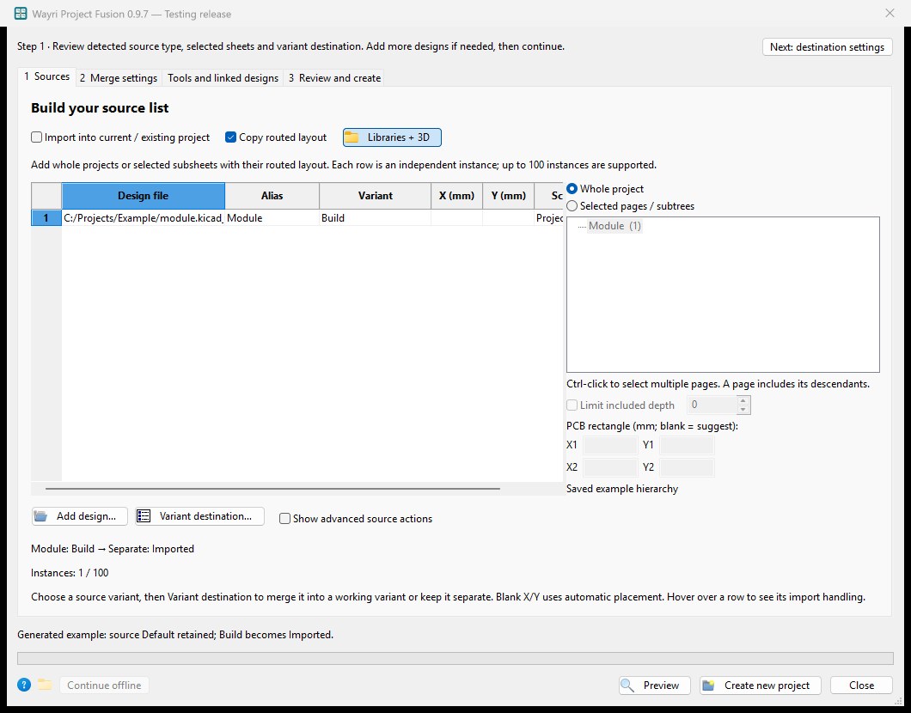
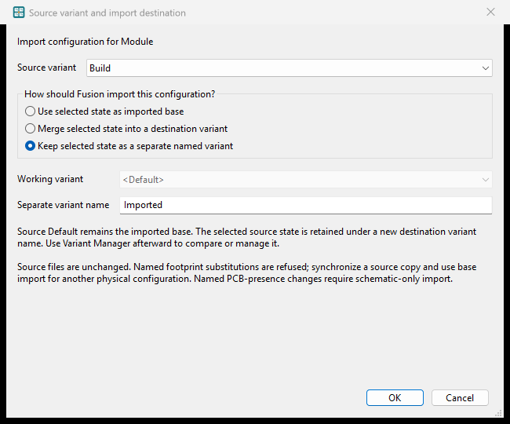
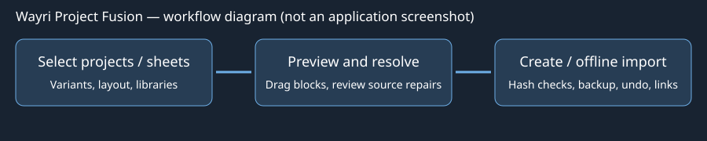

# Wayri Project Fusion 0.9.7

**KiCad 10 · native wxPython plugin · testing release**

Combine 1–100 saved KiCad project instances or extracted routed subsheet instances into a new project, a parent schematic and one PCB. Select a native assembly variant independently for each source, collect local dependencies, and reannotate the schematic and PCB together without reference-only relinking.

## Guided import and variant destination

Start with **Start guided import…**. Choose **New project**, **Current / existing
project**, or **Update a previously linked design**. For an import, Fusion leads
through detected source/sheet scope, the variant choice, destination settings,
preview and Create / Apply. **Show advanced source actions** reveals duplication,
ordering and setup-file actions when needed. The full workspace remains available.





These Windows/KiCad 10.0.6 captures use a generated example hierarchy. The
displayed project path was substituted with a generic path in the controls
before window-only capture; no private design or desktop contents are included.

The guided flow asks how each source configuration should enter the destination.
You can also select a source row and click **Variant destination…**:

| Choice | Imported base | Selected source configuration |
|---|---|---|
| Use selected state as imported base | Selected source variant | Compiled into the imported copy's Default state, as before. |
| Merge into a destination variant | Source Default | Overrides only the imported instances inside the chosen working variant. Existing destination components and their configurations remain unchanged. |
| Keep as a separate named variant | Source Default | Creates a new native destination variant with overrides on the imported instances. |

For a new project, create a name with **Separate** on one source; other sources
can **Merge** into that name. In a working project, merge into an existing native
variant or create a new separate name. Duplicate/reserved names and missing merge
destinations stop preview. These are native project-wide assembly configurations,
not disconnected copies of the design. The separate Variant Manager can compare,
rename, merge or delete the resulting configurations.

Whole projects and selected sheet occurrences support these choices. Source files
stay unchanged. Default values/geometry remain authoritative in named import
modes; reports identify that native validation state. Named footprint substitutions
are refused rather than silently losing their library/geometry requirements.
Named PCB-presence changes require schematic-only import. Synchronize a source
copy and use base-state import when a different physical layout is required.
Named imports are recorded as links, but automatic linked updates of those named
configurations are currently refused; manage them with Variant Manager or import
a fresh reviewed copy. Base-state linked imports retain their existing updater.

When running inside KiCad, the final guided step opens an independent **offline
Apply** window. Save and close the target editors, inspect the plan, then apply
with a verified backup. The standalone window asks for the closed-editor
acknowledgement at that step. Changed inputs always require a fresh preview.

## Automatic source scope and PCB-only import

**Add** recognizes saved project/root files, child sheets, schematic-only projects
and standalone PCBs. A child schematic resolves to its owning project. When it
belongs to several projects or occurs repeatedly in a hierarchy, choose its
owner and exact UUID occurrence; Fusion never guesses from a filename or
reference. The selected sheet appears immediately in the source tree. Use
**Whole project** or **Selected pages / subtrees** to override the import scope.
Projects without a PCB automatically select schematic-only mode. Standalone
schematics are copied to a separate temporary project context for native checks;
the original folder receives no generated project file. External sheet paths
and library dependencies remain subject to the usual source-copy checks.

Owner detection checks projects in the selected directory and four ancestors,
with at most 64 candidate roots and the existing 512-occurrence/32-depth limits.
If external path variables or a remote owner prevent automatic resolution,
select the owning root project and configure **Paths and extra assets**.

A PCB without schematic companions opens **PCB-only layout import**. The same
tool is available in **Tools → PCB-only layout import…** for any saved PCB,
including a PCB that has an owning schematic. Choose the working target project,
a unique namespace and the incoming board's left/top position in millimetres.
**Show placement** overlays the incoming geometry on the target. **Validate
candidate** checks native target schematic/PCB parity, refills zones and refuses
new DRC or unconnected findings. Then **Open Apply Review…** launches an
independent window. Close Fusion and the target editors before applying there;
the existing verified backup, stale-input rejection and rollback apply.

PCB-only footprints become explicit **Board Only** objects, with new UUIDs and
namespaced references. Their nets are isolated from the working schematic nets;
this mode does not create schematic symbols or add parts to its BOM. Source
Edge.Cuts becomes a Dwgs.User guide; the target outline, schematic files and
project configuration remain unchanged. A smaller stack retains F.Cu/B.Cu on
the target outside faces. Full-span through vias are required; blind, buried and
microvias stop for review. Images and embedded-file payloads need extraction
before import. Project-relative model files are copied and hashed; unresolved
models stop preview. Library environment model paths remain external references.
Electrical changes that need schematic connectivity should use ordinary project
or linked-design import instead.

The source tree now reads lightweight scope metadata instead of allocating
complete import identities and variant copies every time a row is selected.
Parsed schematic syntax uses a cache limited to 16 MiB of source bytes and 32 files, keyed by file
contents, with independent mutable copies and a fresh SHA-256 check on every
read. Repeated occurrences parse each file once per traversal. Native exports,
DRC and preview/apply acceptance are always fresh. In the included synthetic
benchmark (100 occurrences, 20 symbols each), scope listing took 0.024 s versus
1.983 s for full import discovery on Windows; this measures listing only, not
an 81× improvement in native merge execution. Run
`python project_fusion_plugin/benchmark_discovery.py` to reproduce the comparison.

**Insertion validation (2026-10-01):** Native routed insertion retained three footprints, six segments, three vias and three zones (one target design plus two imports), with zero schematic/PCB parity findings and zero unconnected items. Three inherited dangling-via findings and nine fixture ERC findings remain reported. Schematic-only insertion from a source without a PCB left the existing target PCB byte-for-byte unchanged. Multi-subsheet extraction, stale inputs, editor locks, backup integrity and rollback are checked separately.

**100-instance validation (2026-10-01):** Windows / KiCad 10.0.6. Native validation merged 100 mixed instances (50 whole projects and 50 reviewed routed sections), retaining 100 footprints, 200 segments, 100 vias and 100 zones. Native netlist isolation, schematic/PCB parity, source hashes and BOM quantity passed; inherited fixture dangling-via warnings remained unchanged. Native wx management tests cover 100 rows, duplication, reordering, removal and setup roundtrips. Other operating systems and live-editor transaction qualification remain unverified.

## 0.9.5 — visible previews and reviewed source inheritance

PCB and schematic previews now fit their saved geometry when the preview tab
first becomes visible. Previously, a hidden tab could retain a near-zero fit
scale and appear blank until another interaction.

The **Issues** panel lists a decision for each source preflight issue. Select
**safe suggestions** to stage the available repairs, then inspect the suggested
action for each row. A unique saved schematic association can restore a PCB
reference in the detached repair copy, including swapped reference labels.
Board-only copper is an advisory with an explicit **Ignore** choice. Missing or
ambiguous schematic identity, changed electrical connectivity and other
blocking checks cannot be ignored. The source project is never edited by this
repair step. Re-preview the repaired copy before import.

For a design inherited from another saved KiCad project, select its `.kicad_pro`,
root `.kicad_sch` or `.kicad_pcb` file. A whole-project import needs the matching
project, schematic and board companions; schematic-only subsheet extraction
can omit the source PCB. Fusion records the source identity and imports it as a
linked design. In **Linked sources / updates…**, scan the saved source and
preview a linked update. Source Value, BOM/custom fields, selected Footprint and
routed footprint positions can propagate while surviving symbols and PCB items
retain stable destination identities. **Linked update mode** offers three
reviewed choices. **Follow source schematic and PCB layout** is the original
behavior. **Update schematic; keep target placement and routing** retains linked
PCB geometry even when source PCB placement changes, while inheriting a
compatible replacement footprint body and pads. **Update PCB layout; keep target
schematic** brings source placement and routes into the linked block without
overwriting the target schematic or its fields. Pad numbers, nets, native DRC
and unconnected change checks must pass; incompatible changes stop for manual review.
New or changed footprints and electrical connections require major-change review
and native validation. The Change
Review gives a suggestion per row; **Ignore for now** defers that design's
whole update rather than silently dropping one field. Destination ownership or
copper conflicts require repair and rescan. Apply the reviewed candidate with
the target and source editors closed, then reopen the target project.

## 0.9.4 — schematic associations and copper preservation

PCB association paths now use the exact sheet path and symbol UUID exported by
KiCad. Schematic instance paths still include their owning root UUID; PCB paths
do not. Create, insertion, section extraction and linked updates keep those two
identities separate. Validation checks the native path directly, in addition to
schematic/PCB parity, so an extra root prefix cannot pass by being repeated in
both generation and validation. This addresses footprints being added again by
**Update PCB from Schematic**.

Source-copy repair no longer deletes every track, via and zone on a changed net.
It retains copper when the numbered-pad partition is unchanged, including a
pure net rename. When existing copper belongs to changed, split or joined
connections and its new assignment is ambiguous, repair stops with the affected
nets and copper counts. Resolve the specific connections in a saved source copy
and preview again. The authoritative source stays unchanged; this is not an
autorouter and does not guess that a plane is still safe after rewiring.

Groups, stable PCB UUIDs and reviewed placements remain subject to the existing
preservation checks. Zone definitions and a visible filled plane are different:
refill uses the destination outline, so blocks outside that outline may have no
filled copper. New parts still need placement and routing. Ordinary DRC findings
are reported separately from identity checks.

Installing the plugin does not rewrite existing projects or restore copper
already removed by older releases. Keep a backup and use the original source
layout when rebuilding a reviewed candidate. Do not enable reference-only
relinking merely to hide a failed UUID association check. The earlier 0.3.1
root-prefix assumption and old changed-net removal policy below are superseded.

This remains a **testing release** using the legacy SWIG entry point. It does not
enable IPC discovery or change KiCad preferences. See `TEST_REPORT.md` for checks
actually run and limits of the release qualification.

## Install or upgrade

Use **`WayriCAD-project-fusion-0.9.5-PCM.zip`**, not the source ZIP. Open KiCad's Plugin and Content Manager, choose **Install from File**, select the ZIP without extracting it, and apply the installation. Restart the PCB Editor. Launch **Wayri Project Fusion** from its toolbar button or **Tools → External Plugins**.

This retains the package identifier `org.wayri.projectfusion`. Remove an old manually installed copy before installing through PCM, so two versions are not loaded. The PCM archive puts the Python package directly inside `plugins/`; it does not add an extra nested source folder.

The plugin uses KiCad 10's SWIG action-plugin entry point and the installed wxPython runtime. The merge engine uses Python's standard library; it does not download Python packages, upload projects, launch a browser service or publish anything. Real merges require the installed **KiCad 10 `kicad-cli`**. The GUI auto-detects it or accepts an explicit executable path, such as `C:/Program Files/KiCad/10.0/bin/kicad-cli.exe`.

Target platforms are Windows and Linux. Linux atomic publication requires `renameat2`. macOS and KiCad 11 are not qualified or supported by this package. Manual installation is possible by copying the `project_fusion_plugin` folder from the source checkout into KiCad's scripting-plugin location; do not install a second copy simultaneously.

## Linked source updates and overview

Open **Linked sources / updates…** to view the saved target and its imported designs. The Overview contains the subsheet/symbol hierarchy and a selectable source-to-destination diagram. Statuses distinguish current, changed, missing and conflicting links. Change Review shows severity, component, pin and before/after values; pin connections use component/pin names instead of opaque UUIDs.

New linked imports retain `wayri-fusion-links.json` with source identities, variants, exact sheet occurrences, placement, reference/UUID mappings and destination baselines. Relocated source projects must retain the verified project UUID. Heuristic symbol matches are review proposals; identical UUID occurrences match automatically. Older imports require verified provenance before adoption.

**Scan all links** is read-only. **Watch saved sources** repeats scans while this window is open; it does not silently overwrite the target. Select one or more link wrappers and choose **Preview selected updates…**. Major changes require deliberate acknowledgement. The candidate and saved plan are separate from the target. Open the standalone Apply window, close the target/source editors, then apply with a backup and stale-input checks.

Major flags include changed pin neighbours, net joins/splits, added/removed pins or components, symbol pin definitions, footprints, assembly flags, hierarchy, copper and source constraints. A net rename with identical electrical pin partitions is distinguished from rewiring. Destination edits to imported content are treated as conflicts instead of silently discarded. Intentional connections across a module boundary require conflict review.

Boundary checks combine native DRC with exact segment/via touch checks. Arc and zone overlap checks use conservative copper envelopes and can require manual review even when the actual curves do not touch. Native zone refill follows the retained destination outline; extend and review that outline before expecting imported zones outside it to fill.

Example hierarchy:

```text
Main design
  +-- Existing circuit
  +-- Imported power project
  |     +-- Regulation sheet: U1, L1
  |     +-- Protection sheet
  +-- Imported sensor project
        +-- Interface sheet
```

Updates retain stable destination references and UUIDs for surviving source identities. Routing comes from the reviewed source layout; this is not an autorouter. Validate ERC, DRC, board outline and module connections before manufacturing.

**Break selected links** or **Break all links** removes monitoring metadata only. Imported schematics, PCB objects, routing, libraries and local resource copies remain intact, including when the original source has been deleted. Source deletion marks a link as missing; it never removes destination content. Breaking links uses a reviewed offline candidate and can be undone.

**Undo applied transaction…** offers verified backup snapshots for imports, updates, adoption and link breaks. Review the undo candidate and apply with the editors closed. Undo first backs up the current destination and removes only verified files created by the transaction being undone. Later destination edits or a changed backup block automatic undo, preventing loss of unrelated work; retained backup folders remain available for recovery.

Linked monitoring starts automatically for new **imports into an existing project** and native **Create combined project** merges. Combined designs using mixed-stack layer/via mapping or preserved source outlines can be scanned and detached, but need a new reviewed combined candidate to propagate changes. Legacy adoption is conservative: only imports covered by the latest root insertion report and its intact source archive are proposed, and older partial-sheet imports require re-extraction. A matching reference alone never establishes ownership. Update schematic-only and routed links in separate transactions. Routed source footprint UUID replacement and conflicting embedded attachment replacements require a new reviewed insertion. Matching copper-layer identities and counts are required for linked layout updates.

## Import into the current project

Choose **Import into current / existing project** in Fusion. When launched from PCB Editor, the saved editor project is offered as the target. The target is excluded from the incoming source list. Select a different saved target when working from the standalone dialog.

Add complete source projects, reviewed routed sections, or select multiple exact subsheet occurrences for schematic-only import. Each selected occurrence includes its descendants; overlapping parent/descendant selections are refused. Repeated occurrences of a shared file remain distinct. Schematic-only extraction requires a project and root schematic, but no PCB rectangle or PCB file.

Choose whether to include layout. Layout imports preserve complete footprints, tracks, vias, zones, drawings and groups by rigid translation. Incoming copper-layer counts and identities must match the target stack; the target outline, setup and existing placements remain intact. Imported source outlines are retained on Dwgs.User for review rather than replacing the target board boundary. Enlarge the target outline and make intentional inter-module connections afterward.

**Preview import** creates a separate review candidate and native validation reports. Existing target references and UUIDs are preserved; incoming references are allocated without collisions. Incoming circuits remain electrically isolated. Schematic-only imports intentionally introduce unplaced components, ready for Update PCB from Schematic. Preview does not alter the target.

Review the candidate and save its import plan. Close Fusion and the target schematic/PCB editors, open the standalone Fusion dialog, load the reviewed import plan, then explicitly apply. Fusion checks the original target, source and candidate hashes again, creates a backup, and applies the reviewed files with rollback on failure. Reopen the target project afterward. This is a saved-file import; it does not modify unsaved editor memory or supply a live-editor undo transaction. Changes made after preview require a fresh preview. Up to 100 incoming instances are supported.

## Four-design workflow

Save all source editors before starting. Select each `.kicad_pro`, root `.kicad_sch` or `.kicad_pcb`. Each design must have all three same-basename companions. Child sheets may be elsewhere on disk.

The source grid now contains **Project**, **Alias**, **Variant to merge**, **X** and **Y**. Adding a source detects variants in project metadata and in the selected project's hierarchical instance records, including nested and reused sheets. Choose a configuration for each row. A source with named variants remains at **[Choose variant]** until you make an explicit selection; the plugin never assumes its Default is current. A source without named variants selects `<Default>` automatically.

Use **Detect / refresh variants** after changing a source on disk. The same project may be added more than once with different aliases and variant selections, within the 100-instance limit. Move rows to change annotation order and the primary settings source.

Choose a new output folder outside all source folders, a project name, numbering policy, arrangement and outline policy. Blank X/Y uses automatic placement; explicit X/Y is the source envelope's desired upper-left coordinate in millimetres. Placement is a rigid translation, not a rotation, mirror or reroute.

Run **Analyse / preview** to inspect the reference map, selected configurations, placement envelopes, layer mapping and layer-related warnings. This is a structural preflight, not a complete asset or electrical audit. The asset-copy audit and actual CLI connectivity checks run during **Create combined project**. Required acknowledgements must be enabled deliberately.

On creation, the plugin stages a complete output, exports each source's selected variant through KiCad CLI, exports the combined schematic, compares component identities and complete electrical pin partitions, creates the board, runs native DRC/parity/refill/save, verifies the saved geometry/layers and audits copied paths. A required-check failure prevents publication. The final folder is created atomically without replacing an existing directory.

## 1. Variant selection and native destination states

Base-state import applies the selected variant's effective state to the **new copy** of each imported sheet occurrence. Merge/separate handling instead retains source Default and writes selected overrides under the rebased native instance paths. Fusion does not generate a Cartesian product of all source variants. All original configurations remain in the source files and source backup.

Supported state includes Value, Footprint assignment, MPN and other custom fields, DNP, BOM exclusion, simulation exclusion, PCB inclusion and supported placement-file exclusion flags. Sheet-level assembly exclusions are carried into the imported hierarchy and the corresponding PCB-part flags. Reused child-sheet occurrences are cloned independently, so instance-specific choices do not overwrite one another. Existing field placement and model transforms are retained; new custom fields are hidden.

Source validation uses `kicad-cli sch export netlist --variant "Chosen name"` for named variants; the flag is omitted for explicit Default. The resulting source netlist is compared against the merged, flattened configuration. The original PCB's stale value/BOM/DNP metadata is refreshed from the chosen schematic state without changing its routing.

**A variant must be compatible with the saved physical layout.** If it assigns a different footprint identifier from the actually placed part, the merger stops rather than replacing a routed footprint. It also stops if the selected configuration excludes an existing placed part from the PCB. Synchronize a *source copy* to that variant first. DNP is different: a DNP part remains physically represented and is supported. Structural Reference/Sheetfile changes and unknown variant tokens are rejected rather than guessed.

`reports/variant-selection.json` records the chosen name, detected names and before/after changes. This package also tests the version-dependent older BOM-flag serialization branch; that branch has not been natively qualified against installed historical KiCad builds.

## 2. Libraries, 3D models and external paths

The collector resolves existing local files through absolute paths, project-relative paths, `../` paths, `${KIPRJMOD}`, project text variables, environment variables, KiCad Configure Paths variables in `kicad_common.json`, and project/global library tables. Windows drive paths and accessible UNC/network paths are handled on the user's machine. Path resolution does not make an unavailable drive or share available.

| Dependency | Behaviour |

|---|---|

| Active schematic symbols | Cached definitions are frozen into source-namespaced local symbol libraries and the imported symbols are relinked. Geometry is not refreshed from a newer installed library. |

| Project-local or project-table symbol libraries | Whole native `.kicad_sym` libraries are copied, including externally located ones. KiCad 10 unpacked symbol-library folders are also copied. Full library snapshots are retained separately from the frozen active design definitions. |

| Project-local or project-table footprint libraries | Whole native `.pretty` folders are copied, including unused members and auxiliary licence/readme files. Table entries and footprint assignments receive source-specific names. |

| Installed/global footprint libraries | Referenced footprint files are copied into a new local library, rather than copying the entire global installation. |

| Referenced 3D models | Files are copied even when their original path uses a standard `KICAD10_3DMODEL_DIR` variable. Model offset, scale and rotation are unchanged. Matching WRL/STEP companion files retain a shared basename and folder. |

| Datasheets and simulation models | Referenced local files are copied. Common SPICE include/library-file dependencies are followed and their relative references rewritten. Ordinary remote datasheet links remain URLs and are listed in the manifest. |

| Drawing sheets and path variables | Recognized worksheet/project-resource paths and path-valued project variables are rebased into the combined folder. |

| Embedded files | Native `kicad-embed://` payloads are retained, not decompressed or converted. Board-owned names are isolated between sources; footprint-owned scopes are retained. Needed schematic-owned resources accompany frozen symbols and copied PCB fields. |

| Additional auxiliary files | Per-source `extra_asset_paths` explicitly includes additional files or folders. Arbitrary unrelated project outputs, caches and repositories are not copied blindly. |

Used copied library-footprint pad layers are also adapted to the source's reviewed copper mapping. Placed PCB geometry remains the original geometry, independent of any differences that already existed between a source's placed footprint and its library definition. Later **Update Footprints from Library** is still a separate design edit and requires review.

All active copied library/model links use the combined project's `${KIPRJMOD}`. Source aliases and hashed folder/library names avoid overwriting unrelated resources that share a filename or library nickname. The asset manifest records original paths, destination paths, source hashes and output hashes; modified textual dependency files can legitimately have different source/output hashes.

### Missing or moved paths

Select one source and open **Source paths / extra assets…**. Automatic resolution is normally sufficient; the per-source JSON editor is for missing variables, moved roots or auxiliary files. Use forward slashes in Windows paths:

```json

{

  "path_variables": {

    "MY_MODELS": "D:/CAD/Models"

  },

  "path_remaps": {

    "C:/OldCompany/Components": "D:/CAD/Components"

  },

  "extra_asset_paths": [

    "D:/CAD/ProjectAuxiliary"

  ]

}

```

A remap replaces a path-root prefix on a path-component boundary; the longest matching root wins. `KIPRJMOD` cannot be overridden. A 3D alias such as `:MY_MODELS:body.step` can be resolved by defining that alias in the per-source path variables. These overrides are saved with the merge setup. They do not modify the installed KiCad configuration or repair the original source files. Native export of an original hierarchy still requires that KiCad itself can resolve that hierarchy; a remap of an otherwise missing external child-sheet location is not a substitute for a valid source project.

**Require all referenced local libraries/models/assets to resolve and be copied** is enabled by default. An unresolved required asset stops publication. Turning this off explicitly permits some unresolved references and marks the manifest as not self-contained; it is not a repair operation. Embedded-reference and structural library errors can still block the merge. Nothing is fetched from HTTP libraries, cloud-only storage, remote repositories or inaccessible shares.

Collection is bounded to 60,000 entries/files and 12 GiB per source to avoid runaway recursion. Symbolic-link loops and an asset folder containing the output staging location are guarded. Complicated file-internal CAD assembly references, arbitrary scripts/commands, third-party database libraries and legacy non-native library formats are not universal dependency-rewriting targets. Include the needed auxiliary files explicitly and inspect them. A recorded-path audit is not a universal proof of portability for opaque third-party formats.

## 3. Mixed copper counts: preserve the outside copper faces

The output copper count is the **highest input count**. The first source with that maximum count supplies the physical stackup, board thickness, copper-layer declarations and layer-specific plot setup. Row 1 supplies other global project/design settings. No dielectric stack is invented, averaged or inserted into a smaller source's stack.

Input copper layers are ordered physically, not by the order or numeric IDs in the file. `F.Cu` and `B.Cu` stay on the corresponding outside faces. A smaller source's internal layers map in order to the first available output internal layers.

For a six-layer output:

| Input | Mapping | Remaining planar copper unused by that source |

|---|---|---|

| 2 layers | `F.Cu → F.Cu`; `B.Cu → B.Cu` | `In1.Cu` through `In4.Cu` |

| 4 layers | `F.Cu → F.Cu`; `In1.Cu → In1.Cu`; `In2.Cu → In2.Cu`; `B.Cu → B.Cu` | `In3.Cu`, `In4.Cu` |

| 6 layers | Every copper layer keeps its corresponding position/name | None |

Tracks, zones, supported copper drawings, pads and explicit padstack layers are remapped. A bottom-side component on a smaller source remains on the final board's bottom face. Wildcards such as `*.Cu` on a smaller source are expanded to that source's mapped layers, not all layers of the larger output. See `reports/layer-map.csv`.

### Physical consequences that cannot be hidden

Imported vias must be native `F.Cu`-to-`B.Cu` through vias. Their barrels span the full output stack, even when the source had fewer layers. Blind, buried and microvias are rejected for a reviewed source redesign. Review fabrication capability, annulus clearance and drill aspect ratio on the final stack.

Unsupported grouped front/inner/back padstacks must be normalized to explicit Custom layers in a source copy before this mapping. A successful layer conversion does not establish impedance, return-path or manufacturing qualification.

Normal PTH pads retain **full-stack annuli (`*.Cu`) and full-depth plated barrels/drilled holes**, as required by native KiCad. Review clearances on all added layers. NPTH holes likewise remain full depth. Therefore the unused-layer promise concerns imported *planar copper*: it cannot mean there is literally no plated barrel passing through those layers. These are explicit report warnings.

Track widths and XY geometry are not changed to compensate for a different dielectric environment. Requalify controlled impedance, return paths, clearances, creepage, via rules and mechanical thickness. A completed low-layer-count layout is not electrically requalified merely because its topology was successfully imported.

## Preserved merger behaviour

Schematic and PCB references use one annotation map. Sequential and per-design block numbering remain available. Schematic-to-footprint links use hierarchical UUID paths, never a guess based on displayed references. Nested/reused sheets, multi-unit references, board-only mechanical objects and source object groups retain the existing conservative checks.

Equal GND/VCC/global names from independent inputs remain isolated by source aliases. Nets are compared by complete pin membership. There is no automatic inter-design wiring, equal-name net joining, autorouting or route optimization. Add intentional interconnects to the combined schematic, update the PCB and route them afterwards.

**Rectangle outline mode moves all original top-level Edge.Cuts—including internal slots/cutouts—to Dwgs.User.** It then creates one enclosing rectangular outline. Recreate required cutouts. Preserve-outline mode retains the translated outlines, which may be separate board islands rather than one manufacturable board. Footprint-owned Edge.Cuts are not guessed at in rectangle mode.

Zone boundaries are copied; cached fills are discarded and refilled by KiCad. New board boundaries and global settings can change actual filled copper. Inspect it. Custom `.kicad_dru` files remain in the source backup for manual migration; they are not automatically activated, rewritten or reconciled. Differing non-stackup global settings require acknowledgement. Global bus labels, complex netclass patterns, live tuning generators, unresolved symbol inheritance and ambiguous UUID mappings retain conservative rejection paths.

## Output and reports

```text

Combined/

  Combined.kicad_pro

  Combined.kicad_sch

  Combined.kicad_pcb

  imported/<source alias>/sheet_000.kicad_sch

  libraries/Fusion_<source alias>.kicad_sym

  libraries/<namespaced native libraries>

  assets/<source alias>/<copied dependencies>

  sym-lib-table

  fp-lib-table

  source-backup.zip

  READ-ME-FIRST.txt

  reports/

    variant-selection.json

    layer-map.csv

    asset-manifest.json

    reference-map.csv

    net-map.csv

    merge-report.json

    <source alias>-source.xml

    combined.xml

    drc.json

    cli-log.json

```

The source backup contains the original project/schematic/PCB files and the dependencies consumed by the merger, with original-path and SHA-256 mapping. It preserves unselected variants too. It is not a folder-preserving, immediately runnable clone of every source project. Source byte hashes are checked again before publication. Reports and backups contain local paths, component fields and potentially sensitive design information; review them before sharing.

A passing merge is not necessarily DRC-clean. Ordinary DRC and unconnected-item findings remain in the report for engineering review; schematic/PCB parity failures and unexpected native-save geometry/layer changes block publication.

## First native acceptance run

Use test copies and first merge a front-populated small-layer-count design with a larger-stack design. Select a named variant with an easily checked value/DNP change. Inspect `variant-selection.json`, open the compiled parent/subsheets, and verify the selected BOM and population flags.

Check cross-highlighting for parts in every imported source. Inspect **Update PCB from Schematic** without enabling reference-only reassociation. Unexpected footprint additions, removals, replacements or reconnections are reasons to stop. Confirm the layer-map CSV against tracks, pads and via spans; inspect the largest-source stackup and all drill types.

Open the 3D viewer and check model transforms. Test portability using a *copy* of the generated folder in a different location; temporarily hide only the test source copies, not your authoritative projects. Confirm local libraries, datasheets and models load. Finally inspect outlines/cutouts, refilled zones, DRC/parity, custom rules, interconnects, return paths and fabrication capabilities. Inspect native ERC/DRC, schematic/PCB parity, libraries and zone fills before using the result.

## CLI and development

Use `wayricad-fusion` from the installed Python package, or
`python -m project_fusion_plugin` from the source root. An extracted PCM package
also provides `python cli_entrypoint.py`. Help does not require wxPython.

| Workflow | Commands |
|---|---|
| Detect source type, variants, exact sheet occurrences and issues | `detect`, `variants`, `sheets`, `issues` |
| Create a new project from a JSON setup | `analyse`, `create` |
| Import projects/sheets or layout-only boards | `import-preview`, `layout-preview`, `apply` |
| Inspect and maintain linked imports | `links`, `scan-links`, `update-preview`, `break-links-preview`, `adopt-links-preview` |
| Review transaction history and recover | `transactions`, `undo-preview`, `apply` |
| Extract schematic pages or routed sections | `section-preview`, `section-apply` |
| Repair detached source copies | `repair-preview`, `repair-apply` |
| Inspect/export/edit fields and BOM | `fields`, `bom`, `fields-preview`, `fields-apply` |
| Audit/package dependencies | `dependencies-preview`, `dependencies-apply` |

For example:

```console
wayricad-fusion detect C:/Projects/Module/board.kicad_sch
wayricad-fusion variants C:/Projects/Module/board.kicad_pro
wayricad-fusion import-preview --config setup.json --target C:/Projects/Working/main.kicad_pro --candidate C:/Projects/Review/main --output import-plan.json
wayricad-fusion apply import-plan.json --apply --yes --editors-closed
wayricad-fusion create --config setup.json --apply --yes
wayricad-fusion update-preview --target C:/Projects/Working/main.kicad_pro --link LINK_ID --candidate C:/Projects/Review/update --retain-layout --output update-plan.json
wayricad-fusion bom --config setup.json --csv assembly.csv
wayricad-fusion fields-preview --config setup.json --edits field-edits.json --output fields-plan.json
wayricad-fusion fields-apply fields-plan.json --destination C:/Projects/FieldCopies --apply --yes
wayricad-fusion section-preview --help
```

Saved setups include source variants, path settings, placement and scope. Each
source accepts `"variant":"Production"`, `"variant_mode":"merge"`, and
`"destination_variant":"Working"`. Use `"variant_mode":"separate"` with a new
name to retain it independently, or `"variant_mode":"base"` for the original
compiled-state behavior. GUI **Save setup** produces the full options JSON;
`_workspace.include_layout:false` or `--schematic-only` selects schematic-only
creation/import. The CLI supports the same exact sheet selection requests.

Field-edit JSON contains `identities` from `fields` output, plus `edits` and/or
`renames`, for example `{"identities":[["Module","/exact/instance/path","symbol-uuid"]],"edits":{"Value":"22k"}}`.
Use each command's `--help` for repair choices, rectangles, descendant depth,
source relocation and linked identity overrides.

Previews do not change original designs, but native validation can create
detached candidate folders. Keep candidates and materialized sources until apply
finishes. `--output` must name a new JSON file outside the candidate. Existing
project writes require `--apply --yes --editors-closed`; detached-copy creation
requires `--apply --yes`. All existing source hashes, native checks, backups and
rollback remain active. Legacy `--config setup.json --analyse` and
`--config setup.json` remain supported with the setup's acknowledgements.

Full routed `analyse` is structural preflight; schematic-only analysis also uses
native candidate validation. Actual creation always needs KiCad's native CLI.
Live IPC adapter operations and GUI drawing exports are not CLI workflows; use
the saved-file commands and JSON/CSV reports. `--gui` needs wxPython in the chosen
interpreter. Loading a GUI setup resets safety acknowledgements.

New code is provided under the included MIT license. No repository or remote project was modified.

## Primary technical references

- [KiCad 10 schematic editor: native variants, embedded resources and native libraries](https://docs.kicad.org/10.0/en/eeschema/eeschema.html)

- [KiCad 10 PCB editor: pad layers, padstacks, via spans and embedded models](https://docs.kicad.org/10.0/en/pcbnew/pcbnew.html)

- [KiCad 10 CLI: variant netlist export and DRC/parity/refill options](https://docs.kicad.org/10.0/en/cli/cli.html)

- [Schematic file format and hierarchical UUID paths](https://dev-docs.kicad.org/en/file-formats/sexpr-schematic/index.html)

- [Shared s-expression and footprint format](https://dev-docs.kicad.org/en/file-formats/sexpr-intro/index.html)

- [PCB file format](https://dev-docs.kicad.org/en/file-formats/sexpr-pcb/index.html)

- [PCM addon packaging](https://dev-docs.kicad.org/en/addons/index.html)

## Local discovery repair 0.3.1

Adds a KiCad 10 IPC manifest alongside the lightweight legacy menu action.

The IPC toolbar launches the native wxPython dialog using a probed interpreter,

including KiCad 10 bundled Python on Windows. IPC discovery requires the KiCad API; the legacy Tools > External Plugins action remains available. This update does not enable IPC or change global preferences. During local crash recovery, IPC remains disabled because enabling it caused a KiCad startup access violation; the responsible IPC interaction remains unidentified.

The IPC launch starts without an active-board selection: choose saved projects

manually. No merge is performed on startup.

If the External Plugins menu extends beyond the display, use its scroll arrows

or the toolbar. PCM installation alone does not prove editor registration.

## Dimension validation fix 0.3.1

KiCad 10 dimension labels can share the UUID of their owning dimension.

These aliases are accepted; duplicate identities on independent objects still

stop the merge. Source footprint, instance-link and connectivity checks remain

mandatory. An empty source PCB cannot stand in for a populated layout.

## Source-copy repair

Select one source row and choose **Repair selected source copy**. Preview a unique stale owning-project root path repair, explicit footprint UUID relinking, selected fields/assembly state, net-name synchronization and copper-preservation conflict checks. The selected configuration is compiled as Default in the new copy. A blank schematic footprint may retain its placed geometry only with the explicit checkbox. Missing parts require an equivalent placed template; new parts are placed beside the source outline and require placement/routing review. Template pad geometry comparisons normalize rotation and coordinate serialization at 0.0001 mm resolution.

Changed numbered-pad partitions with existing tracks, arcs, vias or conductive zones block source-copy repair for review; they are not removed. Equivalent partitions, including net renames, retain their geometry. Unnumbered exposed copper keeps its net only when the partition remains equivalent. Original-source ZIP/hashes are retained in successful reviewed copies. Incompatible footprints, ambiguous hierarchy, genuinely duplicate UUIDs, excluded placed parts, external child-sheet writes and reused-sheet repair remain refused. Native operations run in a separate KiCad Python process. Preview alone does not publish a copy; Create reviewed repair copy refuses stale inputs and existing output directories. Native pad/net metadata parity is checked; physical connectivity and DRC still require review.

## Dependency audit

**Audit dependencies** lists all unresolved local paths together and suggests only unique matches inside each source. Review the complete report before creating new copies with path remaps and footprint-library registrations. Ambiguous or absent files still require manual resolution. Registered native footprint folders may have names other than `.pretty`. KiCad 10 third-party paths are discovered when present; older-version variables still need explicit mappings. A bare part-number label in Datasheet stays metadata, while explicit filenames/paths remain checked. Strict asset checks remain enabled for the merge.

## BOM and field manager / merger

**BOM and field manager** reads each explicitly selected source configuration without requiring PCB-layout preflight. The combined BOM groups only identical fields and assembly flags across sources, counts a multi-unit part once, keeps DNP separate, excludes BOM-excluded and power references by default, and retains source/instance/reference provenance. An option includes BOM-excluded parts as separate groups. Export UTF-8 CSV for the combined BOM or complete field inventory. A successful project merge also writes `reports/bom.csv` and `reports/fields.csv`; BOM references map to the merged annotation and preserve original references. For named destination imports these output reports describe retained Default; the field inventory also records the selected source variant. Source BOM review always shows the chosen source configuration.

Select field rows, enter a field and value for a bulk edit, or enter a target field name for a rename/field merge. Preview all before/after values. Conflicting target fields stop the plan instead of silently discarding data. Create reviewed field copies compiles selected configurations to Default and preserves local assets, source options and original-file hashes. Structural fields and assembly flags are protected case-insensitively. External child resources must first be made self-contained. PCB geometry stays unchanged; PCB metadata is refreshed by normal Fusion preflight. Pending edits are not included in CSV exports until applied to candidate copies and reloaded.

## Update scope

Fusion is published as an independently installable testing release; each update uses a new package version. Package identifier remains `org.wayri.projectfusion`. It does not import BOM Studio or another installed plugin. Installation preserves a complete backup; restart PCB Editor to load changed Python modules. No manufacturing-ready claim, automatic routing, original-project editing or IPC re-enabling is performed.

## Subsheet and routed layout section import (0.4.0)

1. Add the saved full source project and explicitly select its variant. Select that source row and choose **Add subsheet / routed layout section**.

2. Choose the exact sheet occurrence by hierarchy name and UUID path. Repeated instances of the same schematic file are separate choices. The chosen sheet includes all its descendant sheets.

3. Enter a PCB rectangle using X1/Y1/X2/Y2 in millimetres. **Suggest rectangle** starts from the selected footprints with a margin; enlarge it to include their routing. This suggestion is not an accepted extraction plan.

4. Choose **Preview section**. Review the object counts, excluded geometry, boundary connections and physical DRC findings. The full source's selected electrical partitions must match a native export of the extracted hierarchy, and the extracted board must pass native schematic/PCB parity and retained-geometry checks.

5. Choose **Create section copy and add to merge** and select a parent folder for a new source copy. This adds the extracted module as a Default-variant source row. Remove the original whole-project row if you only want its section. Normal Fusion placement, annotation, asset auditing, layer mapping and BOM/field merging then apply.

The copy preserves contained footprint placement, tracks/arcs, vias, copper zones, keepouts, drawings and complete groups, together with local project resources. Sheet files are cloned per occurrence and symbol/footprint instance paths are rebased to the new standalone hierarchy. Source hashes, an original-source ZIP, extraction report and native DRC report accompany the copy and remain available to the merge's resource archive.

Copper is never clipped. The rectangle must contain every selected footprint and exclude unrelated footprints. Objects touching or crossing its boundary, outside-only/unproven-net copper, partially selected groups, components whose units span excluded sheets and electrical connections dependent on omitted parent wiring are refused. Move the rectangle or prepare an independent module in a source copy, then preview again. External child-sheet files must first be copied inside the source project. Ordinary whole-project import remains available separately.

The extracted board gets a rectangular Edge.Cuts outline. Contained source cuts are archived on Dwgs.User and require review before fabrication. A native parity pass establishes schematic/PCB metadata agreement; DRC findings, physical connections, boundary connectors, stackup and manufacturing suitability still require engineering review. Matching net names in separate imported modules remain electrically isolated.

## 0.3.1 native merge corrections

Selected variants are exported through disposable effective-state hierarchies because native XML exports can omit variant field overrides. Instance-specific embedded symbol selectors are frozen from their actual cached definition. The original root-prefix handling described for 0.3.1 was incorrect for PCB associations and is superseded by 0.9.4; automatic pin-derived slash names retain KiCad escaping. Null netclass metadata and bare layer flags are handled without changing physical geometry. Embedded checksum manifests inherit their board payload; footprint-owned payloads are promoted to native board scope before save. All publication, source-hash, electrical partition and geometry checks remain mandatory.

## 0.4.1 footprint keepout corrections

Footprint-owned PCB rule areas now follow project and routed-section placement in board coordinates; local pad, graphics and model geometry remains unchanged. Source-copy library exports normalize detached copies so footprint keepouts match the placed layout. Existing originals, UUIDs and rule restrictions are preserved. Native regression checks cover rotated front/back footprints and keepout holes. This fix does not automatically repair pre-existing routed boards; review and validate a newly generated candidate.

## Manage up to 100 instances (0.7.1)

Each grid row is an independent instance with a unique alias, selected variant and X/Y placement. Multiple rows can use the same saved source. Mix whole-project rows (schematic hierarchy plus PCB) and reviewed extracted sections in the same setup. The read-only Scope column and live instance count distinguish them. Add/remove and move rows normally; all input paths, placement settings and section provenance survive Save setup / Load setup. Earlier setup files remain compatible.

Select rows and use **Duplicate selected…** to add a chosen number of copies per row. Copies appear beside their original, receive unique aliases, retain variant/path/section settings, and use blank X/Y for automatic placement. Copies remain electrically isolated and are independently reannotated. More than 100 rows is rejected before changing the setup. Automatic placement supports 1–100 columns; about 10 columns is useful for a 100-instance grid, subject to the actual source envelopes and native KiCad geometry limits.

To add a subsheet with its partial layout, select its source project and variant, then use **Add subsheet / routed layout section…**. Select the exact sheet occurrence and PCB rectangle, preview, and create the section copy. The new Section row retains its original project, exact sheet path and selected rectangle. Contained routing, vias, zones, groups, graphics and dependencies follow the extracted schematic subtree; boundary cuts, unrelated overlapping components and omitted parent-wiring dependencies remain rejected. Duplicate that Section row to repeat the reviewed module. Extracted rows use materialized, saved candidates; changes to the original design require a fresh preview/extraction.

Identical saved sources reuse native source-netlist validation within one merge run. Each instance still owns separate mutable trees, UUIDs, net namespaces, references, placement and source XML evidence, and source hashes are checked before publication. Progress identifies each instance being read or validated. Source count does not remove native coordinate, file-size or memory limits; large real projects need their own engineering validation. No automatic rotation, mirroring, boundary clipping or inter-module routing is added by this update.


## Plugin visibility fix (0.7.1)

The IPC package includes the requirements file KiCad 10 needs to mark its Python toolbar action ready. It requires no downloaded dependencies. The legacy action remains available under Tools > External Plugins. With many installed plugins that menu may extend below the screen; Preferences > PCB Editor > Plugins provides a list with ordering and toolbar visibility controls. Installation in PCM is distinct from successful action registration.


## Universal workspace (0.8.0)

Use **Import into current / existing project** to switch between creating a new
project and inserting into a saved target. **Add design** accepts project,
schematic and board paths and resolves their matching saved design. Select a row
to inspect its actual sheet-instance tree. Choose the whole project or selected
pages, then set descendant depth: zero keeps only the checked page; unlimited
retains its subtree. Ctrl-click selects multiple schematic pages. A routed
selection uses one subtree and a reviewed PCB rectangle; electrical boundary and
partial-geometry checks reject unsafe cuts.

**Copy layout** includes footprints, routing, vias, zones and supporting geometry.
Turn it off for schematic-only creation or import. **Libraries + 3D** is on by
default: copy available local symbol/footprint libraries and model files. Off
retains resolved external library/model references. Required active symbol caches
and footprint normalization files are still generated for a valid candidate.
Dependency reports distinguish copied, generated, external and unresolved files;
external references depend on the original files remaining available. Available
models are preserved; missing dependencies are reported, never invented.

Routine source actions use native icons with accessible names and tooltips;
Preview, Create and Apply retain labels. The Sources, Merge settings, Tools and
linked designs, and Review and create pages resize and scroll. The inline tree
and table share a movable divider. Changing inputs invalidates the reviewed plan.
Saved setups retain the mode, layout/library choices and sheet selection, but
reset safety acknowledgements when loaded.

Preview shows actual saved copper, pads, vias, saved filled zones and edges at
planned placement. Choose copper layers, pan, zoom, fit, select an instance and
navigate to its row. Imported candidates show the complete candidate board.
Source outlines shown during new-project preflight precede the selected final
outline policy. Preview is read-only; creation/import runs native connectivity,
geometry, ERC and DRC checks. Findings require engineering review.

Import applies offline to saved files with source/target hash checks and backups.
If launched inside PCB Editor, **Continue offline** transfers the reviewed plan
into the same standalone workspace. Save and close target editors, confirm that
on Merge settings, then Apply. It does not replace unsaved live editor contents.
Selection preparation creates isolated working copies beside the output; retain
those copies and review candidates while their plans or source links use them.
Advanced repair, BOM, dependency and link-management tools retain their existing
review dialogs, undo and unlink contracts.

Windows KiCad 10.0.6 native light-theme validation is recorded with the candidate.
Live editor transaction qualification remains unverified. Restart KiCad
after installation to replace cached older modules.


## KiCad startup compatibility (0.9.2)

This candidate uses the legacy PCB Editor action entry only. Its PCM runtime is
`swig` and the archive excludes `plugin.json`. On Windows KiCad 10.0.6, startup
with the previous IPC manifest reproduced a native `API_PLUGIN::Identifier()`
access violation. Excluding that manifest allowed the same saved PCB to open
and Fusion to launch from **Tools → External Plugins → Wayri Project Fusion**.
This is a compatibility workaround; the native lifetime fault has not been
repaired inside KiCad. Other IPC tools remain enabled.

If updating a manually patched installation, remove its old Fusion package
before installing this candidate through PCM; do not retain a stale
`plugin.json`. Keep source projects and link manifests intact.

## WayriCAD integration



Version 0.9.3 avoids editor-only action registration during standalone native CLI imports.

Fusion is an independently installable testing package in the WayriCAD suite. It retains its MIT license and `org.wayri.projectfusion` identifier. Install through PCM, then restart PCB Editor. Full project imports apply to saved files with closed target editors; live schematic insertion is unsupported.
