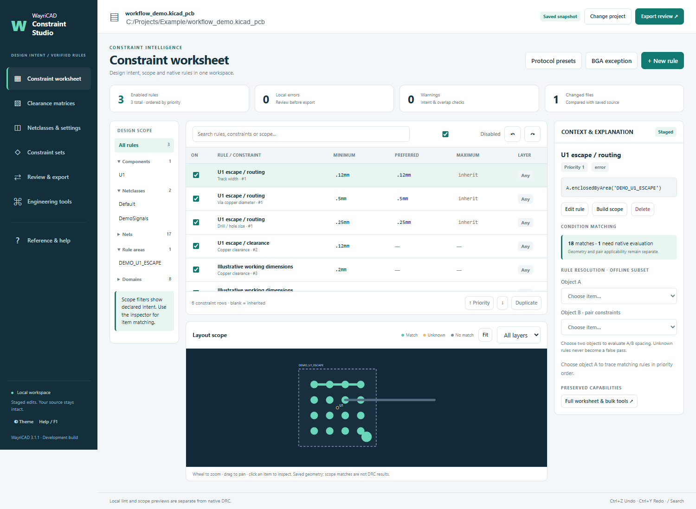

# WayriCAD Constraint Studio 3.1.1

Constraint Studio 0.3.1 is integrated into the existing Protocol Constraint Composer package. Its package ID stays `com.github.wayri.wayricad.protocol-constraints`; it uses the suite's IPC launcher and wx runtime. It edits a saved project snapshot, not the live board. Save the board and Board Setup before opening it.

The **Constraint worksheet** uses an embedded desktop WebView with BOM Studio's visual language: scope navigation, directly editable constraint cells, priority controls, a linked layout preview and a context inspector. All 34 constraint forms can be authored from **New rule / Edit rule**. The map distinguishes condition matches, unknowns and non-matches. Select objects A and B for a conservative priority trace. Colours are not native DRC violations or effective-rule certification.

**Clearance matrices** support symmetric cell editing, generated-rule preview and named-group staging. **Netclasses & settings** edits native dimensions and manufacturing floors while preserving inherited/unknown fields. **Constraint sets** configures the six original reusable profile families with ownership protection. Undo/redo and revision checks cover the visual and specialist workspaces.

**Engineering tools** retains the complete original worksheets, bulk/clipboard/CSV operations, BGA wizard, advanced matrices, class assignments, timing, field solver, managed regions, catalogue, signed reviews and DRC evidence. Those specialist editors open natively on the same staged workspace; **Back to visual workspace** refreshes the modern shell. If WebView cannot initialize, the full native worksheet remains available.

**Layer routing profiles** supports independent protocol instances such as CAN1, CAN2, DDR1 Data and Ethernet1 TX. Select exact nets individually or as a group using the searchable checkbox list, or apply to an existing netclass. Each instance has its own native KiCad 10 per-layer widths and pair gaps. Duplicate geometry, edit membership or remove an instance with undo; overlapping saved assignments and missing nets are checked. Review the physical stackup and references, enter verified dimensions or estimate width at a fixed gap, then stage the native profile and DRC limits. After offline apply/reopen, KiCad changes routing sizes by layer in netclass/rule sizing mode with Studio closed. Stackup fingerprints flag stale settings; manual sizing and higher-priority scoped rules can override defaults. See [setup, calculation limits and validation](docs/LAYER_ROUTING.md). **How it works** opens help inside the profile editor.

**Protocol presets** retains USB, CAN, Ethernet, PCIe/SerDes, DDR, RS-485 and RF detection. Preview and **Stage in Constraint Studio** merge the managed block into the workspace, preserving other rules. Geometry and assignment changes invalidate the old preview. The other pages provide constraint worksheets, BGA regions, clearance matrices, netclasses, board settings, reusable sets, timing, engineering tools and DRC evidence.

**Review & export** shows local lint, file diffs and generated native rules. Export to a separate empty folder, run native DRC on that copy, and use its **Apply Review** helper after closing every source-project editor. Hash checks and backups protect the offline apply. The old direct-write Apply button is replaced by staging. Review exports include the helper's GPL license.

Open Help/F1 inside the application for the bundled searchable native reference, or read [the original development guide](docs/USER_GUIDE.md). Installation instructions in that original guide describe the standalone development package; use the WayriCAD package for this integration. Do not install the original Constraint Studio PCM beside it.

Source launch, with KiCad's Python (wxPython required):

```powershell
& 'C:/Program Files/KiCad/10.0/bin/python.exe' -m protocol_constraint_composer_plugin.studio_ui path/to/board.kicad_pcb
```

The source owner authorized GPL-3.0 inclusion; archive hashes and the original delivery notice are retained in `SOURCE_PROVENANCE.json` and `constraint_studio/LICENSE.original.txt`. Signing still requires optional `cryptography`; NumPy accelerates the optional solver. Neither is installed automatically.

Validation and remaining acceptance work are recorded in [the integration report](docs/INTEGRATION.md). Full KiCad host/PCM/DPI acceptance and KiCad 11 remain unverified.

Preset geometry is illustrative and must be replaced with values derived from the actual stackup, protocol specification, device requirements and fabricator. Always use KiCad's rule syntax checker and DRC after applying rules.


## Native interface



The image is a Chromium render of the actual shipped interface using the demonstration snapshot. Native WebView interactions are tested separately, including worksheet edits, undo, matrix staging, review and native help. Scope colours describe condition matching, not native DRC acceptance.

The installed package includes [offline help](help.html) with its workflow and limitations.
