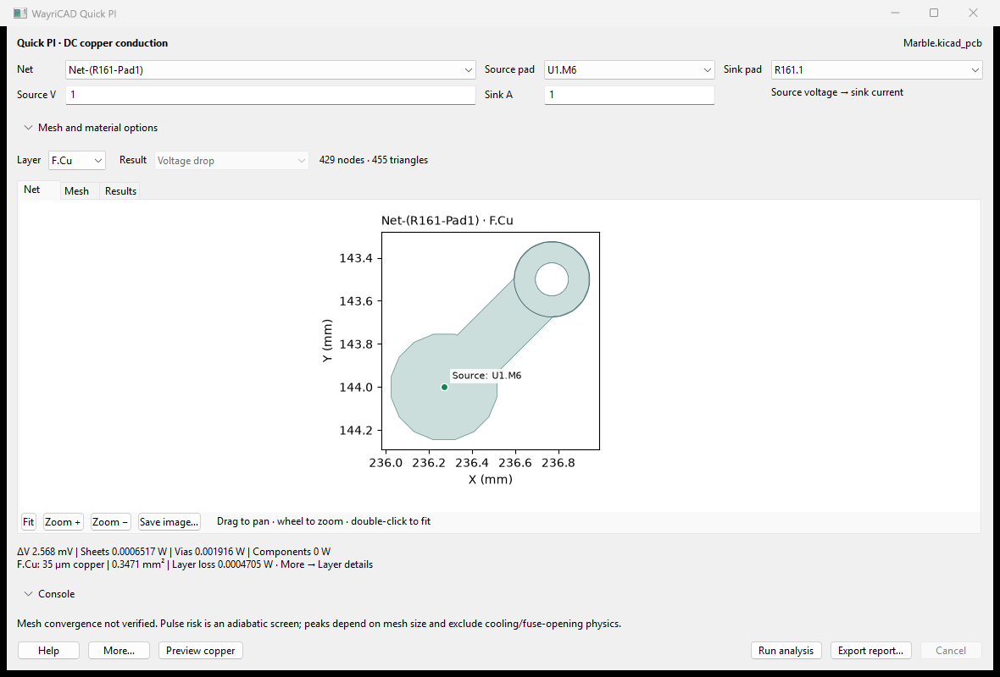
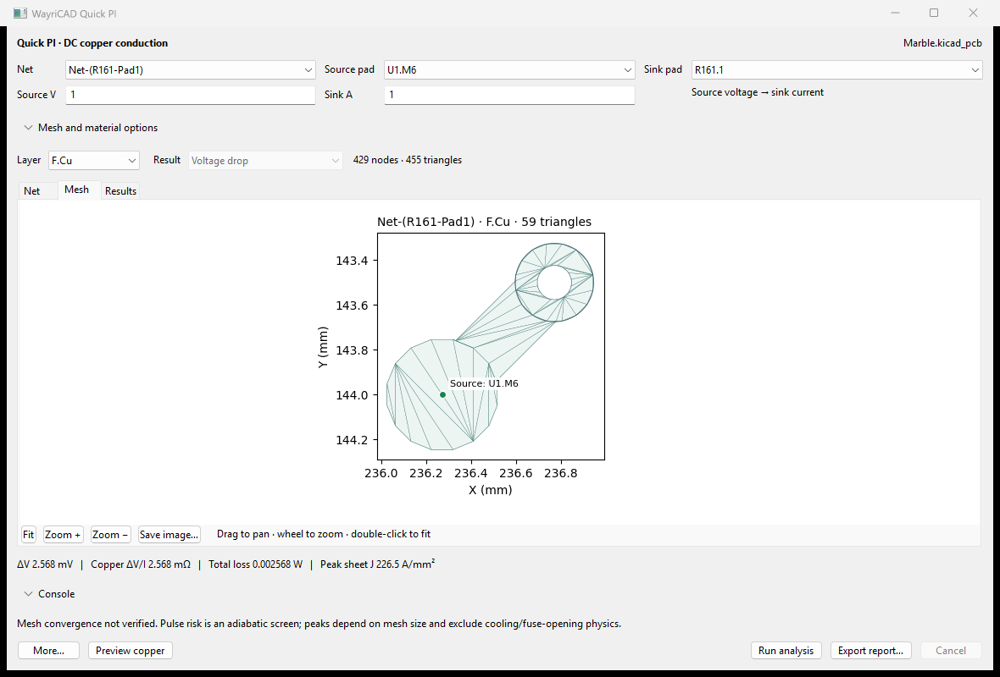
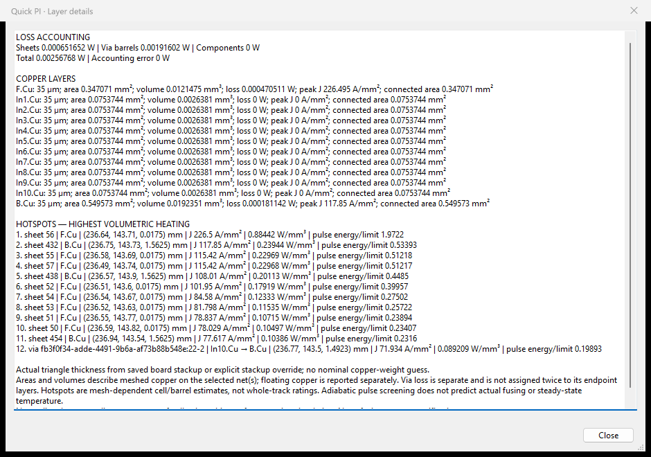
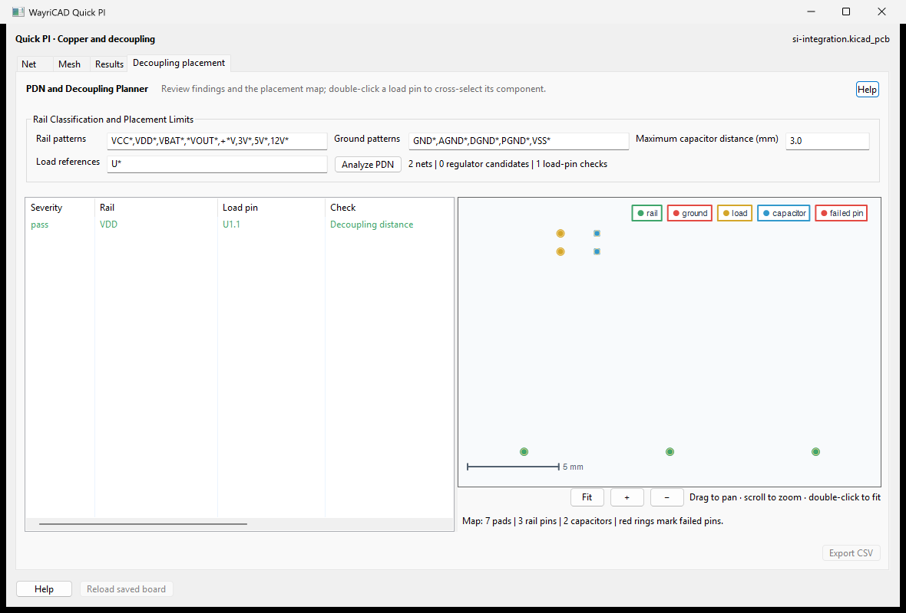

# WayriCAD Quick PI

Quick PI estimates DC voltage drop and current flow through saved PCB copper. It uses the board's filled copper polygons, pads, holes, layer thicknesses and plated via barrels to build a layered finite-element conduction model. Analysis runs in a cancellable worker process and does not edit the board.

## Workflow

1. Save the PCB and update zone fills in KiCad. Open **WayriCAD Quick PI**.
2. Choose a net, source pad and sink pad. Enter source voltage in volts and load current in amperes.
3. Click **Run analysis**. The **Net**, **Mesh** and **Results** tabs show the same extracted geometry.
4. Choose a copper layer and result: absolute voltage, voltage drop, DC transfer resistance (drop divided by load current), current density, current flow, loss density or pulse risk. Drag to pan and scroll to zoom; **Fit** restores the copper extent.
5. Use **Export report** for an offline HTML report with seven maps of the selected layer and a paired JSON file containing all layers and numerical results.


This is the **small `Net-(R161-Pad1)` connection on Berkeley Marble**, from `U1.M6`
to `R161.1`, at 1 V / 1 A. It is not a power-rail or full-board loading test.
The result is about **2.568 mV**, comprising **0.652 mW sheet loss + 1.916 mW via
barrel loss**. The saved copper thickness is 35 µm. These are computed regression
results, not measurements or proof of mesh convergence.

| Preview | What to check |
|---|---|
| Net | Actual extracted copper, pads, drill holes and selected terminals. |
| Mesh | Triangles on the selected layer; inspect narrow necks and contacts. |
| Results | Select voltage, drop, current density, arrows, loss or pulse screening. |





**Mesh and material options** contains mesh size, assumed via plating, copper temperature, ambient temperature, pulse duration and a temperature limit. A smaller mesh costs more time and memory. Compare successive mesh sizes before relying on localized peaks. The default 25 µm plating is an assumption, not a measured board property.

## Console

Expand **Console** to enter commands. `help`, `nets`, and `pads <net>` list available names. **Tab** cycles context-aware completions; **Up/Down** recall commands. Commands run through the same cancellable worker as the controls; the pane does not execute Python or shell commands.

```text
run pi "Net-(R161-Pad1)" U1.M6 R161.1
```

The console also accepts explicitly defined series components. Use `help` for the supported resistance/inductance syntax. Component links are drawn as dashed lines and recorded in the report; they are not invented board tracks. Source voltage, load current and material settings come from the visible controls.

```text
run pi U1.M6 R161.1 5m R161.2 U1.M5
run pi U1.M6 R161.1 5mH+30m R161.2 U1.M5
```

The first command assigns 5 mΩ to the explicitly named two-pad component. The
second assigns 5 mH and 30 mΩ in series. These values are user assumptions, not
automatic identification of R161's actual component. In DC, the inductance adds
no voltage drop; its stored energy is reported. `m` means milli, `M`/`Meg` mega,
and `u`, `µ`, `n`, `p`, scientific notation and explicit `H`/`ohm`/`Ω` are supported.

## Reading results

Copper thickness comes from each layer of the **saved board stackup** (or an explicit
stackup override). It is used in the conductance and thermal-mass calculations;
missing thickness is an error, never a nominal copper-weight guess. The layer selector
shows the solved layer's thickness, area and loss beneath the preview.

Choose **More → Layer thickness, losses and hotspots** for all layer areas, volumes,
thickness ranges and peak current density. The same details are in the HTML report.
Sheet, via-barrel and explicit component losses are accounted separately. Floating
copper is included in total geometry area but excluded from connected area and loss.
Ranked local hotspots include coordinates, layer and current/heating density. These
are mesh-dependent cell/barrel estimates, not whole-track ratings or fusing predictions.



The detail window separates sheet, via-barrel and component losses, includes the
accounting error, and lists local hotspot XYZ coordinates. A pulse energy/limit
ratio above one means the **adiabatic screen** exceeds the entered temperature
limit. It does not mean a trace will fuse in that time.

- **Copper ΔV/I** is conductor resistance for a single-net run. **Circuit ΔV/I** includes explicit series components. Operating-point source **V/I** is displayed separately.
- Current-flow arrows indicate in-plane direction. Sheet current is A/mm; volumetric sheet and barrel current density is A/mm². Via barrels have their own current, resistance and loss records.
- Density and pulse-risk maps color the plated via barrel around its white drill hole. The color scale includes both sheet and barrel values. Each layer shows the worst barrel segment crossing that layer; coincident segments are combined without adding their risk values.
- The pulse-risk map compares adiabatic deposited energy with energy to reach the chosen temperature limit. It excludes heat spreading, cooling, phase change and fuse-opening dynamics; it is not a fuse-time prediction.
- Floating copper has no solved potential. Geometry extraction and meshing issues are reported rather than silently connecting disconnected islands.
- This is a **2.5D DC conduction model**, not an AC, electromagnetic or thermal field solver. Explicit inductance does not change the DC solution. Contact-current peaks depend on mesh refinement and terminal assumptions.

## Runtime and installation

Install the WayriCAD PCM ZIP through KiCad's Plugin and Content Manager, or use the suite's documented manual installation. KiCad 10's native Python needs NumPy, SciPy, VTK, Matplotlib and wxPython. The UI uses Matplotlib's wx canvas when available and a native wx/Agg canvas when the optional wx SVG backend is missing. Everything renders locally.

The Berkeley Marble smoke test used `Net-(R161-Pad1)`, source `U1.M6`, sink `R161.1`, 1 V and 1 A. The tested mesh produced approximately 2.568 mV drop. This is a regression example, not validation against a physical measurement.

## Command line

After installing the suite wheel, `wayricad-pi --help` lists the options. From a
source checkout use `python -m quick_pi_plugin.cli` in place of `wayricad-pi`.
The CLI parent does not need numerical libraries: the same isolated native worker
performs the analysis and report generation.

```text
wayricad-pi board.kicad_pcb
wayricad-pi board.kicad_pcb --net "Net-(R161-Pad1)" --source U1.M6 --sink R161.1 --voltage 1 --current 1 --mesh-edge 0.5 --pulse 1 --temperature-limit 150 --html pi.html --output pi.json
wayricad-pi board.kicad_pcb --command "run pi U1.M6 R161.1 5mH+30m R161.2 U1.M5" --voltage 1 --current 1 --html series.html
```

The first command lists saved nets, pads and layers. Replace the example pad/net
names with ones from your own board. `--mesh-only` builds a mesh without solving;
`--plating` and `--mesh-edge` use mm, `--pulse` seconds, and temperatures °C.
Without `--pulse`, CLI thermal screening is marked as requiring a pulse duration.
HTML is available after a solve; its paired JSON contains all layers and analytics.
Exit code 0 indicates successful execution, 2 a command/model error—not proof of
electrical suitability or convergence.

## If a run fails

| Message or symptom | Next action |
|---|---|
| Missing/ambiguous stackup | Save explicit copper and dielectric thicknesses in Board Setup; retry the saved board. |
| Unfilled zone | Refill zones in KiCad and save before rerunning. |
| Source and sink disconnected | Check the selected pads/net, copper continuity and filled-zone contacts. Use explicit series components when the path crosses nets. |
| Mesh budget or timeout | Increase mesh edge length or select a smaller net; then refine gradually. |
| Environment/dependency setup failed | Read the reported setup log. Verify KiCad 10 Python and binary-wheel mirror/proxy access; configured offline wheels are supported. |
| Wrong or stale project | Launch from the intended PCB Editor and save changes. The action uses that editor's connection, not another running KiCad window. |
| Peak changes after refinement | Keep refining and compare total resistance and local J separately; report the unresolved sensitivity. |

**Help** opens the bundled local guide; **More → Layer thickness, losses and hotspots**
opens numerical details. No external website is needed to use either.


## Decoupling placement

The **Decoupling placement** tab incorporates the former PDN and Decoupling
Planner. Set rail/ground patterns, load-reference patterns and the maximum
capacitor distance; run **Analyze PDN**, inspect the linked placement map and
export findings as CSV. Rail-to-ground capacitor qualification, proximity
checks and regulator candidates are retained. These placement heuristics are
separate from the DC copper solver and do not predict AC PDN impedance.

The tab uses the same saved originating board as the solver. **More → Reload
saved board** refreshes both. Save/refill in KiCad first; the tab does not move
components. [Detailed placement help](decoupling/help.html).



## Zoned power-rail example


This is the actual MGTAVCC copper between L34.2 and U1.C6 with an explicit,
hypothetical 1 A load at one FPGA ball. The pictured coarse mesh gives 2.483 mV;
refinement gives 2.640 mV with a further 1.96% change. Peak current density is
not converged. This does not model the FPGA's distributed load or regulator.
See the [validation record](../docs/audits/QUICK_PI_3.2_VALIDATION.md).
