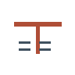
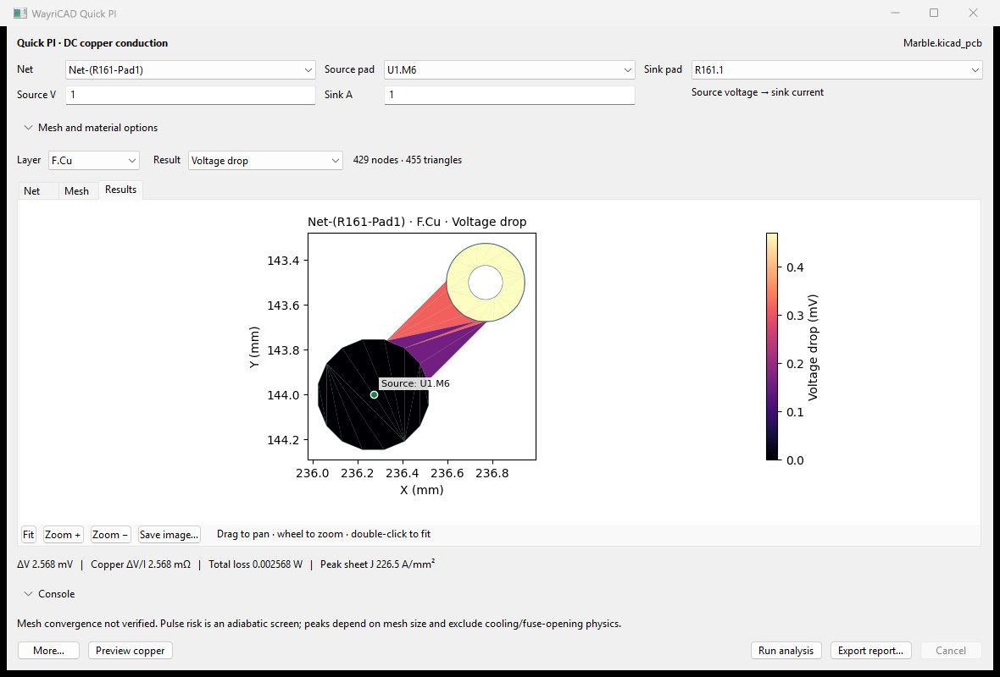
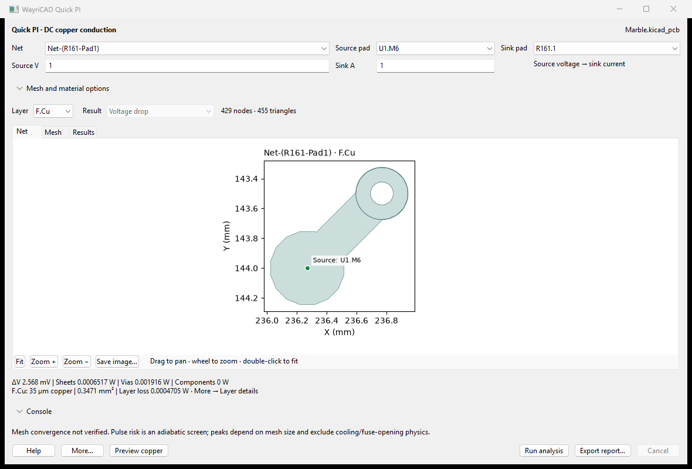
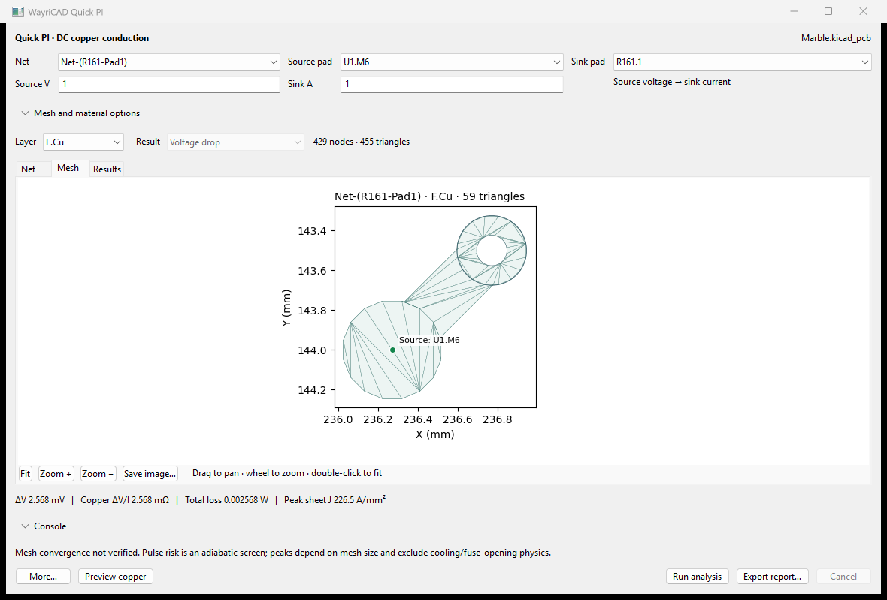
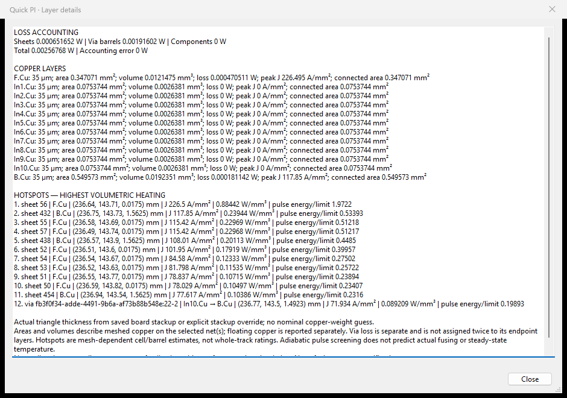
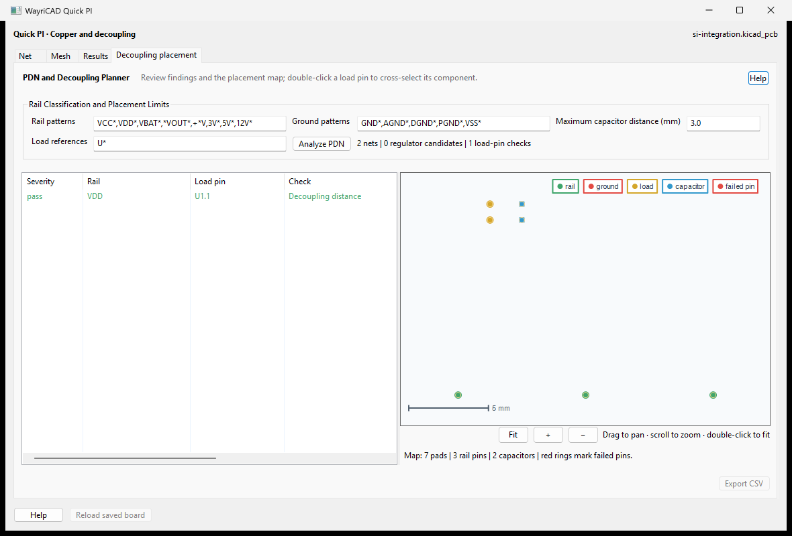
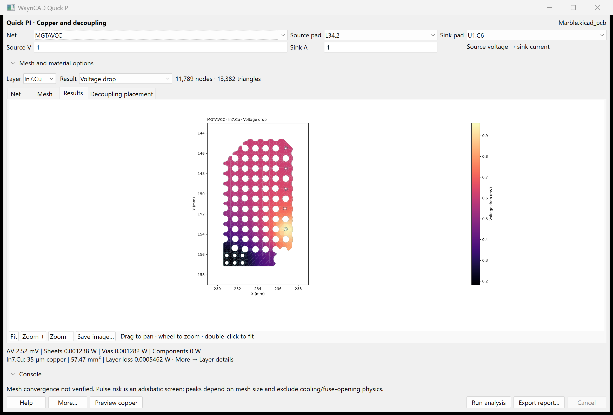
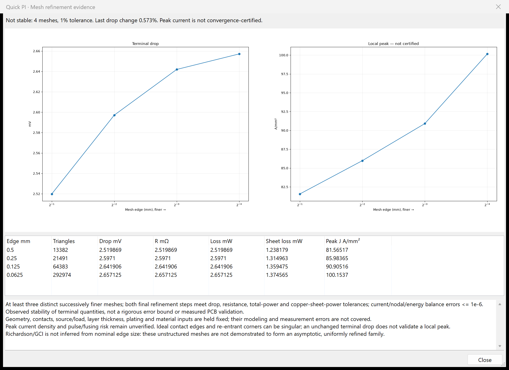

# WayriCAD Quick PI



## Capabilities

- Analyze saved traces, filled zones, pads and plated vias using a layered 2.5D DC conduction mesh and saved copper thicknesses.
- Select source/sink pads and voltage/current; inspect native net, mesh and per-layer result views.
- Visualize voltage/drop, current density/flow, loss density and pulse-risk screening; separate sheet, via and component losses.
- Define repeated series resistance/RL, fixed-drop and current-dependent diode elements through the console or CLI, with engineering notation and console completion/history.
- Build the same saved-net series path in a native editor, including source/sink pad selection from the originating PCB Editor, ordered components, and reusable JSON paths.
- Solve a voltage-driven resistive load or sweep a bounded range of prescribed DC currents on one extracted path.
- Screen selected return nets against saved filled copper and local return vias, and estimate component temperatures from mapped board fields in air or vacuum.
- Run bounded mesh-refinement studies and reference benchmarks; export local HTML and JSON reports.

## Limitations

- This is DC conduction, not full 3D/AC electromagnetics or a thermal-field solve. Series inductance adds stored-energy reporting, not RL transient behavior.
- Zones must be filled when included in the path; valid connectivity and explicit material/stackup inputs are required. Assumed via plating is not a measured property.
- Local current-density peaks depend on mesh/contact assumptions; stable total resistance alone does not certify hotspot convergence.
- Pulse-risk estimates omit cooling, heat spreading and fuse-opening dynamics. They are not fusing-time predictions or manufacturing sign-off.

## Overview

Quick PI estimates DC voltage drop and current flow through saved PCB copper. It uses the board's filled copper polygons, pads, holes, layer thicknesses and plated via barrels to build a layered finite-element conduction model. Analysis runs in a cancellable worker process and does not edit the board.

## Workflow

1. Save the PCB and update zone fills in KiCad. Open **WayriCAD Quick PI**.
2. Choose a net, source pad and sink pad. Enter source voltage in volts and load current in amperes.
3. Click **Run analysis**. The **Net**, **Mesh** and **Results** tabs show the same extracted geometry.
4. Choose a copper layer and result: absolute voltage, voltage drop, DC transfer resistance (drop divided by load current), current density, current flow, loss density or pulse risk. Drag to pan and scroll to zoom; **Fit** restores the copper extent.
5. Use **Export report** for an offline HTML report with seven maps of the selected layer and a paired JSON file containing all layers and numerical results.



This is the **small `Net-(R161-Pad1)` connection on Berkeley Marble**, from `U1.M6`
to `R161.1`, at 1 V / 1 A. It is not a power-rail or full-board loading test.
The result is about **2.568 mV**, comprising **0.652 mW sheet loss + 1.916 mW via
barrel loss**. The saved copper thickness is 35 µm. These are computed regression
results, not measurements or proof of mesh convergence.

| Preview | What to check |
|---|---|
| Net | Actual extracted copper, pads, drill holes and selected terminals. |
| Mesh | Triangles on the selected layer; inspect narrow necks and contacts. |
| Results | Select voltage, drop, current density, arrows, loss or pulse screening. |





**Mesh and material options** contains mesh size, assumed via plating, copper temperature, ambient temperature, pulse duration and a temperature limit. A smaller mesh costs more time and memory. Compare successive mesh sizes before relying on localized peaks. The default 25 µm plating is an assumption, not a measured board property.

The mesher preserves copper, hole and terminal boundaries while improving triangle
angles. Broad, complex planes receive interior mesh points to avoid spending the
cell budget on long, thin triangles. Geometry, area and electrical conservation
checks still apply; the mesh budget is unchanged. A successful solve or stable
total resistance does not establish convergence of local current-density peaks.

## Console

Expand **Console** to enter commands. `help`, `nets`, and `pads <net>` list available names. **Tab** cycles context-aware completions; **Up/Down** recall commands. Commands run through the same cancellable worker as the controls; the pane does not execute Python or shell commands.

**Series elements and CLI support are retained in v3.2.0.** Press **Enter** to run
a console command. Use `run pi NET START END` for an explicitly named net, or
`run pi START END` to infer the net from the pads. Quote net names containing spaces.

```text
run pi "Net-(R161-Pad1)" U1.M6 R161.1
```

The console also accepts explicitly defined series components. Use `help` for resistance, inductance, fixed-drop and diode syntax. Component links are drawn as dashed lines and recorded in the report; they are not invented board tracks. Source voltage, load current and material settings come from the visible controls.

```text
run pi U1.M6 R161.1 5m R161.2 U1.M5
run pi U1.M6 R161.1 5mH+30m R161.2 U1.M5
run pi VIN.1 D1.1 1V D1.2 LOAD.1
run pi VIN.1 D1.1 diode(Vf=0.7V,Iref=1A,n=2,T=25C) D1.2 LOAD.1
```

The first command assigns 5 mΩ to the explicitly named two-pad component. The
second assigns 5 mH and 30 mΩ in series. These values are user assumptions, not
automatic identification of R161's actual component. In DC, the inductance adds
no voltage drop; its stored energy is reported. `m` means milli, `M`/`Meg` mega,
and `u`, `µ`, `n`, `p`, scientific notation and explicit `H`/`ohm`/`Ω` are supported.

For a forward-drop component, select its two pads in the source-to-load order.
`1V` or `500mV` imposes a fixed forward drop. The `diode(...)` form uses a
user-supplied forward-voltage/current anchor, ideality factor and temperature:
it evaluates the ideal diode equation at the specified DC load current. `Vf`
and `Iref` must be positive; `n` is 1–4; `T` is in °C. No model is read from the
KiCad symbol. The result lists each component's current, forward drop, voltage
before and after, and dissipated power. The same fields appear in exported JSON
and HTML. The console accepts the same syntax in two-pad shortcuts, such as
`D1:1V`, when the incoming net identifies one pad unambiguously.

The default mode prescribes load current. **Resistive load** mode solves a DC
current from source voltage, path drop and the specified load resistance.
Neither mode solves reverse bias, turn-off, transients or temperature feedback.
A diode Vf is therefore a **DC operating-point** value, not an instantaneous waveform.
If the requested current and path drops make the sink voltage negative, Quick PI
warns that the operating point may be infeasible. Forward-drop paths must cross
each net once, so an alternate path cannot silently bypass the selected diode.
With a forward drop, circuit ΔV/I is an apparent ratio at that current, not a
resistance; copper losses and device power remain separate.

### Multiple series components

Repeat `FROM_PAD VALUE TO_PAD` triplets between the starting and ending pads:

```text
run pi C1.1 R1.1 5m R1.2 L1.1 5mH+30m L1.2 U8.2
```

This models R1 as **5 mΩ**, followed by L1 as **5 mH with 30 mΩ series
resistance**. Pad names can include ICs and transistors, such as `U8.2` or
`Q2.3`. Each component triplet must join two distinct pads of the same component;
the intervening copper sections must belong to the corresponding actual nets
and be electrically connected. Replace these illustrative references with pads
on your board. Values are explicit user-supplied models, not inferred part ratings.

**DC limitation:** resistance and forward-drop elements contribute voltage drop and power loss. Inductance
is retained for stored-energy reporting and contributes no steady-state DC drop.
Quick PI does not simulate RL transients or AC impedance; entering an inductance
or a pulse duration does not enable a transient circuit simulation. Copper and
component losses are reported separately.

## Reading results

Copper thickness comes from each layer of the **saved board stackup** (or an explicit
stackup override). It is used in the conductance and thermal-mass calculations;
missing thickness is an error, never a nominal copper-weight guess. The layer selector
shows the solved layer's thickness, area and loss beneath the preview.

Choose **More → Layer thickness, losses and hotspots** for all layer areas, volumes,
thickness ranges and peak current density. The same details are in the HTML report.
Sheet, via-barrel and explicit component losses are accounted separately. Floating
copper is included in total geometry area but excluded from connected area and loss.
Ranked local hotspots include coordinates, layer and current/heating density. These
are mesh-dependent cell/barrel estimates, not whole-track ratings or fusing predictions.



The detail window separates sheet, via-barrel and component losses, includes the
accounting error, and lists local hotspot XYZ coordinates. A pulse energy/limit
ratio above one means the **adiabatic screen** exceeds the entered temperature
limit. It does not mean a trace will fuse in that time.

- **Copper ΔV/I** is conductor resistance for a single-net run. **Circuit ΔV/I** includes explicit series components. Operating-point source **V/I** is displayed separately.
- Current-flow arrows indicate in-plane direction. Sheet current is A/mm; volumetric sheet and barrel current density is A/mm². Via barrels have their own current, resistance and loss records.
- Density and pulse-risk maps color the plated via barrel around its white drill hole. The color scale includes both sheet and barrel values. Each layer shows the worst barrel segment crossing that layer; coincident segments are combined without adding their risk values.
- The pulse-risk map compares adiabatic deposited energy with energy to reach the chosen temperature limit. It excludes heat spreading, cooling, phase change and fuse-opening dynamics; it is not a fuse-time prediction.
- Floating copper has no solved potential. Geometry extraction and meshing issues are reported rather than silently connecting disconnected islands.
- This is a **2.5D DC conduction model**, not an AC, electromagnetic or thermal field solver. Explicit inductance does not change the DC solution. Contact-current peaks depend on mesh refinement and terminal assumptions.

## Series editor, sweep and board screens

Use **Build series path…** in the native window to choose source and sink pads, then add compatible two-pad parts in source-to-load order. **Use KiCad selected pads** reads one or two pads from the PCB Editor that opened Quick PI; review pad order before running. **Use selected component** adds one compatible selected two-pad footprint at the next net transition. The editor validates each net transition with the same parser as the console and can save or reload a JSON path. Its component values are explicit models, not values inferred from the symbol or footprint.

Choose **Resistive load** beside the voltage/current controls to enter a load in ohms. Quick PI solves the positive DC current for that source voltage using the saved copper and explicit components. **More → DC current sweep** plots path drop and sink voltage over 2–200 prescribed positive current points. Both retain the fixed-temperature and mesh assumptions of the main solve; the sweep does not represent a time waveform. The HTML export includes a chart and paired JSON.

The **Return path** tab asks for one signal net and explicit return net(s). It maps saved straight tracks, adjacent filled return zones, sampled coverage gaps and return vias near evidenced layer transitions. Warnings identify missing local evidence; a clear sampled route is not proof of a continuous return-current path or controlled impedance. Refill zones and save before running. [Return-path method and limits](RETURN_PATH.md).

Board and component thermal screening is provided by the separately installable [QuickTherm plugin](../quick_therm_plugin/README.md).

## Runtime and installation

Install the WayriCAD PCM ZIP through KiCad's Plugin and Content Manager, or use the suite's documented manual installation. KiCad 10's native Python needs NumPy, SciPy, VTK, Matplotlib and wxPython. The UI uses Matplotlib's wx canvas when available and a native wx/Agg canvas when the optional wx SVG backend is missing. Everything renders locally.

The Berkeley Marble smoke test used `Net-(R161-Pad1)`, source `U1.M6`, sink `R161.1`, 1 V and 1 A. The tested mesh produced approximately 2.568 mV drop. This is a regression example, not validation against a physical measurement.

## Command line

After installing the suite wheel, `wayricad-pi --help` lists the options. From a
source checkout use `python -m quick_pi_plugin.cli` in place of `wayricad-pi`.
The CLI parent does not need numerical libraries: the same isolated native worker
performs the analysis and report generation.

```text
wayricad-pi board.kicad_pcb
wayricad-pi board.kicad_pcb --net "Net-(R161-Pad1)" --source U1.M6 --sink R161.1 --voltage 1 --current 1 --mesh-edge 0.5 --pulse 1 --temperature-limit 150 --html pi.html --output pi.json
wayricad-pi board.kicad_pcb --command "run pi U1.M6 R161.1 5mH+30m R161.2 U1.M5" --voltage 1 --current 1 --html series.html
wayricad-pi board.kicad_pcb --net VIN --source J1.1 --sink U1.1 --voltage 5 --load-ohms 10 --html load.html
wayricad-pi board.kicad_pcb --net VIN --source J1.1 --sink U1.1 --voltage 5 --sweep 0.1 2 20 --html sweep.html
wayricad-pi board.kicad_pcb --return-path --net VIN --return-nets GND --html return.html
```

The same multiple-component path used in the native console can run from a shell:

```text
wayricad-pi board.kicad_pcb --command "run pi C1.1 R1.1 5m R1.2 L1.1 5mH+30m L1.2 U8.2" --voltage 3.3 --current 1 --html report.html
```

Quote the entire `--command` value. `--voltage` is the source voltage in volts
and `--current` is the load current in amperes. The native console instead uses
the visible voltage/current controls. Both interfaces use the same path parser
and analysis worker, with the DC limitations described above.

The first command lists saved nets, pads and layers. Replace the example pad/net
names with ones from your own board. `--mesh-only` builds a mesh without solving;
`--plating` and `--mesh-edge` use mm, `--pulse` seconds, and temperatures °C.
HTML is available after a solve, sweep or board screen; its paired JSON contains the corresponding evidence.
Exit code 0 indicates successful execution, 2 a command/model error—not proof of
electrical suitability or convergence.

## If a run fails

The console starts folded so the copper preview has more room. Expand it when
you need job details; the plot supports Fit, wheel zoom and drag panning.
If an older installation reports `name 'math' is not defined` after **Run
analysis**, update Quick PI to 3.6.4 and restart PCB Editor.

| Message or symptom | Next action |
|---|---|
| Missing/ambiguous stackup | Save explicit copper and dielectric thicknesses in Board Setup; retry the saved board. |
| Unfilled zone | Refill zones in KiCad and save before rerunning. |
| Source and sink disconnected | Check the selected pads/net, copper continuity and filled-zone contacts. Use explicit series components when the path crosses nets. |
| Mesh budget or timeout | Increase mesh edge length or select a smaller net; then refine gradually. |
| Environment/dependency setup failed | Read the reported setup log. Verify KiCad 10 Python and binary-wheel mirror/proxy access; configured offline wheels are supported. |
| Wrong or stale project | Launch from the intended PCB Editor and save changes. The action uses that editor's connection, not another running KiCad window. |
| Peak changes after refinement | Keep refining and compare total resistance and local J separately; report the unresolved sensitivity. |

**Help** opens the bundled local guide; **More → Layer thickness, losses and hotspots**
opens numerical details. No external website is needed to use either.


## Decoupling placement

The **Decoupling placement** tab incorporates the former PDN and Decoupling
Planner. Set rail/ground patterns, load-reference patterns and the maximum
capacitor distance; run **Analyze PDN**, inspect the linked placement map and
export findings as CSV. Rail-to-ground capacitor qualification, proximity
checks and regulator candidates are retained. These placement heuristics are
separate from the DC copper solver and do not predict AC PDN impedance.

The tab uses the same saved originating board as the solver. **More → Reload
saved board** refreshes both. Save/refill in KiCad first; the tab does not move
components. [Detailed placement help](decoupling/help.html).



## Zoned power-rail example



This is the actual MGTAVCC copper between L34.2 and U1.C6 with an explicit,
hypothetical 1 A load at one FPGA ball. The pictured coarse mesh gives 2.520 mV;
refinement to 0.0625 mm gives 2.657 mV. The two-step 1% stability criterion fails. Peak current density is
not converged. This does not model the FPGA's distributed load or regulator.
See the [validation record](../docs/audits/QUICK_PI_3.2_VALIDATION.md).


## Numerical verification and mesh refinement

Run `wayricad-pi --verify --output pi-reference-results.json` to check eight production-mesher/solver cases against analytical references: strips, parallel current sharing, a plated via, the published Elmer beam/circuit operating point and three radial-annulus meshes. See [equations, tolerances and sources](../docs/PI_REFERENCE_BENCHMARKS.md).

For a board path, use **More → Check mesh convergence** (3–5 levels) or add `--converge-levels 4` to the CLI solve. The viewer plots drop and peak current separately and reports conservation plus total/sheet loss stability. Two final steps must meet the selected tolerance; incomplete or unstable studies return CLI exit 3. HTML/JSON exports retain this evidence. This does not certify physical accuracy or local peak current/fusing limits.




Report export starts in the originating board’s project folder and proposes `<board>-quick-pi.html`; its JSON companion preserves all layers and convergence evidence.


## Jobsets and automatic reports

Use this tool’s existing CLI in a shared WayriCAD report sequence. The runner adds ordered steps, failure propagation, per-run logs and an HTML/JSON report index, and can insert the sequence into a native KiCad jobset. See [setup, presets and examples](../wayricad_runtime/JOBSETS.md). The CLI keeps the same input requirements and engineering limitations as interactive use.
