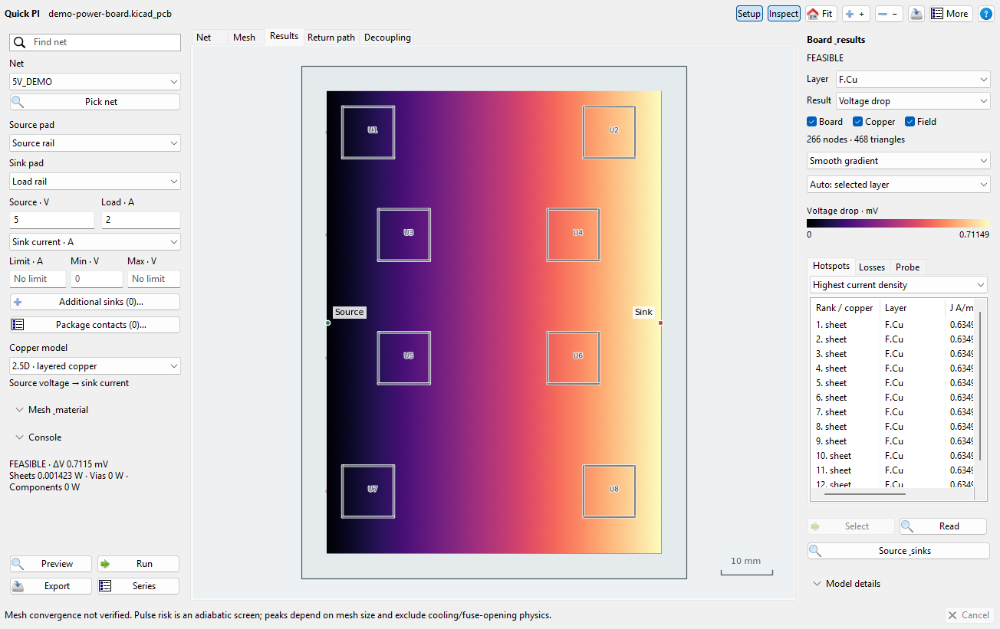

# WayriCAD Quick PI


## Interactive inspection

Use **Find net** or **Pick net** to choose an analysis input from
saved pads, vias or tracks. Select the two terminals and rerun after changes.
Hover over solved Results cells and click to pin exact cell values; Ctrl-right-click
clears probes. Holes and unresolved cells remain gaps.

The native 3D copper view supports orbit, pan, wheel zoom and sampled-cell probes.
**Export 3D report** saves an offline interactive viewport plus the complete JSON.
HTML 3D views use drag to orbit, Shift-drag to pan and the wheel to zoom. Planar
reports include three interactive field maps alongside static print figures.
Display movement does not modify board geometry or the solve.

See [analysis views and probe controls](../docs/ANALYSIS_INTERACTIONS.md) for details.

## Capabilities

- Analyze saved traces, filled zones, pads and plated vias using a layered 2.5D DC conduction mesh and saved copper thicknesses.
- Select one voltage source and multiple constant-current sinks; check an optional source current budget and individual sink voltage limits.
- Visualize voltage/drop, current density/flow, loss density and pulse-risk screening; separate sheet, via and component losses.
- Define repeated series resistance/RL, fixed-drop and current-dependent diode elements through the console or CLI, with engineering notation and console completion/history.
- Build the same saved-net series path in a native editor, including source/sink pad selection from the originating PCB Editor, ordered components, and reusable JSON paths.
- Solve a voltage-driven resistive load or sweep a bounded range of prescribed DC currents on one extracted path.
- Screen selected return nets against saved filled copper and local return vias, and estimate component temperatures from mapped board fields in air or vacuum.
- Run bounded mesh-refinement studies and reference benchmarks; export local HTML and JSON reports.
- Couple DC conductor losses and local resistivity to the shared QuickTherm layer model; run explicit lumped electrothermal rail transients with thermal R/C paths.

## Limitations

- Both copper models solve fixed-temperature DC conduction, not AC electromagnetics or thermal feedback. Series inductance adds stored-energy reporting in those modes. Separate transient and electrothermal studies use the explicit models described below.
- Zones must be filled when included in the path; valid connectivity and explicit material/stackup inputs are required. Assumed via plating is not a measured property.
- Local current-density peaks depend on mesh/contact assumptions; stable total resistance alone does not certify hotspot convergence.
- Pulse-risk estimates omit cooling, heat spreading and fuse-opening dynamics. They are not fusing-time predictions or manufacturing sign-off.

## Overview

Quick PI estimates DC voltage drop and current flow through saved PCB copper. It uses the board's filled copper polygons, pads, holes, layer thicknesses and plated via barrels to build a layered finite-element conduction model. Analysis runs in a cancellable worker process and does not edit the board.

## Workflow

1. Save the PCB and update zone fills in KiCad. Open **WayriCAD Quick PI**.
2. Use the left **Setup** panel to choose a net, source pad and primary sink pad. Enter **Source · V** and **Load · A** (or switch to a resistive load in Ω). Set **Limit · A** for an optional source current budget and **Min · V / Max · V** for the primary sink's bounds. Use **Additional sinks** for further loads.
3. Click **Preview** or **Run** at the bottom of Setup. The **Net**, **Mesh** and **Results** tabs show the same extracted geometry in a full-height board canvas. The window opens maximized.
4. Use the right **Inspect** panel to choose a layer and result. Its colour legend gives the numerical range and units. Drag the board to pan, scroll to zoom, or double-click / click **Fit** to restore the board extent. **Setup** and **Inspect** in the header hide either panel; the divider adjusts the inspector width. **Board**, **Copper** and **Field** toggle saved context, extracted copper and the result overlay independently. Millimetres stay proportional during resizing, and a compact ruler replaces graph axes.
5. Use **Export** for an offline HTML report with seven maps of the selected layer and paired JSON containing all layers and numerical results. The save-image icon exports the current board view. **Mesh & material**, **Console** and **Model details** start collapsed; **More** retains transient, electrothermal and diagnostic studies.



This UI demonstration uses a disposable portrait PCB as saved context and an
analytical **65 × 90 mm, 35 µm uniform copper plate**, with full-height edge
contacts at **5 V / 2 A**. Its computed drop is **0.71149 mV**. The plate is a
known-answer display fixture, not a simulation of the illustrated routed PCB.
Source files remain unchanged during navigation and inspection.


This is the **small `Net-(R161-Pad1)` connection on Berkeley Marble**, from `U1.M6`
to `R161.1`, at 1 V / 1 A. It is not a power-rail or full-board loading test.
The result is about **2.568 mV**, comprising **0.652 mW sheet loss + 1.916 mW via
barrel loss**. The saved copper thickness is 35 µm. These are computed regression
results, not measurements or proof of mesh convergence.

| Preview | What to check |
|---|---|
| Net | Actual extracted copper, pads, drill holes and selected terminals. |
| Mesh | Triangles on the selected layer; inspect narrow necks and contacts. |
| Results | Select voltage, drop, current density, arrows, loss or pulse screening. |


**Mesh & material** in Setup contains mesh size, assumed via plating, copper temperature, ambient temperature, pulse duration and a temperature limit. Expanding it scrolls the sidebar without reducing the board height. A smaller mesh costs more time and memory. Compare successive mesh sizes before relying on localized peaks. The default 25 µm plating is an assumption, not a measured board property.

### Multiple loads and source limits

The primary sink uses **Load · A**, **Min · V** and **Max · V**
controls. **Additional sinks** opens a table to add, edit or remove other pad
demands, each with its own current and optional minimum/maximum voltage. All
sinks must be distinct pads on the selected net and different from the source.
Blank minimum voltage defaults to 0 V; blank maximum is unbounded. **Limit · A** is an optional nonnegative
current budget: blank means unlimited and zero supplies no current.

Quick PI solves all requested constant-current loads together at the entered
source voltage. Results and reports show each sink voltage/drop, total demand,
source current headroom and **FEASIBLE** or **INFEASIBLE** against that budget
and the entered voltage windows. This is a DC requirement check, not thermal,
transient, regulator-stability or hardware qualification. If demand exceeds the
source budget, maps and losses remain **requested-load diagnostics**: the source
cannot sustain that operating point. Loads are not scaled to fit; foldback,
constant-current regulation and voltage-collapse dynamics are not simulated.

For multiple sinks, **Worst drop / total demand** divides the largest sink drop
by total requested current; it is not a physical two-terminal resistance. The
inspector's **Losses** tab and console retain every sink's demand,
voltage and bounds. Source and all sinks are marked in the views and included
in terminal selection/zoom. Changing any demand or bound clears stale results.
Multiple sinks with explicit series components are not supported; remove
additional sinks before running a console series path. The legacy single-sink
series path retains source current and sink voltage limits.

The mesher preserves copper, hole and terminal boundaries while improving triangle
angles. Broad, complex planes receive interior mesh points to avoid spending the
cell budget on long, thin triangles. Geometry, area and electrical conservation
checks still apply; the mesh budget is unchanged. A successful solve or stable
total resistance does not establish convergence of local current-density peaks.

If the Quick PI Python runtime has the optional `gmsh` package, meshing uses
Gmsh's conforming planar surfaces for extracted copper and contact regions.
The default internal 2.5D DC solver uses those triangles. With no Gmsh
package, `auto` uses the existing VTK mesher.
The JSON mesh report records the selected backend. For a reproducible CLI run,
choose `--mesh-backend gmsh` to require Gmsh or `--mesh-backend vtk` to require
VTK. A requested Gmsh run reports a setup error if its package is unavailable;
geometry, area, edge length and cell-budget checks remain in force.

### Explicit lead, solder and BGA contact paths

**Package contacts** in Setup or CLI `--package-conduction paths.json` adds finite
axial package paths to the selected 2.5D constant-current net. Supply a JSON list
(or the request field `package_conduction`) with one record per pad face:

```json
[{"id":"U1-ball-A1","reference":"U1","pad_number":"A1","layer_id":0,
  "port":"sink:U1.A1","segments":[
    {"shape":"spherical_ball","length_mm":0.3,"diameter_mm":0.5,"rho_ohm_m":1.4e-7,"material":"User-declared solder"},
    {"shape":"rectangular","length_mm":0.1,"width_mm":0.3,"thickness_mm":0.3,"rho_ohm_m":1.4e-7}
  ],"evidence":"Replace with measured geometry/property source"}]
```

The numbers illustrate syntax, not recommended solder properties. Ports are
`source` and `sink:<selected sink pad UUID>`. CLI also accepts
`sink:<the exact requested sink terminal label/UUID>`; reports canonicalize the
port and `pad_uuid` to the extracted UUID. Several balls/pads may share a port;
the network solves their currents from the board and contact resistances. Do
not prescribe per-ball currents. A source pad/sink selection remains the port's
identity; configured paths define its actual board attachments. Ports without
paths retain legacy ideal electrodes across their selected pad layers.

Each record declares `reference`, `pad_number`, integer copper `layer_id`, and
optionally `pad_uuid` to disambiguate repeated pad numbers. Attachment requires
one unambiguous saved pad on the selected net and meshed copper on that face.
Duplicate face ownership, cross-net pads, overlapping mesh contacts and overlap
with legacy ideal terminals are rejected. A PTH face attachment preserves the
finite plated-barrel path to other layers; it does not short all pad faces.

Segments in one path are in series. `cylinder` requires `length_mm` and
`diameter_mm`; `rectangular` requires `length_mm`, `width_mm`, `thickness_mm`;
`spherical_ball` is a symmetric truncated sphere with `0 < length_mm < diameter_mm`,
using the axial integral of inverse area. Every electrical segment requires
positive `rho_ohm_m`. There are no inferred dimensions or default materials.
Optional `additional_electrical_ohm` explicitly adds interface resistance.
`material`/`evidence` text and computed segment properties remain in JSON.

Reports separate sheet, barrel, package and component losses and give each
contact's solved current, resistance, voltage drop, I²R, board voltage and
package voltage. Source voltage and sink voltage bounds apply at package
endpoints. Package contacts are 1D circuit paths coupled to the 2.5D board,
not a 3D package/solder field solve or a solder reliability assessment. 3D,
series paths, resistive loads, sweeps, rail transients and electrothermal modes
reject explicit contacts; those modes cannot silently omit their losses.
Changing contact definitions invalidates results. Analysis never changes the PCB.

### Opt-in volumetric DC analysis

`--model-dimension 3d` builds copper solids from every extracted layer at its
saved stackup position, adds the extracted polygonal drill/annular plating of
circular through vias and PTH pads, and tetrahedralizes the conductor with
Gmsh. A three-dimensional conductivity FEM then solves voltage, current density
and copper loss at a prescribed DC sink current. This is a separate model from
the default 2.5D sheet/barrel solver. The 3D path requires Gmsh in the Quick PI
worker runtime; the launcher installs its compatible wheel if needed.

```text
python -m quick_pi_plugin.cli C:/Projects/Example/board.kicad_pcb \
  --net VCC --source J1.1 --sink J2.1 --current 1 \
  --model-dimension 3d --mesh-edge 0.25 \
  --plating 0.025 --output C:/Projects/Example/pi-3d.json
```

The 3D JSON contains tetrahedra, node voltages, XYZ current-density vectors,
per-cell loss, electrode current residual, power balance and an independent
extracted-polygon volume check. Source and sink pads are ideal equipotential electrodes. Mesh
refinement remains necessary near narrow copper and contacts. A run fails if
the mesh lacks electrode nodes, has disconnected source/sink copper, exceeds its
tetrahedron budget, or violates conservation. Plated slots, backdrills and
unresolved drill contours are unsupported rather than converted to cylinders.
The 3D model is fixed-temperature DC conduction: it does not solve AC skin or
proximity effects, dielectric current, thermal feedback or series components.
In the native window, choose a net and two pads, set **Copper model** to
**3D · copper volume (Gmsh)**, and enter a specified sink current. The first
run prepares Gmsh in Quick PI's private Python runtime when needed; setup may
require access to the configured package source. Set the 3D tetrahedron budget
under **Mesh and material options**. Start with a coarse mesh edge and refine
after inspecting the result. **Run 3D copper** opens a result view with a board
top view and a 3D view, copper-layer or interlayer barrel filtering, and current
density, voltage and volumetric loss density. The display samples cells for
speed; the DC drop, loss and conservation checks use the full mesh. **Export
3D JSON** from that window or the main window saves the complete field and
verification metrics. Editing an input invalidates that result. Switch back to
**2.5D · layered copper** for the standard per-layer maps and HTML report.
Resistive-load/sweep, series paths and pulse screening remain 2.5D.

## Console

Expand **Console** to enter commands. `help`, `nets`, and `pads <net>` list available names. **Tab** cycles context-aware completions; **Up/Down** recall commands. Commands run through the same cancellable worker as the controls; the pane does not execute Python or shell commands.

**Series elements and CLI support are retained in v3.2.0.** Press **Enter** to run
a console command. Use `run pi NET START END` for an explicitly named net, or
`run pi START END` to infer the net from the pads. Quote net names containing spaces.

```text
run pi "Net-(R161-Pad1)" U1.M6 R161.1
```

The console also accepts explicitly defined series components. Use `help` for resistance, inductance, fixed-drop and diode syntax. Component links are drawn as dashed lines and recorded in the report; they are not invented board tracks. Source voltage, load current and material settings come from the visible controls.

```text
run pi U1.M6 R161.1 5m R161.2 U1.M5
run pi U1.M6 R161.1 5mH+30m R161.2 U1.M5
run pi VIN.1 D1.1 1V D1.2 LOAD.1
run pi VIN.1 D1.1 diode(Vf=0.7V,Iref=1A,n=2,T=25C) D1.2 LOAD.1
```

The first command assigns 5 mΩ to the explicitly named two-pad component. The
second assigns 5 mH and 30 mΩ in series. These values are user assumptions, not
automatic identification of R161's actual component. In DC, the inductance adds
no voltage drop; its stored energy is reported. `m` means milli, `M`/`Meg` mega,
and `u`, `µ`, `n`, `p`, scientific notation and explicit `H`/`ohm`/`Ω` are supported.

For a forward-drop component, select its two pads in the source-to-load order.
`1V` or `500mV` imposes a fixed forward drop. The `diode(...)` form uses a
user-supplied forward-voltage/current anchor, ideality factor and temperature:
it evaluates the ideal diode equation at the specified DC load current. `Vf`
and `Iref` must be positive; `n` is 1–4; `T` is in °C. No model is read from the
KiCad symbol. The result lists each component's current, forward drop, voltage
before and after, and dissipated power. The same fields appear in exported JSON
and HTML. The console accepts the same syntax in two-pad shortcuts, such as
`D1:1V`, when the incoming net identifies one pad unambiguously.

The default mode prescribes load current. **Resistive load** mode solves a DC
current from source voltage, path drop and the specified load resistance.
Neither mode solves reverse bias, turn-off, transients or temperature feedback.
A diode Vf is therefore a **DC operating-point** value, not an instantaneous waveform.
If the requested current and path drops make the sink voltage negative, Quick PI
warns that the operating point may be infeasible. Forward-drop paths must cross
each net once, so an alternate path cannot silently bypass the selected diode.
With a forward drop, circuit ΔV/I is an apparent ratio at that current, not a
resistance; copper losses and device power remain separate.

### Multiple series components

Repeat `FROM_PAD VALUE TO_PAD` triplets between the starting and ending pads:

```text
run pi C1.1 R1.1 5m R1.2 L1.1 5mH+30m L1.2 U8.2
```

This models R1 as **5 mΩ**, followed by L1 as **5 mH with 30 mΩ series
resistance**. Pad names can include ICs and transistors, such as `U8.2` or
`Q2.3`. Each component triplet must join two distinct pads of the same component;
the intervening copper sections must belong to the corresponding actual nets
and be electrically connected. Replace these illustrative references with pads
on your board. Values are explicit user-supplied models, not inferred part ratings.

**DC limitation:** resistance and forward-drop elements contribute voltage drop and power loss. Inductance
is retained for stored-energy reporting and contributes no steady-state DC drop.
The copper DC mode does not simulate RL transients or AC impedance; entering an inductance
or a pulse duration does not enable a transient circuit simulation. Copper and
component losses are reported separately.

## Reading results

Copper thickness comes from each layer of the **saved board stackup** (or an explicit
stackup override). It is used in the conductance and thermal-mass calculations;
missing thickness is an error, never a nominal copper-weight guess. The layer selector
shows the solved layer's thickness, area and loss beneath the preview.

Choose **More → Layer thickness, losses and hotspots** for all layer areas, volumes,
thickness ranges and peak current density. The same details are in the HTML report.
Sheet, via-barrel and explicit component losses are accounted separately. Floating
copper is included in total geometry area but excluded from connected area and loss.
Ranked local hotspots include coordinates, layer and current/heating density. These
are mesh-dependent cell/barrel estimates, not whole-track ratings or fusing predictions.

The inspector's **Hotspots** tab ranks current density or volumetric heating.
Select a row to switch to its layer, mark the actual solved location and zoom
there. **Probe / object** shows the selected cell or barrel, coordinates and
units. Click solved copper in **Results** to inspect the containing triangle or
plated barrel; empty space and drill holes have no copper result. Cell values
are local mesh estimates, not measurements of an entire track. The hotspot
table uses W/mm³ for volumetric heating; the loss map uses W/mm².

Board context uses the actual saved outlines, footprint/pad shapes, traces,
vias and filled zones, with source object identities where extraction supports
them. It is display-only: showing the rest of the board does not include those
objects in the selected-net DC solve. Inspection highlights source tracks,
pads or vias when their actual copper shape covers the selected location;
unsupported or purely merged sheet geometry retains a local mesh identity.

Choose **Auto: selected layer**, **Shared: all layers**, or **Manual: this metric**
for the color scale. Manual limits use the displayed units, require minimum
below maximum, and reset to solved limits when the metric changes. Shared
scales include solved barrel values where the metric supports them. HTML maps
and JSON retain the chosen scale mode; a manual range applies only to its
selected metric and can clip values outside that range.

**Smooth gradient** is the default result display and remains continuous when
zooming. Voltage, drop and transfer resistance interpolate the solved nodal
potential within the existing triangles. Current density, flow, loss and pulse
risk use area-weighted corner colors for display, restricted to the same layer
and copper thickness. Holes, disconnected islands and unavailable cells remain
uncolored. This does not refine the analysis mesh. Probes, hotspot rankings and
automatic color limits retain the original solver values and peaks; use
**Solver cells** to see the unsmoothed cell resolution. HTML maps and JSON retain
the display choice.

**Select object in PCB** selects an exact saved via or plated-pad identity when
available. **Select source and all sinks in PCB** selects the reviewed terminals.
**Read PCB selection** brings a selected track, pad or via back to the inspector.
Objects outside the DC model remain selectable for navigation but have no
invented electrical values.
Sheet cell indices cannot be selected as native PCB objects; navigation is
available only when exact source copper identities resolve at that location.
Navigation uses the originating editor and rejects changed saved
board bytes or unresolved object identities. Live unsaved geometry is outside
the saved analysis snapshot; save, reload and rerun after editing. The inspector
shows model basis and snapshot status, and export rejects a changed saved board.


The inspector's **Layers / losses** tab separates sheet, via-barrel and component losses, includes the
accounting error, and lists local hotspot XYZ coordinates. A pulse energy/limit
ratio above one means the **adiabatic screen** exceeds the entered temperature
limit. It does not mean a trace will fuse in that time.

- **Copper ΔV/I** is conductor resistance for a single-net run. **Circuit ΔV/I** includes explicit series components. Operating-point source **V/I** is displayed separately.
- Current-flow arrows indicate in-plane direction. Sheet current is A/mm; volumetric sheet and barrel current density is A/mm². Via barrels have their own current, resistance and loss records.
- Density and pulse-risk maps color the plated via barrel around its white drill hole. The color scale includes both sheet and barrel values. Each layer shows the worst barrel segment crossing that layer; coincident segments are combined without adding their risk values.
- The pulse-risk map compares adiabatic deposited energy with energy to reach the chosen temperature limit. It excludes heat spreading, cooling, phase change and fuse-opening dynamics; it is not a fuse-time prediction.
- Floating copper has no solved potential. Geometry extraction and meshing issues are reported rather than silently connecting disconnected islands.
- This is a **2.5D DC conduction model**, not an AC, electromagnetic or thermal field solver. Explicit inductance does not change the DC solution. Contact-current peaks depend on mesh refinement and terminal assumptions.

## Series editor, sweep and board screens

Use **Build series path…** in the native window to choose source and sink pads, then add compatible two-pad parts in source-to-load order. **Use KiCad selected pads** reads one or two pads from the PCB Editor that opened Quick PI; review pad order before running. **Use selected component** adds one compatible selected two-pad footprint at the next net transition. The editor validates each net transition with the same parser as the console and can save or reload a JSON path. Its component values are explicit models, not values inferred from the symbol or footprint.

Choose **Resistive load** beside the voltage/current controls to enter a load in ohms. Quick PI solves the positive DC current for that source voltage using the saved copper and explicit components. **More → DC current sweep** plots path drop and sink voltage over 2–200 prescribed positive current points. Both retain the fixed-temperature and mesh assumptions of the main solve; the sweep does not represent a time waveform. The HTML export includes a chart and paired JSON.

The **Return path** tab asks for one signal net and explicit return net(s). It maps saved straight tracks, adjacent filled return zones, sampled coverage gaps and return vias near evidenced layer transitions. Warnings identify missing local evidence; a clear sampled route is not proof of a continuous return-current path or controlled impedance. Refill zones and save before running. [Return-path method and limits](RETURN_PATH.md).

Board and component thermal screening is provided by the separately installable [QuickTherm plugin](../quick_therm_plugin/README.md).

## Runtime and installation

Install the WayriCAD PCM ZIP through KiCad's Plugin and Content Manager, or use the suite's documented manual installation. KiCad 10's native Python needs NumPy, SciPy, VTK, Matplotlib and wxPython. The UI uses Matplotlib's wx canvas when available and a native wx/Agg canvas when the optional wx SVG backend is missing. Everything renders locally.

The Berkeley Marble smoke test used `Net-(R161-Pad1)`, source `U1.M6`, sink `R161.1`, 1 V and 1 A. The tested mesh produced approximately 2.568 mV drop. This is a regression example, not validation against a physical measurement.

## Command line

After installing the suite wheel, `wayricad-pi --help` lists the options. From a
source checkout use `python -m quick_pi_plugin.cli` in place of `wayricad-pi`.
The CLI parent does not need numerical libraries: the same isolated native worker
performs the analysis and report generation.

```text
wayricad-pi board.kicad_pcb
wayricad-pi board.kicad_pcb --net "Net-(R161-Pad1)" --source U1.M6 --sink R161.1 --voltage 1 --current 1 --mesh-edge 0.5 --pulse 1 --temperature-limit 150 --html pi.html --output pi.json
wayricad-pi board.kicad_pcb --command "run pi U1.M6 R161.1 5mH+30m R161.2 U1.M5" --voltage 1 --current 1 --html series.html
wayricad-pi board.kicad_pcb --net VIN --source J1.1 --sink U1.1 --voltage 5 --load-ohms 10 --html load.html
wayricad-pi board.kicad_pcb --net VIN --source J1.1 --sink U1.1 --voltage 5 --sweep 0.1 2 20 --html sweep.html
wayricad-pi board.kicad_pcb --return-path --net VIN --return-nets GND --html return.html
wayricad-pi board.kicad_pcb --net +3V3 --source J1.1 --voltage 3.3 --source-current-limit 2 --load U1.1 0.8 --load U2.1 0.6 --load-voltage-limits U1.1 3.1 3.4 --load-voltage-limits U2.1 3.0 - --html multisink.html
```

The same multiple-component path used in the native console can run from a shell:

```text
wayricad-pi board.kicad_pcb --command "run pi C1.1 R1.1 5m R1.2 L1.1 5mH+30m L1.2 U8.2" --voltage 3.3 --current 1 --html report.html
```

Quote the entire `--command` value. `--voltage` is the source voltage in volts
and `--current` is the load current in amperes. The native console instead uses
the visible voltage/current controls. Both interfaces use the same path parser
and analysis worker, with the DC limitations described above.

Repeat `--load PAD CURRENT_A` for each sink instead of `--sink`/`--current`.
Use `--load-voltage-limits PAD MIN_V MAX_V` for a matching load, with `-` for
an omitted bound (minimum defaults to 0 V; maximum is unbounded).
`--sink-min-voltage` and `--sink-max-voltage` set bounds for legacy single-sink
or series `--command` paths. `--source-current-limit` accepts a nonnegative current in
amperes and works with the legacy single-sink or series `--command` path too.
`--load` cannot combine with `--sink`, `--current` or `--command`.

The first command lists saved nets, pads and layers. Replace the example pad/net
names with ones from your own board. `--mesh-only` builds a mesh without solving;
`--plating` and `--mesh-edge` use mm, `--pulse` seconds, and temperatures °C.
Without `--pulse`, CLI thermal screening is marked as requiring a pulse duration.
HTML is available after a solve, sweep or board screen; its paired JSON retains the corresponding evidence.
Exit code 0 indicates a completed calculation whose entered source/load limits
passed, 2 a command/model error, 3 an incomplete/unstable convergence study, and
4 an infeasible source/load requirement. Infeasibility takes precedence over
convergence status. Successful execution does not establish electrical
suitability, convergence or physical accuracy.

## If a run fails

The console starts folded so the copper preview has more room. Expand it when
you need job details; the plot supports Fit, wheel zoom and drag panning.
If an older installation reports `name 'math' is not defined` after **Run
analysis**, update Quick PI to 3.6.4 and restart PCB Editor.

| Message or symptom | Next action |
|---|---|
| Missing/ambiguous stackup | Save explicit copper and dielectric thicknesses in Board Setup; retry the saved board. |
| Unfilled zone | Refill zones in KiCad and save before rerunning. |
| Source and sink disconnected | Check the selected pads/net, copper continuity and filled-zone contacts. Use explicit series components when the path crosses nets. |
| Mesh budget or timeout | Increase mesh edge length or select a smaller net; then refine gradually. |
| Environment/dependency setup failed | Read the reported setup log. Verify KiCad 10 Python and binary-wheel mirror/proxy access; configured offline wheels are supported. |
| Wrong or stale project | Launch from the intended PCB Editor and save changes. The action uses that editor's connection, not another running KiCad window. |
| Peak changes after refinement | Keep refining and compare total resistance and local J separately; report the unresolved sensitivity. |

**Help** opens the bundled local guide; **More → Layer thickness, losses and hotspots**
opens numerical details. No external website is needed to use either.


## Decoupling placement

The **Decoupling placement** tab incorporates the former PDN and Decoupling
Planner. Set rail/ground patterns, load-reference patterns and the maximum
capacitor distance; run **Analyze PDN**, inspect the linked placement map and
export findings as CSV. Rail-to-ground capacitor qualification, proximity
checks and regulator candidates are retained. These placement heuristics are
separate from the DC copper solver and do not predict AC PDN impedance.

The tab uses the same saved originating board as the solver. **More → Reload
saved board** refreshes both. Save/refill in KiCad first; the tab does not move
components. [Detailed placement help](decoupling/help.html).


## Zoned power-rail example


This is the actual MGTAVCC copper between L34.2 and U1.C6 with an explicit,
hypothetical 1 A load at one FPGA ball. The pictured coarse mesh gives 2.520 mV;
refinement to 0.0625 mm gives 2.657 mV. The two-step 1% stability criterion fails. Peak current density is
not converged. This does not model the FPGA's distributed load or regulator.
See the [validation record](../docs/audits/QUICK_PI_3.2_VALIDATION.md).


## Transient load steps and decoupling

Open **More → Transient load-step study**. The selected sink labels, final
demands and voltage bounds seed the setup. Enter the shared source resistance,
each load's local capacitance, optional source/path inductance and capacitor
ESR. Set before/after current and the step time for every load. The setup uses
explicit SI units (100 µF is `100e-6` F); it does not extract L or C from copper
or guess decoupling values. **Run transient** opens voltage/current time plots
and **Checks / limits**. Changing an input clears the previous result.

This is a separate lumped rail network: the shared source R/L feeds parallel
load paths, each with its own R/L and series-ESR capacitor to return. It starts
in the pre-step DC state. Backward Euler advances the state and reports a
half-step comparison, charge balance, energy accounting and voltage bounds.
Step timestamps include before/after samples for instantaneous ESR jumps.
Refine the integration step until the reported waveform differences are
acceptable; stable integration alone does not establish waveform accuracy.
Source current limits are **budget diagnostics**, not simulated regulator
CV/CC, foldback or control loops. The resulting time traces are not full-board
transient field maps or a distributed electromagnetic solve.

Export HTML/JSON from the study window for the explicit inputs, raw time samples
and checks. Saved-source changes block a new run or export. Standalone CLI:

```text
wayricad-pi --transient transient-load-step.json --html pi-transient.html --output pi-transient-data.json
```

Use the bundled [example input](studies/transient-load-step.json) as an
illustrative circuit, then replace its values with your actual source, paths
and capacitors. An optional positional PCB records and checks the saved-file
revision; it does not supply circuit parameters. Exit 4 indicates a limit
violation; exit 2 indicates invalid inputs or an execution failure.

## Electrothermal coupling

For explicit lead/solder/BGA paths, the separate
[package conduction guide](../docs/PACKAGE_CONDUCTION.md) describes fixed-point
Joule-heat transfer to QuickTherm, pad bindings, assumptions and verification.
Temperature feedback through those contacts remains unsupported.

**More → Electrothermal study** offers steady saved-copper/layer-temperature
feedback and explicit lumped rail/thermal-RC transients. The shared QuickTherm
kernel is independently bundled in Quick PI. Model settings and thermal paths
are explicit; losses, state updates and source/study identities retain checks.
See the [setup, CLI, examples and limitations](ELECTROTHERMAL.md).

## Numerical verification and mesh refinement

Run `wayricad-pi --verify --output pi-reference-results.json` to check eight production-mesher/solver cases against analytical references: strips, parallel current sharing, a plated via, the published Elmer beam/circuit operating point and three radial-annulus meshes. See [equations, tolerances and sources](../docs/PI_REFERENCE_BENCHMARKS.md).

For a board path, use **More → Check mesh convergence** (3–5 levels) or add `--converge-levels 4` to the CLI solve. The viewer plots drop and peak current separately and reports conservation plus total/sheet loss stability. Two final steps must meet the selected tolerance; incomplete or unstable studies return CLI exit 3. HTML/JSON exports retain this evidence. This does not certify physical accuracy or local peak current/fusing limits.


Report export starts in the originating board’s project folder and proposes `<board>-quick-pi.html`; its JSON companion preserves all layers and convergence evidence.


## Jobsets and automatic reports

Use this tool’s existing CLI in a shared WayriCAD report sequence. The runner adds ordered steps, failure propagation, per-run logs and an HTML/JSON report index, and can insert the sequence into a native KiCad jobset. See [setup, presets and examples](../wayricad_runtime/JOBSETS.md). The CLI keeps the same input requirements and engineering limitations as interactive use.

HTML reports put three primary Matplotlib plots first: voltage drop, current density and copper loss density for the selected layer. Additional maps remain available in an expandable section. All images are embedded for offline viewing.
