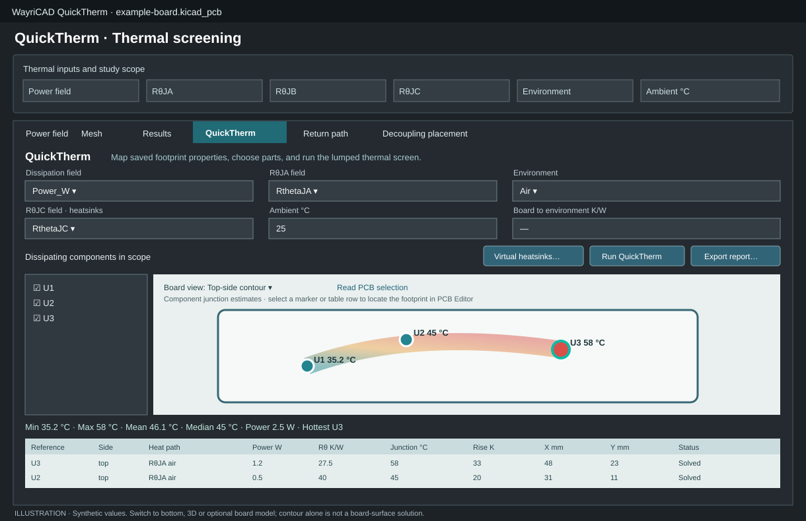
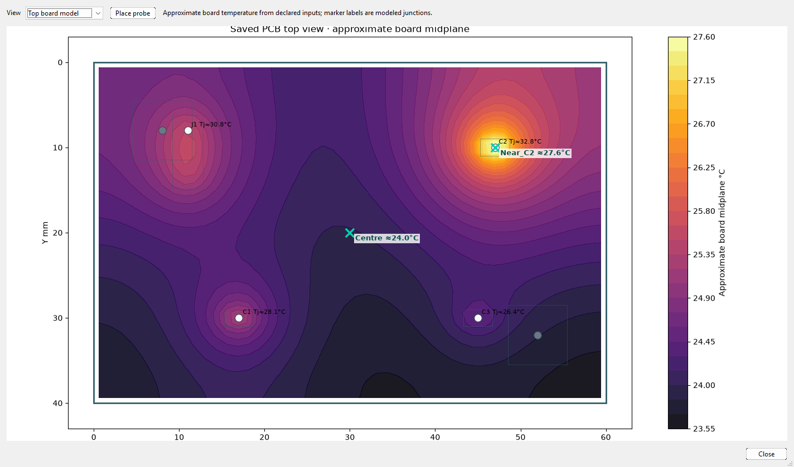
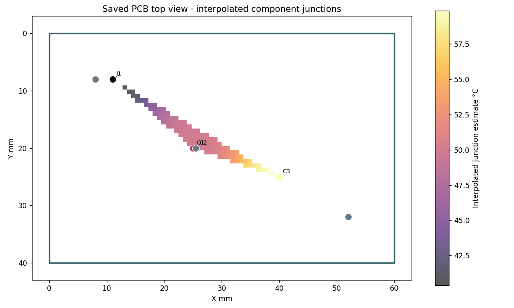
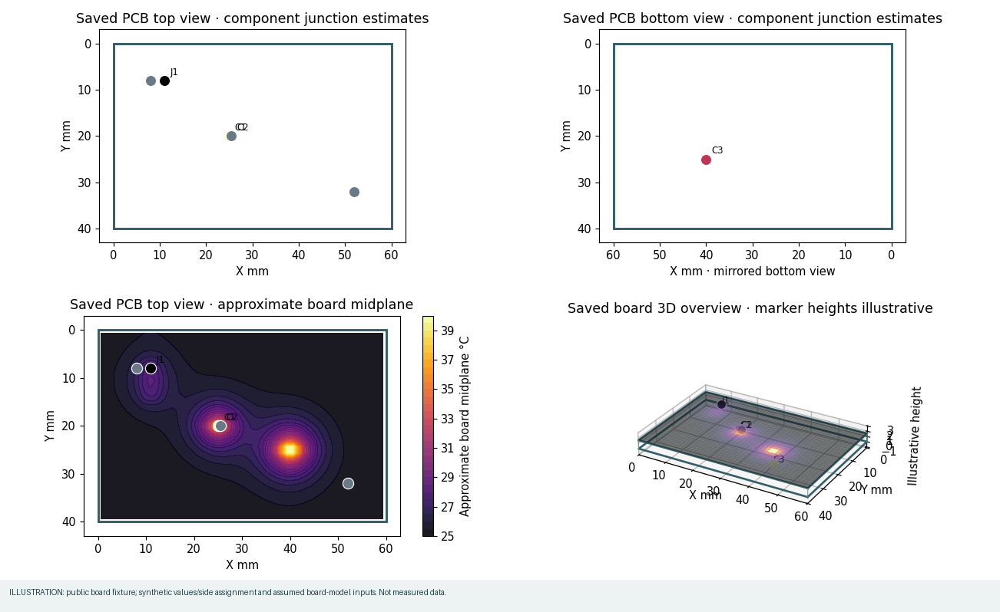
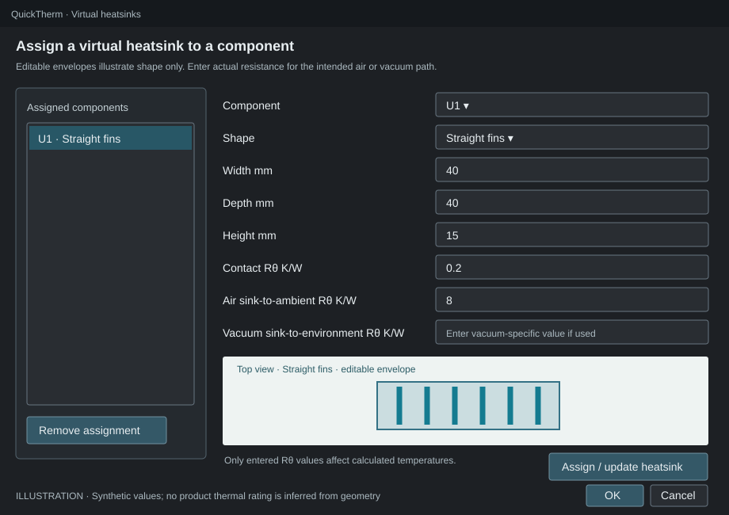
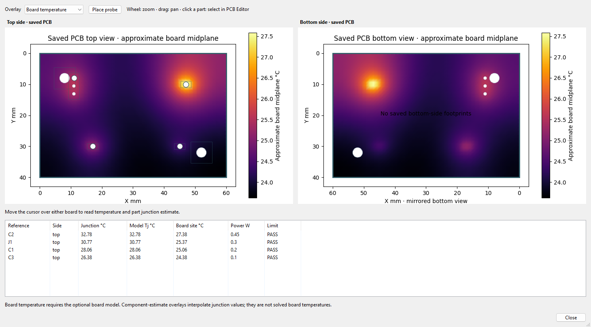
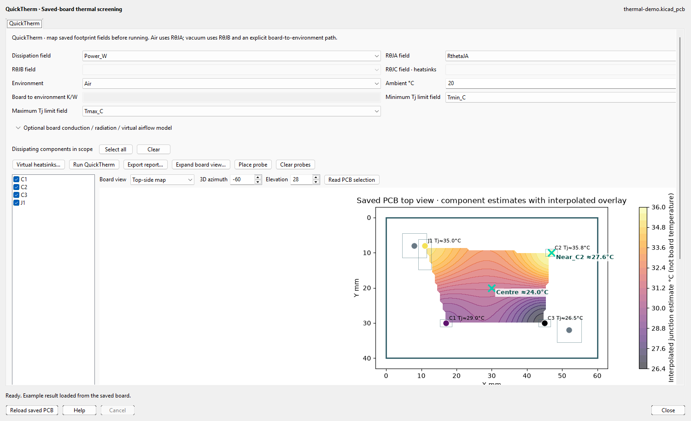
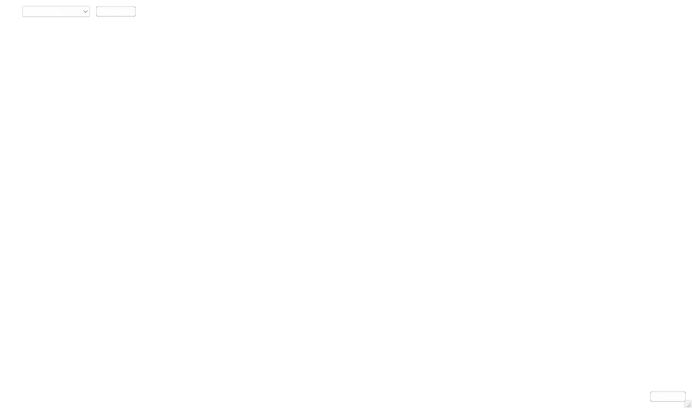

# QuickTherm: step-by-step user guide

QuickTherm is the **standalone WayriCAD QuickTherm plugin**. It reads saved
footprint properties, estimates steady-state component junction temperatures,
and exports an HTML report with paired JSON evidence. It does not edit the PCB.
The base component calculation is a lumped thermal screen. Optional board
models add either a thin-sheet field or a layer-resolved stackup/copper field.
Neither is CFD, a transient simulation or a qualified measurement.

The optional **CalculiX 3D · fixed lower face** mode is a separate bounded
steady-conduction model. It accepts selected top-side heat sources with known
power even when RθJA/RθJB is unavailable. In the board-model controls, choose
that mode, use **Locate CalculiX…** to select the `ccx` executable, then use
**Check solver setup**. The executable path is remembered locally. Gmsh may be
installed into QuickTherm's private runtime on first use. Set the fixed
lower-face temperature, conductivity and mesh target before running. The
solved top/bottom board field is available without RθJB; package junction
temperature and junction-limit status remain **UNKNOWN** until a valid RθJB is
entered or mapped. See the [CalculiX setup and limits](CALCULIX_BRIDGE.md).



*UI illustration based on the implemented wxPython controls. The 1 W and 0.5 W
results shown are synthetic examples, not a screen capture or a measured board.*



*Native KiCad 10.0.6 run on the public thermal demo board. The 10 m/s forced-air input and material values are illustrative; the overlay is an approximate board-midplane model, not a measurement.*



*Saved test-fixture outline and footprint locations with synthetic 40/50/60 °C
junction estimates. The colored strip is supported interpolation only, not a
measured or solved board temperature. Blank space has no contour support.*



*Four view modes from a public test-board outline with synthetic component
temperatures, one synthetic bottom-side assignment and assumed model inputs.
The lower-left panel is the optional thin-sheet board model, distinct from the
junction markers; the 3D geometry is illustrative.*

## 1. Prepare the saved board

1. In KiCad PCB Editor, save the board you intend to analyze and choose
   **WayriCAD QuickTherm** from the plugins menu. Its thermometer icon opens
   the independent QuickTherm window. QuickTherm reads
   the saved `.kicad_pcb` file; unsaved editor changes are not included.
2. You can enter dissipated power and thermal resistance directly in the
   QuickTherm window. The values remain in the window and the PCB is not
   modified. Alternatively, add custom **footprint properties** with those
   values on the saved board and map their case-sensitive names in QuickTherm.
3. Enter actual, characterized values. No power, thermal resistance, airflow,
   board radiation, or heatsink rating is inferred from a part number or shape.
   Keep the selected operating point and environmental assumptions together.

Example property names and values for two **illustrative** components:

| Reference | `Power_W` | `RthetaJA` | `RthetaJB` | `RthetaJC` |
|---|---:|---:|---:|---:|
| U1 | `1 W` | — | — | `2 K/W` |
| U2 | `500mW` | `40 K/W` | `5 K/W` | — |

U1 will use an explicit virtual heatsink. U2 will use the air or shared-board
path. A component with zero dissipation needs an explicit `0 W` if you include
it in the study. Components outside the selected scope are not counted.

Accepted power values include `1`, `1 W`, `500mW`, and `1000uW`; bare power
numbers mean watts. Accepted resistances include `40`, `40 K/W`, `40 °C/W`;
bare resistance numbers mean kelvins per watt. Thermal resistances must be
positive. Component power may be zero but cannot be negative.

## 2. Open QuickTherm and enter component inputs

1. Open **WayriCAD QuickTherm** from the intended saved PCB Editor. Choose
   **Air** or **Vacuum** and review **Ambient °C**.
2. In the checklist, select only parts whose power you intend to include.
   Unselected heat sources are outside the estimate.
3. Leave **Input source** at **Enter values per component** and click
   **Enter component inputs…**. For every selected part, enter its power in W
   and the applicable thermal resistance in K/W. In air this is RθJA; in
   vacuum it is RθJB; for a virtual heatsink it is RθJC. Blank, invalid and
   nonfinite values are rejected. Nothing is inferred from the PCB geometry.
4. In vacuum, also enter the reviewed board-to-environment resistance for any
   selected part without a virtual heatsink. This must represent the actual
   radiation and conductive heat path, not an in-air RθJA.
5. Click **Run QuickTherm**. The table, temperature chart and map identify the
   parts that were solved. Exported HTML and JSON record every entered value
   and identify the input source. These are estimates under your assumptions.

### Saved footprint field workflow

Choose **Use saved footprint fields** to reveal the field mappings, then:

1. Open **WayriCAD QuickTherm** from the intended saved PCB Editor.
2. Set **Dissipation field** to the PCB property containing power, such as
   `Power_W`.
3. Confirm **Environment** and **Ambient °C** in the setup row.
4. For components **without** a virtual heatsink, map **RθJA field** in air or
   **RθJB field** in vacuum. The inactive field is not used. Air RθJA must be
   applicable to the actual PCB, mounting, orientation and airflow; a package
   datasheet value measured on another board can be misleading.
5. For components **with** a virtual heatsink, map **RθJC field · heatsinks**
   to the saved junction-to-case property. You may leave RθJA/RθJB unmapped
   only if every selected component has a heatsink path.
6. In vacuum, if any selected component uses the shared-board path, enter
   **Board to environment K/W**. This is the effective resistance of the actual
   board-to-chamber radiation and mechanical conduction path. It is not the
   in-air RθJA and cannot be derived from the UI preview.
7. Optionally choose saved PCB property names for **Minimum Tj limit field**
   and **Maximum Tj limit field**. The fields may contain bare Celsius numbers,
   `85 °C`, or an absolute Kelvin value. Each selected component is checked
   against its own mapped values. Missing or invalid limits show **UNKNOWN**;
   values outside a valid bound show **FAIL**. The table sorts by clicking its
   headings and colors each row by status.

The field selectors list names found on the saved board. If a property is
missing, save the PCB after adding it and use **Reload saved board** from the
QuickTherm window before remapping.

## 3. Choose the study scope

Use the component checklist on the left of the QuickTherm window. **Select all**
checks every saved footprint; **Clear** empties the scope. For a useful thermal
screen, select the actual dissipating references and any explicitly zero-power
parts you want recorded. Check that the selected list covers all power sources
whose heat enters the modeled board node. If an unselected part dissipates
power, its heat is omitted.

Changing the mapping, environment, scope or heatsink assignment clears the old
result. Run QuickTherm again after each change.

## 4. Add virtual heatsinks, if present

Click **Virtual heatsinks…**. The editor assigns one virtual path to each
component. Select a reference, then choose a shape:

| Choice | Preview | Required dimensions |
|---|---|---|
| Straight fins | Parallel fins | Width, depth, height in mm |
| Pin fins | Pin array | Width, depth, height in mm |
| Radial fins | Radial top view | Width, depth, height in mm |
| Flat plate | Plate outline | Width, depth, height in mm |
| Resistance only · no envelope | Symbolic path | None |

The shape choices start with editable illustrative envelopes: 40 × 40 × 15 mm
straight fins, 25 × 25 × 10 mm pin fins, 30 × 30 × 20 mm radial fins, and
40 × 40 × 3 mm plate. These are **not product SKUs or rated heatsinks**. The
live top-view sketch changes with shape and dimensions, but dimensions do not
change the temperature calculation.



*UI illustration; the shown dimensions and resistances are synthetic inputs.*

Enter a positive **Contact Rθ K/W** for the actual component-to-sink interface.
Enter **Air sink-to-ambient Rθ K/W** and/or **Vacuum sink-to-environment Rθ K/W**
for the environments you plan to analyze. These values must account for the
real orientation and airflow in air, or radiation and conductive mounting in
vacuum. Air and vacuum values are separate; do not reuse an air rating in
vacuum. Click **Assign / update heatsink**, then **OK**. To edit an assignment,
select it in the left list, change its inputs, and assign again. **Remove
assignment** returns that part to the ordinary RθJA/RθJB path.

The **Resistance only** option is useful when you know the thermal path but
do not have a meaningful geometric envelope. It still needs RθJC, positive
contact resistance, and an environment-specific sink resistance.

## 5. Run and interpret the result

Click **Run QuickTherm**. The default **Top-side map** traces the saved
Edge.Cuts outline and marks top-mounted footprints at their saved positions.
**Bottom-side map** marks bottom-mounted parts and mirrors the X axis like a
physical bottom view. Marker colors encode estimated **component junction**
temperatures, not board temperature. Reload and rerun after PCB edits. An
incomplete outline is marked as unverified. **3D overview** extrudes the saved
outline by its saved thickness and places illustrative component markers above
or below it. Adjust azimuth and elevation to rotate the view. It does not
import STEP component models or measured component heights.

Choose **Top-side contour** or **Bottom-side contour** to compare nearby solved
component estimates on that side. Each field uses inverse-distance
interpolation inside its same-side anchors' convex hull and valid board
outline. Blank regions have no support. It is **not** a solved
board-surface temperature, so its colors and extrema cannot be used as board
hotspot or clearance evidence. Choose **Temperature chart** for a ranked
component comparison.

For an optional approximate **board temperature** field, expand **Optional
board conduction / radiation / virtual airflow model** before running. Check
**Include board heat model in next run**. Review effective in-plane
conductivity (W/m·K), board emissivity (0–1), and virtual air speeds over the
board and assigned sinks (m/s). Thickness comes from the saved KiCad board.
For heatsinks, enter their **exposed area in mm²**; enter a number for one sink
or `U1=1200, U2=800` for multiple independently sized sinks. The visual envelope does
not determine fin area. To calculate new model junction temperatures for
board-cooled parts, choose their saved **Model junction-to-board RθJB field**.
For sink-cooled parts, the existing mapped RθJC and entered contact resistance
provide the component-to-sink path. Missing RθJB values leave only board-site
temperatures for those parts. Airflow must be zero in vacuum. Rerun, then choose
**Top board model** or **Bottom board model**. Both display the same computed
thin-sheet **midplane** temperature: this model has no through-thickness
gradient. **Mesh cells · long axis** controls the board solve resolution;
the default is 48 and 80 gives a denser study. Component heat is distributed
over footprint contact areas where those saved bounds are available. Rerun at
two mesh densities and compare board-site and peak temperatures before relying
on local values. The color contours draw the calculated cells smoothly but do
not change the solved temperatures. The 3D overview can display that field. The report separates input
power, board and sink convection/radiation, and residual heat-balance error.
The speed-based convection coefficients are screening correlations, **not
CFD** or a prediction of real flow around board obstacles.

The analytics strip gives minimum, maximum, mean and median **solved junction
estimates**, total solved power and the hottest reference. Excluded components
are omitted from those statistics. The sortable output table lists every
selected component, including excluded entries and their reasons, with side,
heat path, power, resistance, legacy junction temperature, rise, optional
board-site/sink temperature, model junction temperature when an explicit path
exists, and PCB X/Y. Legacy RθJA is not reused as a junction-to-board
resistance. Click a
table row or map marker to highlight the other and select the exact footprint
in the originating PCB Editor. **Read PCB selection** brings an editor-selected
component back to the table/map. Cross-selection requires the original live
editor and unchanged saved board; a stale board is rejected. The status line
reports solved versus selected counts.

For an unsinked part in air, QuickTherm uses
`Tj = Tamb + P × RθJA`. For a virtual-heatsink part it uses
`Tj = Tamb + P × (RθJC + Rcontact + RθSA)` for the selected environment.
For unsinked parts in vacuum it uses one isothermal board node:
`Tboard = Tamb + ΣPboard-path × Rboard→environment`, then
`Tj = Tboard + P × RθJB`. Power assigned to an independent virtual-heatsink
path is excluded from that shared board-node sum, so it is not counted twice.
Parallel heat flow through both a heatsink and PCB is not modeled.

With the illustrative fields above, 25 °C ambient, and a U1 air sink having
RθJC = 2 K/W, contact = 0.2 K/W and air RθSA = 8 K/W, U1 estimates **35.2 °C**.
U2 at 0.5 W and RθJA = 40 K/W estimates **45 °C**. In vacuum, if U1 instead
uses 20 K/W sink-to-environment resistance, it estimates **47.2 °C**. If U2
uses RθJB = 5 K/W and the 0.5 W board path has 10 K/W board-to-environment
resistance, the board node is 30 °C and U2 estimates **32.5 °C**. These are
equation checks, not predictions for a particular product or PCB.

In air, incomplete mapped records are excluded and reported; **2/3 solved**
is not a whole-scope pass. Vacuum requires complete power and thermal fields
for all selected references because a missing heat source would lower the
shared-node estimate. A failed or missing input does not receive a guessed
default.

## 6. Resolve copper layers, vias and fixed fixture temperatures

1. Save the board with a complete physical stackup, closed Edge.Cuts and filled
   copper zones. QuickTherm will stop if this saved geometry is missing or if
   the file changes during analysis.
2. Expand **Optional board conduction / radiation / virtual airflow model**,
   enable it and choose **Copper layers + vertical paths**. Set the mesh to
   24–80 long-axis cells. The exact saved copper outlines, tracks, pads and
   plated via spans become the lateral and vertical conduction inputs.
3. Enter the laminate's **dielectric thermal conductivity** in W/m·K and the
   fabricated **via plating thickness** in mm. Review copper conductivity;
   the editable starting value is 385 W/m·K. Electrical εr does not supply
   thermal conductivity. Keep **Copper simplification** at 0 for initial runs;
   0.5 or 1 cell increases subcell copper sampling without joining islands.
4. To hold a mounting point at 10 °C, check the exact plated hole in the
   fixed-temperature contact list, enter **10** for fixture temperature and
   the characterized contact resistance in K/W. Several checked holes share
   those values. A selected NPTH needs the explicit mechanical-contact option;
   it couples the fixture to board dielectric, without inventing a ground-plane
   connection. A GND net name alone never creates a sink.
5. Run QuickTherm and choose **Layer model: F.Cu**, inner copper layers or
   **Layer model: B.Cu** to compare the solved fields. Read each contact's
   signed heat flow in the HTML/JSON report: positive leaves the board;
   negative enters it. Review the residual and assumptions. Refine the mesh
   and compare hotspot temperatures. A small energy residual is numerical
   conservation, not proof that material or fixture inputs are correct.

Virtual heatsinks still need their explicit thermal path and exposed area.
The layered model is steady-state finite-volume screening. It approximates
component injection by footprint area and barrel heat flow axially; it omits
anisotropic laminate detail, contact spreading, airflow fields, view factors,
transients and electrical-temperature feedback. Whole-circuit coupled
electrothermal simulation is tracked in [SPIKE #1](https://github.com/wayri/SPIKE-Main/issues/1).

### Optional CalculiX 3D board solve

1. Install a compatible `ccx` executable or enter its full path in the
   **CalculiX executable** field. KiCad's Python runtime also needs Gmsh.
2. Save the board with an explicit copper/dielectric stackup and filled zones.
   Select **CalculiX 3D · fixed lower face** under the board model. Enter the
   measured copper and dielectric conductivity, XY mesh target and the
   prescribed temperature of the entire lower board face.
3. Map component power. Optionally map an RθJB field for estimated junction
   temperatures. Run QuickTherm. The plugin checks the saved-board hash,
   meshes copper occupancy, runs CalculiX, imports its final nodal temperature
   result and rejects an incomplete field or failed lower-face heat balance.
4. Open the top/bottom workspace. The two overlays and probes now show the
   imported board field; the component table keeps the lumped estimate separate
   from any model junction estimate. Review the mesh size, boundary assumption
   and heat residual in the JSON evidence before using the temperatures.

This mode currently stops with an explicit error for vias, drilled pads,
mounting contacts, bottom-side heat sources, virtual heatsinks, convection and
radiation. Its fixed entire lower face is a strong cooling assumption, not a
model of a point fixture. Use the internal layered screen for board cases that
need its supported via and mount representations. See the
[CalculiX model contract](CALCULIX_BRIDGE.md).

## 7. Export and repeat

Use **Open top + bottom workspace…** for simultaneous, resizable front and
mirrored-back board views. Select **Board temperature** for the optional solved
board field or **Component estimates** for the explicitly labelled junction
interpolation. Hover over a position to read its X/Y coordinate, field
temperature and the junction estimate when the cursor is over a component.
Click a component or a row in the workspace summary to highlight it in both
views, the main table and PCB Editor.



This native-window illustration uses synthetic component and layer-temperature
data to show the interaction and shared color scale; it is not a measured run.

Select **Place probe** and click a board coordinate to
add a labeled virtual temperature probe. The probe table lists side,
coordinates, temperature, source and status. A probe samples the nearest valid
field cell; it is **UNKNOWN** outside the board or field coverage. With only
the basic lumped screen, a probe samples interpolated junction estimates, not
a board-surface temperature. Run the optional board model for an approximate
board-temperature probe. **Clear probes** removes them from the next report.

The component table places estimated junction, selected minimum/maximum limit
and **PASS / FAIL / UNKNOWN** status in its first columns. Click a heading to
sort. A passing limit check is only as sound as its power, Rθ and temperature
limits; missing property values never silently pass.

Click **Export report…** after a successful run. QuickTherm writes a local
`.html` summary and paired `.json` file with the saved-board top view, labeled
contour, per-component table and analytics, plus exact mapped fields, scope,
probe rows, temperature-limit decisions, heatsink definitions, assumptions and coverage. Keep the files
together so the HTML link to JSON works. The report does not modify the PCB.
After editing fields or replacing a component, save the PCB, reload it in Quick
QuickTherm, review mapping and scope, and rerun. An old export is not automatically
updated.

The same read-only analysis can be scripted. Replace the example field names
and resistance values with those on your saved board:

```text
wayricad-therm C:/Projects/Example/board.kicad_pcb --environment air --power-field Power_W --theta-ja-field RthetaJA --thermal-refs U1 U2 --html quicktherm-air.html
wayricad-therm C:/Projects/Example/board.kicad_pcb --environment vacuum --power-field Power_W --theta-jb-field RthetaJB --board-rtheta 10 --thermal-refs U2 --html quicktherm-vacuum.html
wayricad-therm C:/Projects/Example/board.kicad_pcb --environment air --power-field Power_W --theta-ja-field RthetaJA --temp-min-field Tmin_C --temp-max-field Tmax_C --probe Centre:30,20:top --thermal-refs U1 U2 --html quicktherm-check.html --require-limits-pass
```

`--require-limits-pass` exits nonzero if any selected part fails or has an
unknown limit, while still writing the reviewable output. For a repeatable
board-model run, place the mapped fields, selected references, probes and
thermal-network settings in a JSON config like the
[public example](examples/thermal-demo-config.json), then run
`wayricad-therm board.kicad_pcb --config thermal-config.json --html result.html --require-limits-pass`.

For a native jobset, run:

```text
wayricad-jobs init Example.kicad_pro --preset thermal --output thermal-jobs.json --set thermal_config=thermal-config.json
```

Review the generated configuration, then use `wayricad-jobs run thermal-jobs.json`
or add it to a KiCad jobset using `wayricad-jobs jobset`. The thermal preset
uses the standalone QuickTherm CLI and fails on failed or unknown mapped limits.

For virtual heatsinks, put a reference-to-sink mapping in `sinks.json`:

```json
{
  "U1": {
    "shape": "straight_fin",
    "width_mm": 40,
    "depth_mm": 40,
    "height_mm": 15,
    "contact_k_per_w": 0.2,
    "theta_sa_air_k_per_w": 8,
    "theta_sa_vacuum_k_per_w": 20
  }
}
```

Then map the component's RθJC and pass the same scope:

```text
wayricad-therm C:/Projects/Example/board.kicad_pcb --environment air --power-field Power_W --theta-jc-field RthetaJC --thermal-refs U1 --heatsinks sinks.json --html quicktherm-sink.html
```

The CLI returns an error if a required mapping, selected reference, thermal
path resistance, or environment-specific heatsink value is missing.

## Troubleshooting and limits

| Symptom | Check |
|---|---|
| Field selector lacks a name | Add the property to a footprint on the PCB, save, and reload the saved board. |
| Selected part is excluded | Inspect its field name, units and numeric value in the report; enter complete positive resistances. |
| Vacuum run refuses to start | Complete all selected power/Rθ fields, enter board-to-environment K/W for unsinked parts, and enter vacuum RθSA for assigned heatsinks. |
| Heatsink shape changes but temperature does not | This is expected: geometry is visual only; the entered Rθ values drive the calculation. |
| Temperature seems implausible | Recheck the operating-point power, thermal characterization conditions, units, missing heat sources, contact path and mounting. |

The base lumped calculation omits spatial board gradients. Optional thin-sheet
and layered models approximate heat spreading, convection and radiation using
the declared inputs. They do not resolve airflow fields, package internals,
temperature-dependent electrical losses, transients or chamber view factors.
A virtual sink with no real path to the environment cannot establish a finite
vacuum steady state.
Use measurements or a qualified thermal model for design sign-off.

The two SVG figures in this guide are **UI illustrations derived from the
implemented controls**. They use synthetic example values. They are not
screenshots, measured results, or evidence that a live KiCad editor accepted a
specific board run.


### Inspecting the saved board in a thermal report

The offline HTML report opens with an interactive full-board viewport. **Top** and **Bottom** show the corresponding saved footprint bounds, reference labels, Edge.Cuts, mounting drills, slots and vias; the bottom view is mirrored. Enable **All reference labels**, hover a part, or select its row in the sortable component table to identify it. Wheel zooms, drag pans, and **Fit board** resets the view. Hover exposed board space to read the nearest valid thermal field cell. Drilled voids and space outside the saved outline have no probe temperature.

**3D overview** provides an orbitable board extrusion and saved footprint bounds on both faces. Package heights are illustrative and no STEP models are loaded. The report also embeds three offline Matplotlib plots: top board overlay, bottom board overlay and component temperature comparison with available limits. Junction, package case and board contact temperatures are separate quantities; a missing case temperature stays unknown. A thin-sheet solve supplies one shared midplane field on both faces, not independently calculated top and bottom surface temperatures. Circular and rotated obround plated slots are supported by the separate multilayer model; coarse barrel contact proxies remain explicitly reported.


### Plated slots and analysis progress

#  WayriCAD QuickTherm

QuickTherm is an independently installable KiCad PCB Editor plugin for read-only, steady-state thermal screening. It has its own PCM package, toolbar action, native window, icon, command-line interface and HTML/JSON export. It does not require Quick PI to be installed.

The separate `wayricad-therm-transient` command runs an explicitly parameterized, four-board lumped RC transient screen. It uses saved-board source hashes and KiCad reference checks, a declared fan P–Q/system operating point or prescribed-flow sensitivity case, explicit serial or parallel-passage airflow topology, optional package/body and isolated-sink paths, and ohmic R(T) loss feedback. The parallel model warms air from high X to low X within each board and retains a user-entered passage flow split; it is not CFD. See the [transient model guide](TRANSIENT_MODEL.md) for the input contract and limitations. This does not make the native board viewport a transient copper-field solver.

For the separate steady multilayer model, set `"source_refinement_factor": 2` inside `thermal_network_settings` to subdivide rectilinear cells near mapped footprint sources. A CLI JSON config can also include `"mesh_acceptance": {"grid_cells_long_axis": [24, 48, 80], "maximum_change_c": 0.1, "minimum_source_cells": 4}`. The solver repeats the same saved geometry on increasing grids and reports PASS/FAIL from the two finest component, source-peak, layer-peak and spatial-field temperatures, numerical balance and effective source-contact coverage. An optional phase-shifted solve exposes grid sensitivity. A failed or absent mesh gate must not be read as a converged local hotspot result. Source-aligned refinement is a rectilinear screening mesh; it does not resolve package-to-copper contact geometry or qualify physical hotspots.

Start with the [step-by-step user guide](QUICK_THERM_USER_GUIDE.md) or its [offline HTML version](QUICK_THERM_USER_GUIDE.html). The [model and limits](QUICK_THERM.md) explain the equations and supported evidence.

The optional [CalculiX 3D steady-conduction mode](CALCULIX_BRIDGE.md) meshes a supported saved board with Gmsh, runs `ccx`, checks its nodal temperatures and heat balance, and displays imported top/bottom board fields. Select it in the native board-model controls, locate the `ccx` executable, and check the solver setup before running; the executable choice is remembered locally. First use may install Gmsh in QuickTherm's private runtime. Enter or map dissipated power for the selected parts; RθJB is optional and is used only to estimate package junction temperature from the solved board field. The mode requires a fixed lower-face temperature and rejects vias, mounting contacts, heatsinks, convection and radiation until those physics have a qualified mesh contract.






The paired-workspace screenshot was captured from the native KiCad Python window using a synthetic 60 × 40 mm board outline, two invented components and illustrative layer-temperature arrays. It demonstrates the UI only; the temperatures are not measured or solver-qualified results.

The **Open top + bottom workspace** button opens simultaneous front and mirrored-back thermal views with a live cursor readout, probe placement and a component summary that cross-selects with the plots and PCB Editor. Top and bottom maps display labelled component junction estimates with a translucent, same-side interpolation where enough mapped points exist. The optional board conduction model provides an approximate board-temperature overlay; it needs material, airflow and boundary inputs. The first expanded map above is **not** a computed board-surface temperature. The second view is the optional thin-sheet model, using an assumed 35 W/(m·K) in-plane conductivity, 0.8 emissivity, 10 m/s forced airflow, a 48-cell long-axis grid and the saved 1.6 mm thickness. Those inputs are illustrative, not measured properties of the fixture.

The [component-results screenshot](examples/quicktherm-native-results.png) shows the sortable temperature table and summary in the same native window.

Open a saved board in KiCad PCB Editor and launch **WayriCAD QuickTherm**. Choose only the dissipating components, review the ambient temperature, then use **Enter component inputs…** to supply power and the applicable thermal resistance for each selected part. No saved `Power_W` or `RthetaJA` fields are required for this path, and the PCB is not modified. If your board has complete thermal properties, switch to **Use saved footprint fields** and map them. Both paths show top and bottom views, contours, a 3D overview, a component temperature table, and cross-selection back to PCB Editor. Optional virtual heatsinks and board models include thin-sheet and layer-resolved copper/vertical-path approximations. The report records input provenance, assumptions, coverage and heat balance where applicable. The viewport board models remain steady-state; the separate transient CLI is a lumped RC screen, not CFD or a spatial transient copper-field solver.

For automation, install the source wheel and use `wayricad-therm`:

```text
wayricad-therm C:/Projects/Example/board.kicad_pcb --environment air --power-field Power_W --theta-ja-field RthetaJA --thermal-refs U1 U2 --html quicktherm-air.html
```

### Reproducible example

The public [demonstration PCB](examples/thermal-demo.kicad_pcb) has four hypothetical dissipating parts spread across a 60 × 40 mm board. From the repository root with KiCad 10 native Python and the declared dependencies available:

```text
python -m quick_therm_plugin.cli quick_therm_plugin/examples/thermal-demo.kicad_pcb --environment air --power-field Power_W --theta-ja-field RthetaJA --thermal-refs C1 C2 C3 J1 --ambient 20 --html quicktherm-demo.html
```

The actual run produced the [JSON summary](examples/thermal-demo-result.json) and [self-contained HTML report](examples/thermal-demo-report.html). The result was generated with KiCad 10.0.6 on Windows; the public example files use relative paths.

| Part | Power | Supplied RθJA | Estimated junction at 20 °C ambient |
|---|---:|---:|---:|
| C1 | 0.20 W | 45 K/W | 29.0 °C |
| C2 | 0.45 W | 35 K/W | 35.75 °C |
| C3 | 0.10 W | 65 K/W | 26.5 °C |
| J1 | 0.30 W | 50 K/W | 35.0 °C |

These are independent `ambient + power × RθJA` estimates. The sample board is a visual fixture with hypothetical fields and repositioned parts, not a routed design or thermal qualification. To regenerate it from the repository fixture, run `examples/build_demo.py`, then run the command above. The example report contains board views and assumptions; the JSON summary is a small subset of the full report evidence.

For the board-model view and automatic limits, use the reviewed [example configuration](examples/thermal-demo-config.json):

```text
wayricad-therm quick_therm_plugin/examples/thermal-demo.kicad_pcb --config quick_therm_plugin/examples/thermal-demo-config.json --html quicktherm-demo.html --require-limits-pass
```

The saved example converged with 1.05 W input and a heat-balance residual below 10⁻¹² W. The resulting board-midplane range is about 23.6–27.6 °C, with four component limits passing and two virtual probes recorded. This is a model output under the declared forced-air assumption, not a measurement. The displayed `Tj≈` labels in the board-model view come from the model and mapped `RthetaJB` fields; the simpler table above uses the separate `RthetaJA` screen.

The PCM action uses the native KiCad Python runtime and launches a separate bounded worker for board analysis. Each installed QuickTherm ZIP carries its own shared runtime files, so it never imports a sibling plugin package.


### Inspecting the saved board in a thermal report

The offline HTML report opens with an interactive full-board viewport. **Top** and **Bottom** show the corresponding saved footprint bounds, reference labels, Edge.Cuts, mounting drills, slots and vias; the bottom view is mirrored. Enable **All reference labels**, hover a part, or select its row in the sortable component table to identify it. Wheel zooms, drag pans, and **Fit board** resets the view. Hover exposed board space to read the nearest valid thermal field cell. Drilled voids and space outside the saved outline have no probe temperature.

**3D overview** provides an orbitable board extrusion and saved footprint bounds on both faces. Package heights are illustrative and no STEP models are loaded. The report also embeds three offline Matplotlib plots: top board overlay, bottom board overlay and component temperature comparison with available limits. Junction, package case and board contact temperatures are separate quantities; a missing case temperature stays unknown. A thin-sheet solve supplies one shared midplane field on both faces, not independently calculated top and bottom surface temperatures. Drilled slots can be displayed even when the multilayer thermal-contact model does not support solving them.
