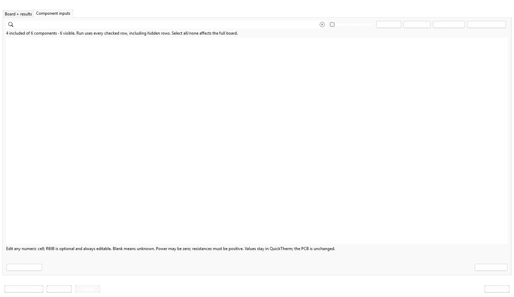
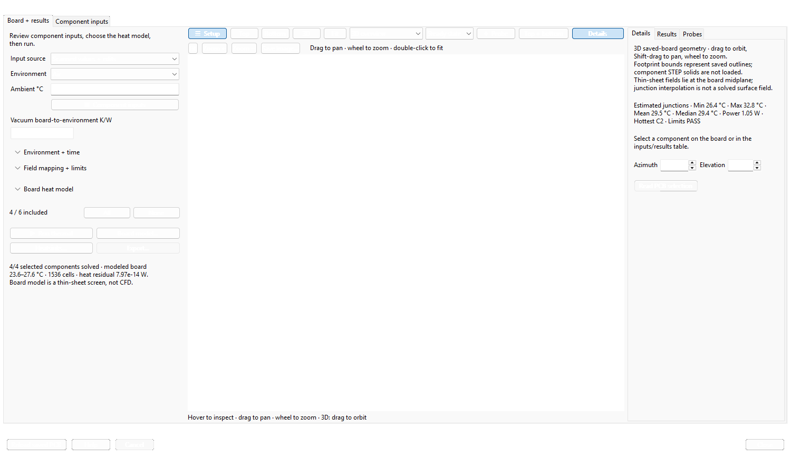

#  WayriCAD QuickTherm

QuickTherm is an independently installable KiCad PCB Editor plugin for read-only thermal screening with steady-state and scheduled spatial transient models. It has its own PCM package, toolbar action, native window, icon, command-line interface and HTML/JSON export. It does not require Quick PI to be installed.

The separate `wayricad-therm-transient` command runs an explicitly parameterized, four-board lumped RC transient screen. It uses saved-board source hashes and KiCad reference checks, a declared fan P–Q/system operating point or prescribed-flow sensitivity case, explicit serial or parallel-passage airflow topology, optional package/body and isolated-sink paths, and ohmic R(T) loss feedback. The parallel model warms air from high X to low X within each board and retains a user-entered passage flow split; it is not CFD. See the [transient model guide](TRANSIENT_MODEL.md) for the input contract and limitations. This lumped workflow remains separate from the spatial board transient described below.

For the separate steady multilayer model, set `"source_refinement_factor": 2` inside `thermal_network_settings` to subdivide rectilinear cells near mapped footprint sources. A CLI JSON config can also include `"mesh_acceptance": {"grid_cells_long_axis": [24, 48, 80], "maximum_change_c": 0.1, "minimum_source_cells": 4}`. The solver repeats the same saved geometry on increasing grids and reports PASS/FAIL from the two finest component, source-peak, layer-peak and spatial-field temperatures, numerical balance and effective source-contact coverage. An optional phase-shifted solve exposes grid sensitivity. A failed or absent mesh gate must not be read as a converged local hotspot result. Source-aligned refinement is a rectilinear screening mesh; it does not resolve package-to-copper contact geometry or qualify physical hotspots.

### Native workspace and component inputs

QuickTherm opens maximized with two tabs: **Component inputs** and **Board + results**. The input table scans saved values and shows every component's power, RθJA, RθJB, RθJC, temperature limits, source and status. Edit numeric cells to add or override values. **Select all**, **Select none**, search and **Include visible** control the scope; filtering preserves checked hidden rows. **Restore saved row** removes overrides. Blank values remain unknown, and the PCB is unchanged.

RθJB is always editable. A physical board study without virtual heatsinks needs known power, reviewed material/boundary settings and optional RθJB; it does not also require RθJA. A known RθJB gives `modeled board site + power × RθJB`; missing RθJB leaves the package junction and its limit check unknown. The independent air screen still requires RθJA, and virtual heatsink screening uses RθJC and declared sink paths. **Field mapping…** maps nonstandard property names or resolves ambiguous aliases. The default **Scanned values + edits** combines saved inputs with explicit overrides; **Saved fields only** ignores table overrides.

The board tab keeps compact setup at the left and **Details**, **Results** and **Probes** at the right. Hide either side for more viewport space. **Top**, **Bottom**, **3D**, **Fit**, field/time selection and probes stay above the board. The native viewport removes graph axes; exported scientific plots keep units and axes. In 3D, drag to orbit, Shift-drag to pan and wheel to zoom. Saved contours and drilled voids stay open; unknown field cells remain blank. A thin-sheet field is shown once at the board midplane, and layered fields retain their declared depths. Footprint bounds and temperature markers are interactive; STEP component solids and drill depth/span geometry are not loaded.




These native Windows/KiCad 10.0.6 captures use the public thermal demo with four invented power sources. The 3D field is a thin-sheet result using assumed 35 W/(m·K) conductivity, 0.8 emissivity and 10 m/s airflow. It demonstrates the workflow, not measured temperatures or a qualified hardware model. The screenshots contain no user project data or private paths.

### Interactive views and time evolution

Component labels appear only for the selected part or the part under the pointer in the main map, paired top/bottom workspace and 3D overview. Selection keeps one label visible; hovering another component shows one temporary label, which clears when the pointer leaves. Hovering does not reset the view or change component selection. Unknown junction temperatures stay unknown.

Choose top, bottom or 3D board views. Drag to orbit a 3D view, Shift-drag to pan, and use the wheel or plot toolbar to zoom. Hover to inspect the local board temperature and component estimates; click to pin a probe. Select a component in the view or table to cross-highlight it. Changing the time frame updates the board field, component power, junction estimate and temperature-limit status together. Camera movements do not modify the PCB. The 3D overview is a temperature board representation, not an imported STEP assembly.

The offline HTML report includes interactive board views, component temperature probes and time curves alongside printable snapshots. Unknown junction temperatures remain unknown without explicit RθJB; coordinate probes in other analysis tools do not imply a solved field. See [analysis interactions](../docs/ANALYSIS_INTERACTIONS.md).

Air, vacuum, forced air, potting and sealed-enclosure modes are available. For **forced air**, enter the effective board/sink convection coefficients. **Vacuum** requires zero convection and an explicit radiation or fixture path. **Potting** needs conductivity, thickness and outer convection, and models their series thermal resistance. **Sealed** needs a fixed enclosure temperature and effective heat-transfer coefficient. Potting heat capacity and lateral spreading, enclosure heating and airflow fields are not solved.

For a **spatial transient**, select the multilayer model, enter copper and dielectric volumetric heat capacities, initial temperature, duration and time step, then provide optional per-component power schedules. Schedule points are `[time_s, multiplier]`, linearly interpolated with held endpoints, applied to the entered dissipation. Heatsinks additionally need explicit heat capacities. Reduce the time step and compare results before relying on a peak; numerical stability is not convergence. The model excludes package die and plated-barrel thermal storage. Package junction values use an explicit, massless RθJB offset from the board contact temperature.

A CLI JSON config accepts this top-level section together with the existing multilayer settings (the capacity values below are illustrative assumptions):

```json
{
  "transient_settings": {
    "duration_s": 60,
    "timestep_s": 1,
    "initial_c": 25,
    "copper_volumetric_capacity_j_m3k": 3450000,
    "dielectric_volumetric_capacity_j_m3k": 1800000,
    "power_schedules": {"U1": [[0, 1], [30, 1], [31, 0], [60, 0]]}
  }
}
```

Run with `wayricad-therm C:/Projects/Example/board.kicad_pcb --config thermal.json --html thermal.html`. Use separate grid analyses for transient spatial refinement; the steady mesh-acceptance option cannot be combined with this transient section.

Start with the [step-by-step user guide](QUICK_THERM_USER_GUIDE.md) or its [offline HTML version](QUICK_THERM_USER_GUIDE.html). The [model and limits](QUICK_THERM.md) explain the equations and supported evidence.

The optional [CalculiX 3D steady-conduction mode](CALCULIX_BRIDGE.md) meshes a supported saved board with Gmsh, runs `ccx`, checks its nodal temperatures and heat balance, and displays imported top/bottom board fields. Select it in the native board-model controls, locate the `ccx` executable, and check the solver setup before running; the executable choice is remembered locally. First use may install Gmsh in QuickTherm's private runtime. Enter or map dissipated power for the selected parts; RθJB is optional and is used only to estimate package junction temperature from the solved board field. The mode requires a fixed lower-face temperature and rejects vias, mounting contacts, heatsinks, convection and radiation until those physics have a qualified mesh contract.


The paired-workspace screenshot was captured from the native KiCad Python window using a synthetic 60 × 40 mm board outline, two invented components and illustrative layer-temperature arrays. It demonstrates the UI only; the temperatures are not measured or solver-qualified results.

The **Open top + bottom workspace** button opens simultaneous front and mirrored-back thermal views with a live cursor readout, probe placement and a component summary that cross-selects with the plots and PCB Editor. Top and bottom maps display component junction estimates with a translucent, same-side interpolation where enough mapped points exist. Only the selected or hovered component is labelled, so large studies remain readable. The optional board conduction model provides an approximate board-temperature overlay; it needs material, airflow and boundary inputs. The first expanded map above is **not** a computed board-surface temperature. The second view is the optional thin-sheet model, using an assumed 35 W/(m·K) in-plane conductivity, 0.8 emissivity, 10 m/s forced airflow, a 48-cell long-axis grid and the saved 1.6 mm thickness. Those inputs are illustrative, not measured properties of the fixture.

The [component-results screenshot](examples/quicktherm-native-results.png) shows the sortable temperature table and summary in the same native window.

### When color covers only a small area

A small colored quadrilateral can be **partial junction interpolation** between selected same-side components. Its dashed boundary is the component-anchor hull; blank regions are unknown, not ambient temperature. This overlay is not a board-surface solution and is never extrapolated across the PCB.

Click **Whole-board study…** to enable and reveal the existing board-model setup. Review the model, material conductivity, saved thickness, cooling and fixture boundaries, and include every actual heat source before running. The action retains your model choices, mappings, entered component values and scope; it does not infer missing physics. A solved board or layer field is preferred automatically, while a later deliberate view selection is retained. With insufficient interpolation support, the component map stays available with point estimates.

Physical finite-volume colors cover known mesh cells through their declared edges, including supported edge and isolated cells. Smooth gradients require neighboring known samples. Cutouts, drills and unsupported cells remain blank; junction and sampled CalculiX interpolation keep their own support limits. Coverage and smoothness do not establish mesh convergence or qualified temperatures.

Reloading the same board retains entered values, valid explicit field mappings and checked references. A unique recognized saved-field alias may be suggested; ambiguous aliases stay blank for review. A board with one component initially selects that reference, without inventing its power or thermal resistance. Reload still clears the previous result and export.

Open a saved board in KiCad PCB Editor and launch **WayriCAD QuickTherm**. Choose only the dissipating components, review the ambient temperature, then use **Enter component inputs…** to supply power and the applicable thermal resistance for each selected part. No saved `Power_W` or `RthetaJA` fields are required for this path, and the PCB is not modified. If your board has complete thermal properties, switch to **Use saved footprint fields** and map them. Both paths show top and bottom views, contours, a 3D overview, a component temperature table, and cross-selection back to PCB Editor. Optional virtual heatsinks and board models include thin-sheet and layer-resolved copper/vertical-path approximations. The report records input provenance, assumptions, coverage and heat balance where applicable. The multilayer viewport also supports explicitly parameterized spatial time evolution. The separate four-board transient CLI remains a lumped RC screen; neither model is CFD.

For automation, install the source wheel and use `wayricad-therm`:

```text
wayricad-therm C:/Projects/Example/board.kicad_pcb --environment air --power-field Power_W --theta-ja-field RthetaJA --thermal-refs U1 U2 --html quicktherm-air.html
```

### Reproducible example

The public [demonstration PCB](examples/thermal-demo.kicad_pcb) has four hypothetical dissipating parts spread across a 60 × 40 mm board. From the repository root with KiCad 10 native Python and the declared dependencies available:

```text
python -m quick_therm_plugin.cli quick_therm_plugin/examples/thermal-demo.kicad_pcb --environment air --power-field Power_W --theta-ja-field RthetaJA --thermal-refs C1 C2 C3 J1 --ambient 20 --html quicktherm-demo.html
```

The actual run produced the [JSON summary](examples/thermal-demo-result.json) and [self-contained HTML report](examples/thermal-demo-report.html). The result was generated with KiCad 10.0.6 on Windows; the public example files use relative paths.

| Part | Power | Supplied RθJA | Estimated junction at 20 °C ambient |
|---|---:|---:|---:|
| C1 | 0.20 W | 45 K/W | 29.0 °C |
| C2 | 0.45 W | 35 K/W | 35.75 °C |
| C3 | 0.10 W | 65 K/W | 26.5 °C |
| J1 | 0.30 W | 50 K/W | 35.0 °C |

These are independent `ambient + power × RθJA` estimates. The sample board is a visual fixture with hypothetical fields and repositioned parts, not a routed design or thermal qualification. To regenerate it from the repository fixture, run `examples/build_demo.py`, then run the command above. The example report contains board views and assumptions; the JSON summary is a small subset of the full report evidence.

For the board-model view and automatic limits, use the reviewed [example configuration](examples/thermal-demo-config.json):

```text
wayricad-therm quick_therm_plugin/examples/thermal-demo.kicad_pcb --config quick_therm_plugin/examples/thermal-demo-config.json --html quicktherm-demo.html --require-limits-pass
```

The saved example converged with 1.05 W input and a heat-balance residual below 10⁻¹² W. The resulting board-midplane range is about 23.6–27.6 °C, with four component limits passing and two virtual probes recorded. This is a model output under the declared forced-air assumption, not a measurement. The displayed `Tj≈` labels in the board-model view come from the model and mapped `RthetaJB` fields; the simpler table above uses the separate `RthetaJA` screen.

The PCM action uses the native KiCad Python runtime and launches a separate bounded worker for board analysis. Each installed QuickTherm ZIP carries its own shared runtime files, so it never imports a sibling plugin package.


### Inspecting the saved board in a thermal report

The offline HTML report opens with an interactive full-board viewport. **Top** and **Bottom** show the corresponding saved footprint bounds, reference labels, Edge.Cuts, mounting drills, slots and vias; the bottom view is mirrored. Only the selected component and the component under the pointer show a reference and junction estimate. Hover a part for a temporary label, or select it in the view or sortable table to keep its label visible. Moving away clears the hover label; missing junction values remain unknown. Wheel zooms, drag pans, and **Fit board** resets the view. Hover exposed board space to read the nearest valid thermal field cell. Drilled voids and space outside the saved outline have no probe temperature.

**3D overview** provides an orbitable board extrusion and saved footprint bounds on both faces. Package heights are illustrative and no STEP models are loaded. The report also embeds three offline Matplotlib plots: top board overlay, bottom board overlay and component temperature comparison with available limits. Junction, package case and board contact temperatures are separate quantities; a missing case temperature stays unknown. A thin-sheet solve supplies one shared midplane field on both faces, not independently calculated top and bottom surface temperatures. Drilled slots can be displayed even when the multilayer thermal-contact model does not support solving them.
