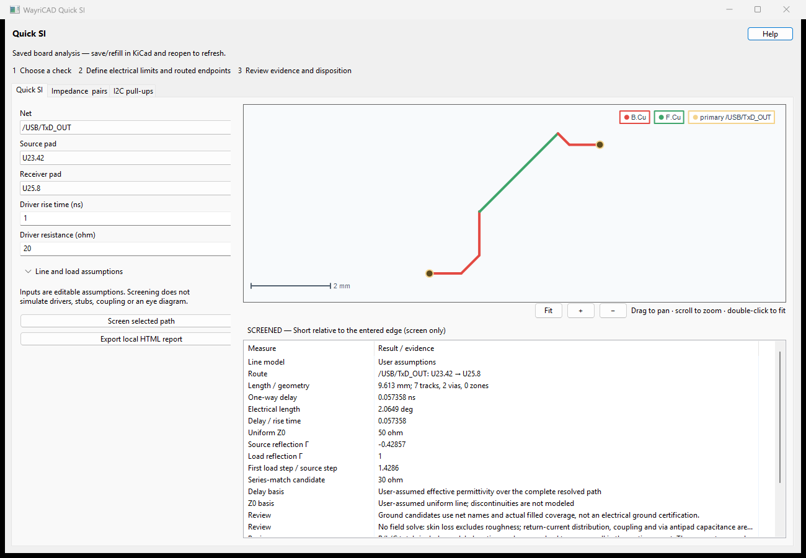
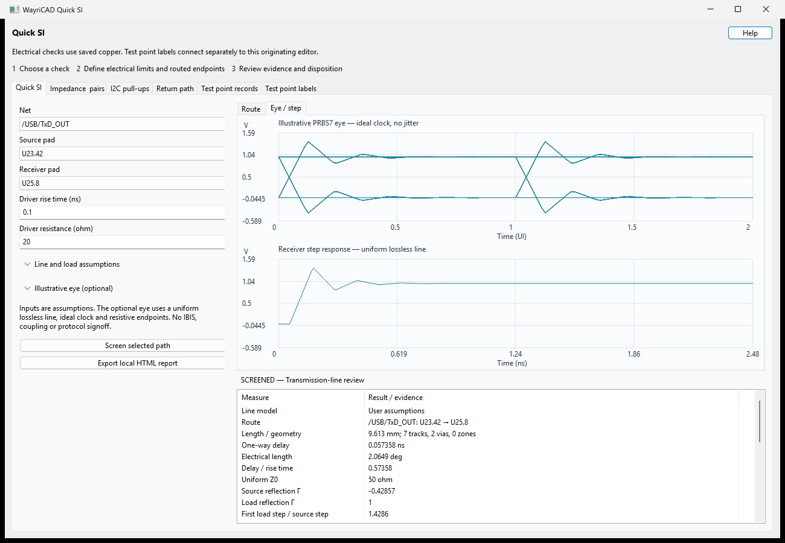
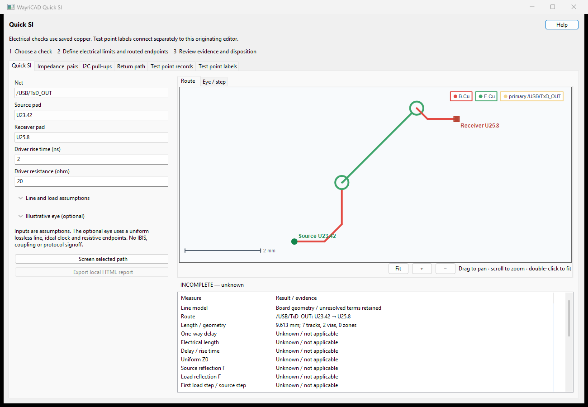
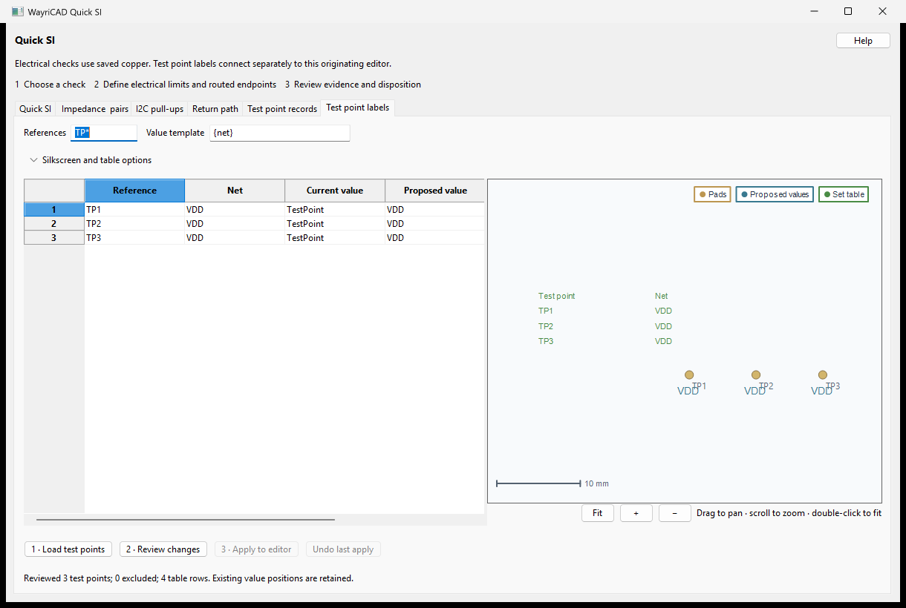

# WayriCAD Quick SI

Quick SI answers a focused question: **does this routed source-to-receiver path
need transmission-line and termination review at the entered edge rate?** It
measures saved PCB copper, shows the route, screens delay and electrical length,
and calculates ideal resistive endpoint reflections. It retains the existing
**Impedance & pairs** and **I2C pull-ups** tabs. This is the former Signal Integrity
Advisor package; its stable PCM identifier is unchanged, so it upgrades in place.



The screenshot uses Marble `/USB/TxD_OUT`, `U23.42` to `U25.8`: **9.612525 mm,
7 tracks and 2 vias**. The entered assumptions are **50 ohm uniform Z0** and
**effective Er 3.2**, a 1 ns rise time, a 20 ohm resistive driver and an open load.
The resulting 57.3577 ps delay and 30 ohm series-match candidate are **screening
estimates under those assumptions**, not extracted USB compliance results.

## Normal workflow

1. Open the project in PCB Editor, save the board and refill zones. Launch
   **WayriCAD Quick SI**. The originating editor supplies the saved board even
   when other KiCad instances are open. A saved selection seeds the net/endpoints
   when its objects still exist; otherwise review the proposed two-pad net.
2. On **Quick SI**, choose the net, source pad and receiver pad. Labels such as
   `U1.1` identify reference and pad number. Endpoints must be distinct and on
   the same net. The tool does not silently bridge series components or gaps.
3. Enter the actual driver rise time and output resistance from your device
   information. The visible defaults, 1 ns and 20 ohm, are editable assumptions.
4. Expand **Line and load assumptions** when needed. Enter frequency for phase
   length, a resistive load, an explicit reference layer, or a clearly labelled
   assumed Z0/effective Er. A blank load means ideal open circuit. Blank Z0/Er
   asks the routed geometry/stackup model; unknown terms stay unknown.
5. Choose **Screen selected path**. Pan, zoom or Fit the route. Read the model
   basis and review notes as well as the numbers. Export a self-contained local
   HTML report if useful; the save dialog defaults to the board's directory.

Changing an input clears the previous result and disables export until a fresh
screen is run. IPC analysis uses a saved snapshot; save/refill and reopen after
editing the board. Analysis does not move copper or write project files.

## Illustrative eye and step response

Expand **Illustrative eye (optional)** and enable the model. Enter the NRZ bit
rate and the driver's **open-circuit source swing**, then run the path screen.
The **Eye / step** tab draws a local PRBS7 eye and receiver step response.
The HTML export includes both plots, model inputs and limitations.



The capture uses the Marble path above with assumed 50 ohm Z0, effective Er 3.2,
100 ps rise time, 1 Gbps bit rate, 1 V source swing, 20 ohm source and open load.
This is an illustrative what-if calculation, not USB signaling validation.

This is a uniform **lossless transmission-line** model with the screen's delay,
Z0 and resistive source/load. Rise time means **10–90%**; rising and falling edges
use equal linear ramps. The periodic 127-bit pattern includes settled history.
The ideal clock is aligned to first arrival. Center opening is minimum high
minus maximum low at **0.5 UI**; it is not optimized eye height, eye width, BER
or a protocol pass/fail. Negative opening means overlap at that sampling phase.
64 samples/UI can miss narrow peaks. No random jitter or noise is added.

Unknown delay/Z0, extra net terminals and zone routes disable the routed eye.
Vias may contribute to the path's delay estimate, but the eye model does **not**
simulate their discontinuities. Non-decaying ideal reflections and excessive
settling workloads produce an actionable error. Source/load matching can be
compared by changing resistance and rerunning; changing inputs clears old plots.

The standalone model needs ordinary Python only, with no KiCad or numerical
library dependency:

```text
wayricad-si eye --z0-ohm 50 --delay-ns 0.4 --source-ohm 20 --rise-ns 0.1 --bitrate-mbps 1000 --swing-v 1 --output eye.json --html eye.html
```

Add `--eye-bitrate-mbps 1000 --eye-swing-v 1` to a `screen` command to use a
resolved board path. Omitting these flags preserves the original screen.
An explicitly requested but unavailable routed eye returns CLI exit code 3.
The standalone model does not infer geometry from a board.

Model basis: successive load arrivals have amplitudes
`swing × Z0/(Rs+Z0) × (1+ΓL) × (ΓS×ΓL)^n` and delays `(2n+1)×td`.
See [TI AN-807: Reflections—Computations and Waveforms](https://www.ti.com/lit/an/snla027b/snla027b.pdf).

## Path screening results

| Result | Meaning |
|---|---|
| One-way / round-trip delay | Complete modeled section delay, or total resolved route length times `sqrt(effective Er) / c` under an explicit assumption. Partial RLC delay is never presented as total delay. |
| Electrical length | `360 × frequency × delay`; a phase estimate at the entered frequency, not a data-rate or protocol limit. |
| Delay / rise time | Conservative screening requests transmission-line review when one-way delay is at least one sixth of the entered rise time. Being below this threshold is not signoff. |
| Source / load reflection Γ | `(R − Z0) / (R + Z0)` for an ideal uniform, linear line with resistive endpoints. An open load gives +1; a short gives −1. |
| First load step / source step | `Z0 / (Rsource + Z0) × (1 + Γload)`. This is the first lossless arrival, not maximum overshoot or a complete waveform. |
| Series-match candidate | `Z0 − Rsource` when nonnegative. It is a candidate for review, not an instruction to add a resistor. Source resistance above Z0 cannot be fixed by adding positive series resistance. |

`SCREENED` means the requested first-order calculations were available; it does
not mean PASS. `INCOMPLETE` preserves unresolved delay/Z0. `UNRESOLVED` means no
usable endpoint path; explicit assumptions cannot turn a disconnected route into
a valid result. More than two terminals, vias, layer changes and zone corridors
produce review notes. Other branches and stubs are not simulated.

JSON and HTML reports include structured **blockers** with a stable code, the
missing evidence, and a next action. Automatic impedance needs saved dielectric
thickness and Er between the routed layer and a continuously filled adjacent
reference. Missing stackup values are never replaced by generic FR-4 dimensions.



## CLI

The installed wheel provides `wayricad-si`; from the repository use
`python -m signal_integrity_advisor_plugin.cli`. Ordinary Python automatically
hands native geometry analysis to a compatible KiCad runtime. The initial runtime
setup may install dependencies; calculations, interface assets and reports are
local. `--help` needs no KiCad connection.

```text
wayricad-si inspect board.kicad_pcb --net "/USB/TxD_OUT"
wayricad-si screen board.kicad_pcb --net "/USB/TxD_OUT" --start U23.42 --end U25.8 --rise-ns 1 --source-ohm 20 --z0-ohm 50 --epsilon-eff 3.2 --output quick-si.json --html quick-si.html
```

Omit `--z0-ohm` and `--epsilon-eff` to retain automatic geometry results and
unknowns. Add `--load-ohm 50` for a 50 ohm resistive load; omit it for open load.
Use `--reference In1.Cu` to request an explicit copper reference. It still needs
actual filled coverage and saved dielectric data. JSON contains all assumptions,
structured blockers, per-section route evidence and a SHA-256 of the analyzed file.
Only separate `.json` and `.html` output files are accepted. Exit codes: 0 for
inventory/screened results, 1 for input/runtime errors, 2 for unresolved routing,
and 3 for incomplete line estimates. Code 0 is not an electrical PASS.

## Other checks and limits

**Impedance & pairs** retains editable targets, route/reference review and pair
length skew. Two independent single-ended impedances are not summed into a
claimed coupled differential Z0. **I2C pull-ups** retains the permitted resistor
range from bus capacitance, rise time and sink-current limits.

Quick SI does not provide full-wave simulation, IBIS driver/receiver behavior,
receiver capacitance, coupled differential modes, crosstalk, IBIS-derived eyes or
frequency-dependent discontinuity simulation. Zone paths are finite-width
corridors, not full plane field solutions. Effective Er is not automatically the
laminate's bulk Er. Use a suitable solver and measurements for signoff.

Troubleshooting: verify endpoint spelling and connectivity for unresolved routes;
refill saved zones; check reference-ground coverage and the physical stackup for
unknown estimates; review every explicit assumption rather than entering a number
only to obtain a result. A missing native runtime is reported by the launcher;
install KiCad and retry instead of installing random `pcbnew` packages.

Equations and screening context: [TI High-Speed DSP Systems Design](https://www.ti.com/lit/ug/spru889/spru889.pdf)
and [TI endpoint termination discussion](https://www.ti.com/document-viewer/lit/html/SSZTB23A/GUID-B7704918-202D-4557-B6E0-F0BB82D05C97).

Validation: six closed-form/unknown-input/export tests, a native Marble path run,
and an actual native window check cover selected-pad defaults, calculation and
result invalidation. The screenshots above are captured from the current window.


## Return paths and test points, in one window

The standalone Return-Path Auditor and Test Point Descriptor workflows now live
inside Quick SI. No second installation is needed.

- **Return path** retains return-net patterns, transition-via proximity, plane
  coverage, stubs, differential geometry, board preview and CSV findings. These
  are conservative geometric checks, not coupled electromagnetic simulation.
- **Test point records** retains descriptor parsing, connected-IC/series-path
  records, CSV/HTML exports and the separate bed-of-nails fixture draft.
- **Test point labels** loads current test points from the *originating editor*.
  Enter a reference pattern (default `TP*`) and value template (`{net}` or
  `{ref}: {net}`), then **Load test points**. Edit individual proposed-value
  cells when required. **Review changes** shows pads, existing value anchors,
  proposed names and the optional table in a pan/zoom preview.



Expand **Silkscreen and table options** to expose values on front/back silk or
place a two-column test-point/net table at entered board coordinates. The table
uses editable KiCad text cells. Existing footprint value positions and sizes
are preserved. The preview shows anchor geometry with approximate glyphs;
inspect actual rotated/mirrored text, pad clearances and silk DRC before saving.

**Apply to editor** performs one native IPC undo transaction. Nothing is applied
until that button is clicked. Any board change after review rejects the stale
plan. **Undo last apply** reverses the operation only if the board has not
changed since applying; otherwise use KiCad's normal undo history. Locked,
unconnected and ambiguous multi-net footprints are excluded. Standalone saved-
board runs can preview but cannot write to an unrelated editor.

Editing PCB footprint values does not update schematic values; a later
Update PCB from Schematic can overwrite them. Use a reviewed project convention.

## Protocol suites

The **Protocol suites** tab offers 33 interface profiles: I2C, SPI, UART, CAN, I2S/TDM, GPIO, SDIO, USB, LVDS, SerDes, PCI/PCIe, DDR, Ethernet and M.2 PCIe/SATA. Screen paths in Quick SI, add their snapshots, assign P/N or clock/data roles with explicit groups, then review timing, impedance and reference evidence against your budgets. Missing coupled impedance and via-transition models stay unknown. Optional eye-rate checks do not establish compliance.


Use `wayricad-si profiles` to list profile IDs and sources. `wayricad-si suite --profile uart --reports route.json --html suite.html` screens saved reports without KiCad. Generate paired reports with `screen ... --role P --group lane0` and `--role N --group lane0`. See the [protocol suite guide](../docs/QUICK_SI_PROTOCOL_SUITES.md) for full CLI examples, budget units and limitations; local help includes the workflow.
