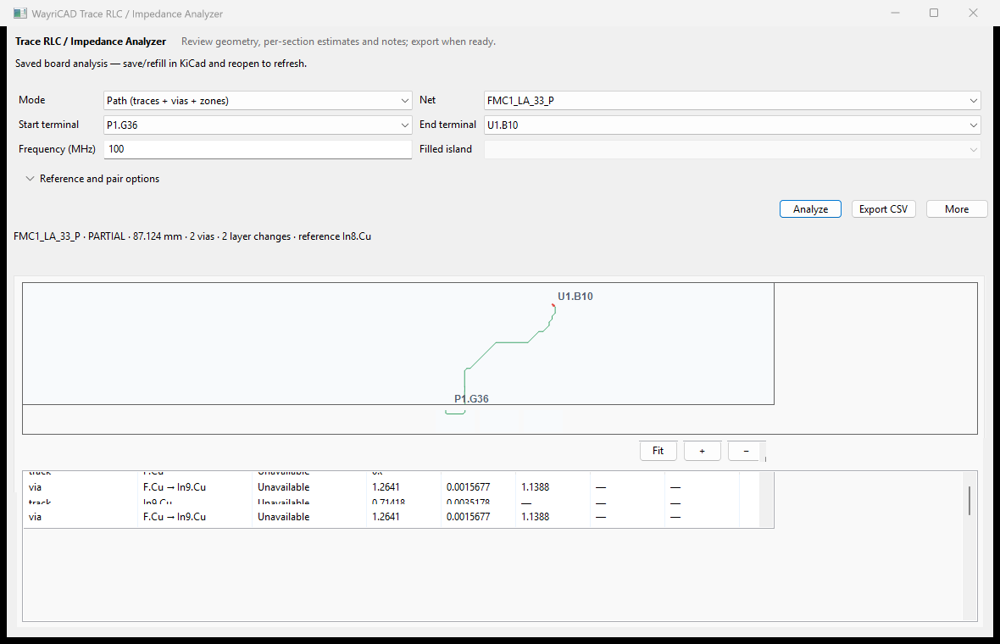
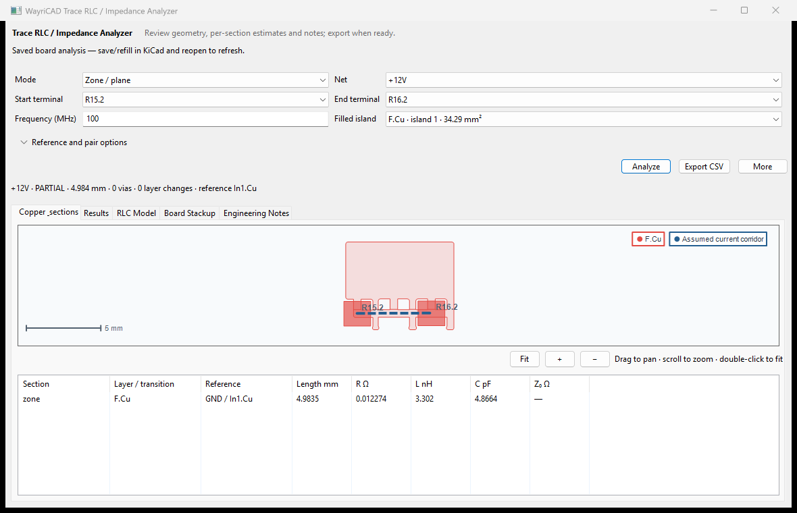
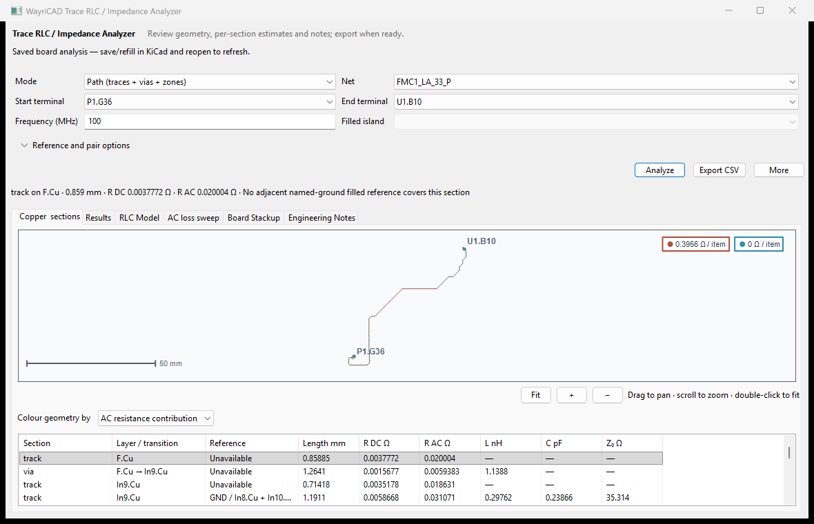
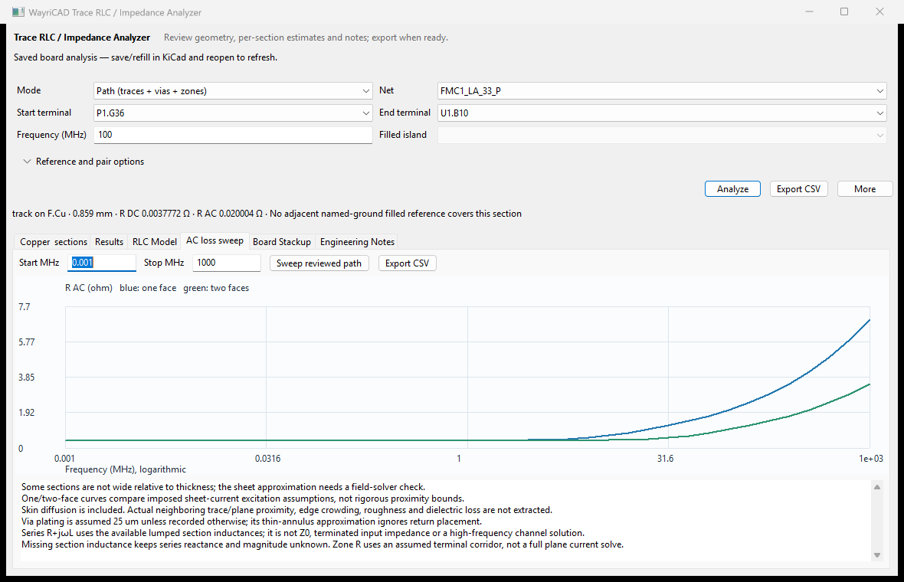

# WayriCAD Trace, Via and Plane RLC


## Capabilities

- Inspect connected trace/via/zone paths or terminal-defined filled-zone/plane corridors, with actual copper previews.
- Identify candidate grounds and verify adjacent reference-copper coverage, or select a reference layer explicitly.
- Estimate section DC resistance, supported transmission-line L/C/Z0, isolated via terms and plane-overlap capacitance.
- Plot AC conductor-loss sweeps with skin-effect models, layer/section highlighting and CSV export.
- Export read-only CLI JSON with source hashes, units, modeled sections and unresolved terms.

## Limitations

- Zone R/L uses an assumed current corridor, not spreading resistance; full-island C and corridor R/L are not one extracted series circuit.
- Mixed routes do not have a single uniform Z0. Via capacitance remains unknown without antipad geometry; partial totals omit unresolved terms.
- Arbitrary proximity, roughness, dielectric loss, full return-current distribution and connector/package effects are not solved.
- Trace arcs and complex obstacle paths can remain unresolved; automatic search omits zone islands with more than 128 contacts.
- Analysis follows existing layer transitions and never reroutes copper. Saved stackup/reference data and native KiCad geometry support are required.

## Overview

Inspect an existing connected route or a filled zone between two terminals. The local preview shows actual pads, copper, vias and filled islands. The section table records each layer transition, reference layer/net and model.

## Native analysis views



Actual saved-board path inspection, including layer transitions. Per-segment estimates and unresolved reference coverage should be reviewed before interpreting a single global impedance.



Plane/zone estimates use the stated geometry and return assumptions; this is not a full-wave field solution. The installed [offline help](help.html) explains the available modes.

## Workflow

1. Save and refill the PCB in KiCad, then launch the plugin. The PCM action opens a saved-board snapshot; reopen it after saving further changes. Choose a net and two different pads. Native in-editor use can also synchronize from PCB selection.
2. Choose **Path** for existing trace/via/zone connections, or **Zone/plane** for a selected filled island and an assumed current-corridor width.
3. Leave the reference at **Auto**, or choose a copper layer explicitly.
4. Analyze, inspect the geometry and section status, then export the results.

Auto ground recognition uses names such as GND, AGND, DGND and VSS. A name alone does not establish a reference: the engine checks filled copper coverage on adjacent copper layers. Explicit reference selection still requires copper coverage. Unfilled zones must be filled in KiCad first.

Paths follow existing layer transitions through vias and plated pads. Analysis does not shift or reroute the board's copper. Crossings on different layers are not connections. Zone links require a finite-width corridor inside one filled island; holes and disconnected islands cannot be crossed by a shortcut. Complex current paths around obstacles and trace arcs remain unresolved. Automatic path search omits islands with more than 128 contacts; use terminal-defined zone mode for those islands.

## What the numbers mean

| Geometry | Estimate |
|---|---|
| Trace | DC conductor resistance; skin-effect estimate; closed-form microstrip or symmetric stripline L/C/Z0 where the reference geometry supports that model |
| Via | Barrel resistance with assumed 25 µm plating and isolated partial inductance; capacitance remains unknown without antipad geometry |
| Zone/plane | Terminal-corridor resistance and inductance; capacitance from filled-island/reference overlap and stackup separation |
| Trace + zone + via | Connected path and individual section models; unresolved terms remain identified |

Plane R/L depends on the selected terminals and assumed corridor width. It is not a spreading-resistance solution. Full-island capacitance and corridor R/L are different estimates and must not be interpreted as one series RLC circuit. Mixed routes have section impedances; they do not have a single uniform Z0. Partial totals contain modeled sections only. Disconnected endpoints produce an unresolved result instead of an aggregate-net fallback.

The stackup source, copper thickness, dielectric separation and permittivity are recorded. Automatic transmission-line estimates require saved dielectric thickness and Er; missing values remain structured blockers and are not replaced by generic FR-4 dimensions. A manufacturing document can disagree with embedded board data; resolve that discrepancy before using these estimates for design decisions. Models exclude copper roughness, etch shape, solder mask, dielectric loss, pad and thermal-spoke impedance, full return-current distribution, and connector/package effects. Critical high-speed work needs field simulation or measurement beyond this preliminary geometry analysis.

## Read-only CLI

Run with KiCad 10's Python, from this repository or with the wheel installed:

```powershell
& 'C:/Program Files/KiCad/10.0/bin/python.exe' -m trace_impedance_plugin.cli inspect board.kicad_pcb --net MDI0_P
& 'C:/Program Files/KiCad/10.0/bin/python.exe' -m trace_impedance_plugin.cli path board.kicad_pcb --net MDI0_P --start U1.1 --end J1.1 --output route.json
& 'C:/Program Files/KiCad/10.0/bin/python.exe' -m trace_impedance_plugin.cli zone board.kicad_pcb --net +3V3 --start C1.1 --end C2.1 --zone-id '<ID from inspect>' --corridor-width-mm 0.2 --output plane.json
```

Replace the example net/pad/zone identifiers with those returned by `inspect`. `wayricad-rlc` is the installed entrypoint. JSON contains numeric values, source-board SHA-256 and section status. Exit codes: 0 resolved, 1 input/runtime error, 2 disconnected (also argparse usage errors), 3 partial. Reports use a separate `.json` file and never save the source board.

See the [Marble smoke report](../docs/audits/MARBLE_SUITE_SMOKE.md) for measured coverage and limitations. KiCad 10 is the native geometry target; KiCad 11 operation requires validation against its available native geometry API.

Model references: [TI Analog Engineer's Pocket Reference](https://www.ti.com/seclit/eb/slyw038d/slyw038d.pdf) for the approximate via inductance relation; [Analog Devices PCB layout guidance](https://www.analog.com/en/resources/analog-dialogue/articles/high-speed-printed-circuit-board-layout.html) for plane-overlap capacitance. These references do not validate this implementation against measurements.

## Visual AC loss review

The copper preview can colour the actual route by layer, DC resistance
contribution, AC resistance contribution or model coverage. Select a section
row to highlight its copper; click a route/via marker to inspect the section.
Changing path inputs clears the reviewed geometry and frequency results.



The **AC loss sweep** tab plots 41 frequency points with editable start/stop
frequencies and CSV export. It includes trace, corridor and plated-via copper.
Move the pointer over the plot to inspect frequency, resistance and skin depth.
One-face and two-face curves compare assumed through-thickness excitation:
`R/Rdc = Re(q coth(q))`, `q=(1+j)t/(faces*skin_depth)`. This gives a continuous
DC-to-skin transition. It does not extract arbitrary neighboring-conductor
proximity, edge crowding, roughness or return-plane loss. These curves are not
rigorous upper/lower bounds on your real board. Narrow traces need field review.



The fixture is a selected signal path, not a power-rail voltage-drop claim.
Via plating defaults to 25 um; the thin annulus is treated as a sheet. Series
R+jωL uses the available lumped section contributions, and is not characteristic
impedance or terminated input impedance. Missing L remains unknown.

CLI: add `--sweep-mhz 0.001 1000` to a `path` or `zone` command to include the
same model, assumptions and points in JSON. Ordinary AC result totals now
include via resistance, which earlier versions omitted.


Trace measurement and AC-sweep CSV exports start in the originating board’s project folder with board-specific filenames. Export refuses a non-CSV destination for measurements.
