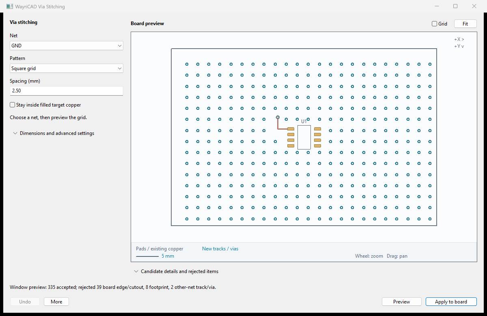

# WayriCAD Via Stitching


## Capabilities

- Preview square/staggered via grids on a chosen net with configurable spacing, diameter, drill and clearance.
- Use uniform/density profiles, rectangular or selected-item bounds and footprint exclusions.
- Check filled target-net copper, other-net obstacles, keepouts and board outline/cutouts before placement.
- Review contextual geometry and rejection reasons, then apply recoverable groups with stale-preview checks.
- Use CLI plan/apply to export JSON/SVG and write a separately reviewed board copy.

## Limitations

- Filled target-net zones are required by default; missing or unfilled zones fail explicitly.
- Conservative obstacle envelopes can reject valid placements; arc previews are approximate and native DRC is still required.
- Grids are bounded to 50,000 candidates; the tool does not establish RF shielding, return-path quality or manufacturing suitability.
- IPC geometry coverage depends on the host API. Native KiCad 11 behavior remains unverified.

## Overview

A fully local routing tool for PCB Editor. No hosted UI or remote preview assets are required.

## Native interface



Synthetic GND-board preview illustrating candidate via placement. Preview candidates are reviewed before copper is modified.

The installed package includes [offline help](help.html) with its workflow and limitations.

## Workflow

1. Configure geometry and pad scope or target net.
2. Click **Preview**. The canvas and result table show accepted candidates and rejection reasons. Preview creates no PCB copper.
3. Inspect the result, then **Apply to board**. A named WayriCAD group contains the committed geometry. Run KiCad DRC before saving or manufacturing.

The optional **More → Review placement again** command rechecks the board snapshot and prepares the same geometry; it is not required before Apply. **More → Clear preview** discards unattached candidates. Settings changes invalidate the preview. Board changes require a new preview. Plugin Undo/Redo preserves a recoverable group; reopen the tool to find its existing named groups.

## Controls and checks

Choose a PCB net and square or staggered grid. Configure grid spacing, via diameter/drill, copper clearance, edge inset, and uniform or density profiles. Expand Area and exclusion settings to limit the rectangle, use selected-item bounds, or exclude footprints by reference.

By default candidates must fit completely inside filled target-net copper. Missing/unfilled target zones fail explicitly. Other-net copper and via keepouts are always excluded; same-net tracks and footprint envelopes have optional exclusions. The complete via radius plus clearance is checked against conservative obstacle envelopes, and vias remain inside the closed board outline, including cutouts. Too-dense grids and more than 50,000 candidates fail before modifying the board.

## Local preview

Primary choices remain visible; detailed dimensions and rejection tables are collapsed until needed. The clean, neutral canvas shows footprint outlines and references, real native pad polygons/rotation, existing copper, and generated geometry. A visible legend, millimetre scale, and coordinate orientation support review; the grid is optional and off by default. The resizable canvas supports wheel zoom at the cursor, drag to pan, double-click to fit, and via picking for coordinates. Pads, existing tracks/vias, zone outlines, and board edges provide context. Candidate copper and drill sizes use board units. Arc tracks currently appear as conservative bounding envelopes; native pads use their effective polygons; the IPC fallback uses supported padstack shapes. The canvas is a review aid, not a replacement for PCB Editor or DRC.

## Command line

Use KiCad 10's bundled Python so `pcbnew` is available. List JSON option names and actual project choices with `python -m wayricad_runtime.cli fanout settings --board source.kicad_pcb` (or `stitching settings`). Settings are a JSON object, for example:

```json
{"net_choice":"GND","pattern":"Staggered grid","spacing":2.5,"diameter":0.6,"drill":0.3,"clearance":0.2,"require_target_zone":true}
```

```text
python -m wayricad_runtime.cli stitching plan --board source.kicad_pcb --settings settings.json --output plan.json --svg preview.svg
python -m wayricad_runtime.cli stitching apply --board source.kicad_pcb --plan plan.json --output routed.kicad_pcb
```

Plan is read-only and produces reviewable JSON plus an optional standalone local SVG. Apply recomputes and checks the reviewed geometry and board fingerprint, then writes a **new** `.kicad_pcb` file. It refuses source overwrites, existing destinations, empty plans, and stale or altered candidate geometry. The source remains unchanged.

## Compatibility

Native in-memory board tests, file round-trips, and hidden wx frame smoke checks run against KiCad 10. The suite also packages an IPC entry point for forward compatibility; supported geometry depends on the live IPC API. Unsupported capabilities fail explicitly. Live KiCad 11 behavior must be validated against its released runtime.
